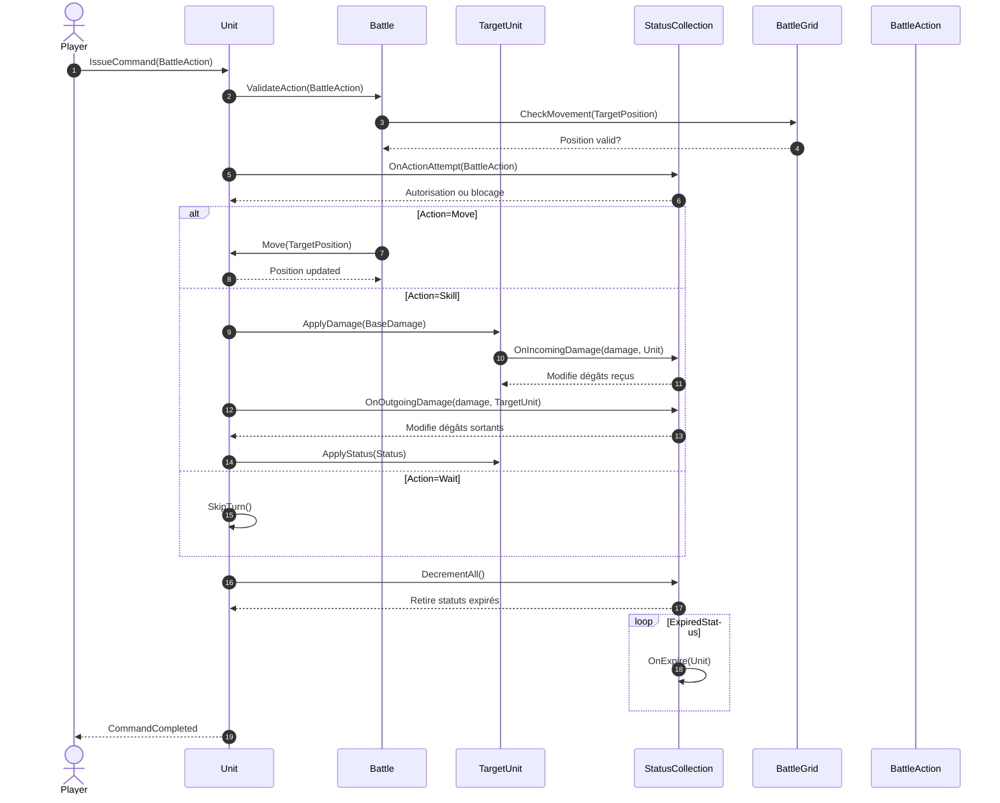

```mermaid
sequenceDiagram
    autonumber
    actor Player
    participant Unit
    participant Battle
    participant TargetUnit
    participant StatusCollection
    participant Grid as BattleGrid
    participant Action as BattleAction

    %% =========================
    %% SÉLECTION DE LA COMMAND
    %% =========================
    Player ->> Unit: IssueCommand(BattleAction)
    Unit ->> Battle: ValidateAction(BattleAction)
    Battle ->> Grid: CheckMovement(TargetPosition)
    Grid -->> Battle: Position valid?

    %% =========================
    %% HOOKS AVANT EXÉCUTION
    %% =========================
    Unit ->> StatusCollection: OnActionAttempt(BattleAction)
    StatusCollection -->> Unit: Autorisation ou blocage

    %% =========================
    %% EXÉCUTION DE LA COMMAND
    %% =========================
    alt Action=Move
        Battle ->> Unit: Move(TargetPosition)
        Unit -->> Battle: Position updated
    else Action=Skill
        Unit ->> TargetUnit: ApplyDamage(BaseDamage)
        TargetUnit ->> StatusCollection: OnIncomingDamage(damage, Unit)
        StatusCollection -->> TargetUnit: Modifie dégâts reçus
        Unit ->> StatusCollection: OnOutgoingDamage(damage, TargetUnit)
        StatusCollection -->> Unit: Modifie dégâts sortants
        Unit ->> TargetUnit: ApplyStatus(Status)
    else Action=Wait
        Unit ->> Unit: SkipTurn()
    end

    %% =========================
    %% FIN DE LA COMMAND
    %% =========================
    Unit ->> StatusCollection: DecrementAll()
    StatusCollection -->> Unit: Retire statuts expirés
    loop ExpiredStatus
        StatusCollection ->> StatusCollection: OnExpire(Unit)
    end
    Unit -->> Player: CommandCompleted

```