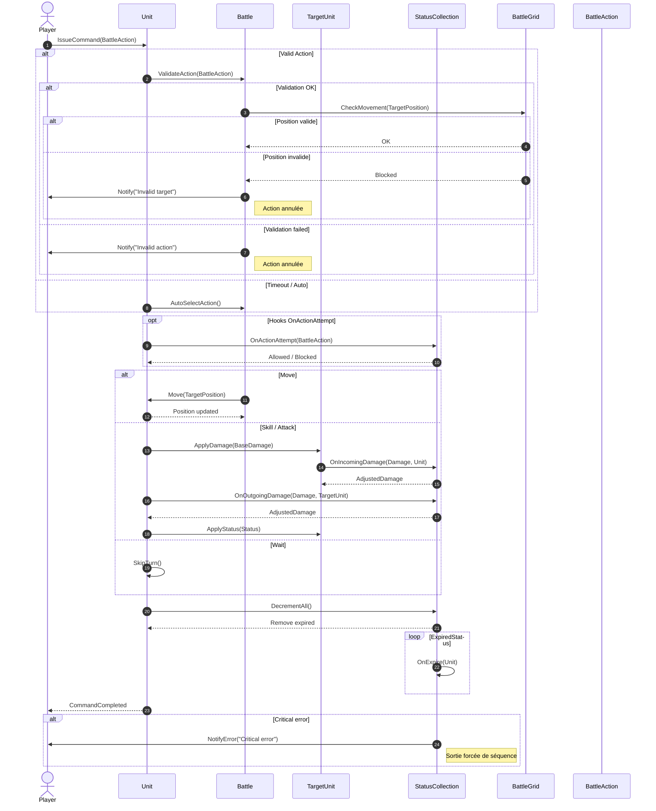

```mermaid
sequenceDiagram
    autonumber
    actor Player
    participant Unit
    participant Battle
    participant TargetUnit
    participant StatusCollection
    participant Grid as BattleGrid
    participant Action as BattleAction

    %% SÉLECTION DE LA COMMAND
    Player ->> Unit: IssueCommand(BattleAction)
    alt Valid Action
        Unit ->> Battle: ValidateAction(BattleAction)
        alt Validation OK
            Battle ->> Grid: CheckMovement(TargetPosition)
            alt Position valide
                Grid -->> Battle: OK
            else Position invalide
                Grid -->> Battle: Blocked
                Battle ->> Player: Notify("Invalid target")
                note right of Battle: Action annulée
            end
        else Validation failed
            Battle ->> Player: Notify("Invalid action")
            note right of Battle: Action annulée
        end
    else Timeout / Auto
        Unit ->> Battle: AutoSelectAction()
    end

    %% HOOKS AVANT EXÉCUTION
    opt Hooks OnActionAttempt
        Unit ->> StatusCollection: OnActionAttempt(BattleAction)
        StatusCollection -->> Unit: Allowed / Blocked
    end

    %% EXÉCUTION DE LA COMMAND
    alt Move
        Battle ->> Unit: Move(TargetPosition)
        Unit -->> Battle: Position updated
    else Skill / Attack
        Unit ->> TargetUnit: ApplyDamage(BaseDamage)
        TargetUnit ->> StatusCollection: OnIncomingDamage(Damage, Unit)
        StatusCollection -->> TargetUnit: AdjustedDamage
        Unit ->> StatusCollection: OnOutgoingDamage(Damage, TargetUnit)
        StatusCollection -->> Unit: AdjustedDamage
        Unit ->> TargetUnit: ApplyStatus(Status)
    else Wait
        Unit ->> Unit: SkipTurn()
    end

    %% FIN DE LA COMMAND
    Unit ->> StatusCollection: DecrementAll()
    StatusCollection -->> Unit: Remove expired
    loop ExpiredStatus
        StatusCollection ->> StatusCollection: OnExpire(Unit)
    end
    Unit -->> Player: CommandCompleted

    %% Chemins d'erreur critiques
    alt Critical error
        StatusCollection ->> Player: NotifyError("Critical error")
        note right of StatusCollection: Sortie forcée de séquence
    end


```