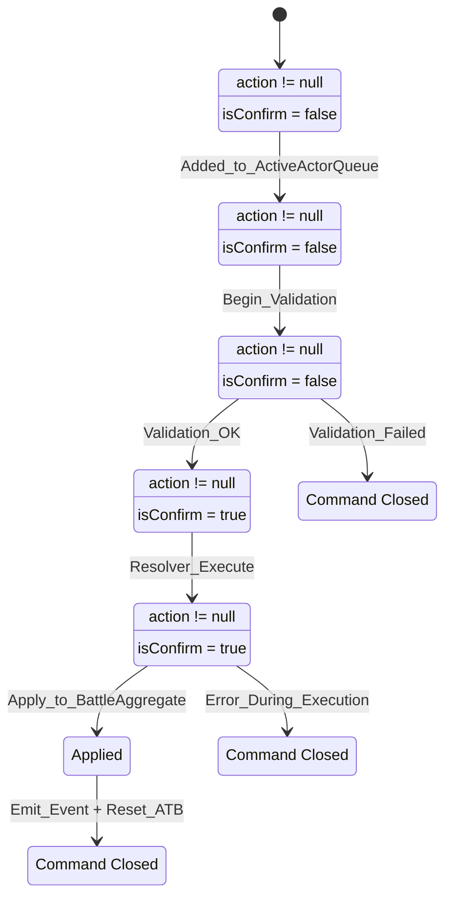

```mermaid
stateDiagram-v2
    [*] --> Created

    Created: action != null
    Created: isConfirm = false
    Created --> Queued: Added_to_ActiveActorQueue

    %% Command en attente d'être résolue
    Queued: action != null
    Queued: isConfirm = false
    Queued --> Validating: Begin_Validation

    %% Validation par TurnResolver
    Validating: action != null
    Validating: isConfirm = false
    Validating --> Confirmed: Validation_OK
    Validating --> Rejected: Validation_Failed

    %% Confirmed means: prêt pour exécution
    Confirmed: action != null
    Confirmed: isConfirm = true
    Confirmed --> Executing: Resolver_Execute

    %% Execution
    Executing: action != null
    Executing: isConfirm = true
    Executing --> Applied: Apply_to_BattleAggregate
    Executing --> Failed: Error_During_Execution

    %% After mutation on the Aggregate
    Applied --> Completed: Emit_Event + Reset_ATB

    Completed: Command Closed
    Rejected: Command Closed
    Failed: Command Closed
```
