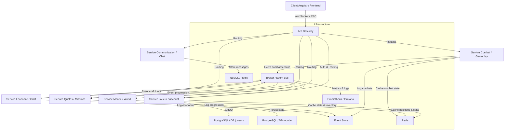

```mermaid
flowchart TD
    %% Clients
    Client[Client Angular / Frontend] -->|WebSocket / RPC| Gateway[API Gateway]

    %% Gateway
    Gateway -->|Auth & Routing| PlayerService[Service Joueur / Account]
    Gateway -->|Routing| CombatService[Service Combat / Gameplay]
    Gateway -->|Routing| WorldService[Service Monde / World]
    Gateway -->|Routing| QuestService[Service Quêtes / Missions]
    Gateway -->|Routing| EconomyService[Service Économie / Craft]
    Gateway -->|Routing| ChatService[Service Communication / Chat]

    %% Event Bus
    CombatService -->|Event combat terminé| EventBus[Broker / Event Bus]
    QuestService -->|Event progression| EventBus
    EconomyService -->|Event craft / loot| EventBus
    EventBus --> PlayerService
    EventBus --> WorldService
    EventBus --> QuestService
    EventBus --> EconomyService

    %% Persistence
    PlayerService -->|CRUD| DBPlayer[PostgreSQL / DB joueurs]
    WorldService -->|Persist state| DBWorld[PostgreSQL / DB monde]
    CombatService -->|Log combats| EventStore[Event Store]
    QuestService -->|Log progression| EventStore
    EconomyService -->|Log économie| EventStore
    ChatService -->|Store messages| DBChat[NoSQL / Redis]

    %% Cache
    PlayerService -->|Cache stats & inventory| CacheRedis[Redis]
    WorldService -->|Cache positions & state| CacheRedis
    CombatService -->|Cache combat state| CacheRedis

    %% Monitoring
    EventBus -->|Metrics & logs| Monitoring[Prometheus / Grafana]

    %% Notes
    subgraph "Infrastructure"
        Gateway
        EventBus
        DBPlayer
        DBWorld
        EventStore
        DBChat
        CacheRedis
        Monitoring
    end

```