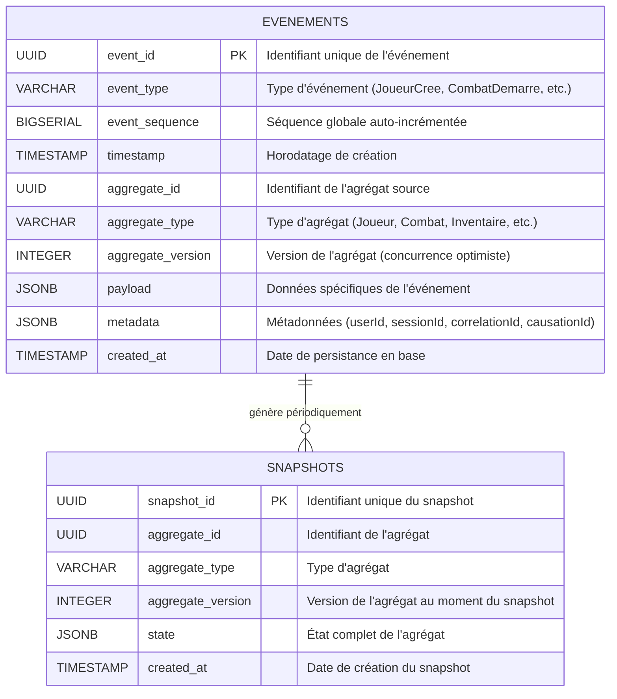

# Event Store - Stockage Centralisé des Événements

## Vue d'ensemble

L'Event Store est le stockage centralisé et immuable de tous les événements du système. Il constitue la source de vérité (source of truth) pour l'ensemble de l'architecture Event Sourcing.

## Architecture

- **Base de données**: PostgreSQL
- **Pattern**: Event Sourcing avec append-only log
- **Immutabilité**: Les événements ne sont jamais modifiés ou supprimés
- **Ordre**: Séquence stricte garantie par event_sequence
- **Versioning**: Suivi de version par agrégat pour concurrence optimiste

## Schéma Principal



## Table EVENEMENTS

### Structure

```sql
CREATE TABLE evenements (
    event_id UUID PRIMARY KEY DEFAULT gen_random_uuid(),
    event_type VARCHAR(100) NOT NULL,
    event_sequence BIGSERIAL UNIQUE NOT NULL,
    timestamp TIMESTAMP NOT NULL DEFAULT NOW(),
    aggregate_id UUID NOT NULL,
    aggregate_type VARCHAR(50) NOT NULL,
    aggregate_version INTEGER NOT NULL,
    payload JSONB NOT NULL,
    metadata JSONB NOT NULL DEFAULT '{}'::jsonb,
    created_at TIMESTAMP NOT NULL DEFAULT NOW()
);
```

### Index

```sql
-- Index principal pour reconstruction d'agrégat
CREATE INDEX idx_evenements_aggregate 
ON evenements(aggregate_id, aggregate_version);

-- Index pour requêtes temporelles
CREATE INDEX idx_evenements_timestamp 
ON evenements(timestamp);

-- Index pour filtrage par type d'événement
CREATE INDEX idx_evenements_type 
ON evenements(event_type);

-- Index pour séquence globale (projections)
CREATE INDEX idx_evenements_sequence 
ON evenements(event_sequence);

-- Index GIN pour recherche dans payload
CREATE INDEX idx_evenements_payload 
ON evenements USING GIN(payload);

-- Index pour métadonnées de traçabilité
CREATE INDEX idx_evenements_correlation 
ON evenements((metadata->>'correlationId'));
```

### Contraintes

```sql
-- Unicité de version par agrégat (concurrence optimiste)
CREATE UNIQUE INDEX idx_evenements_aggregate_version 
ON evenements(aggregate_id, aggregate_version);

-- Vérification des types d'agrégats valides
ALTER TABLE evenements 
ADD CONSTRAINT chk_aggregate_type 
CHECK (aggregate_type IN (
    'Joueur', 'Combat', 'Inventaire', 'Item', 'Equipement',
    'Quete', 'Competence', 'PNJ', 'Economy', 'WorldState'
));
```

## Table SNAPSHOTS

### Structure

```sql
CREATE TABLE snapshots (
    snapshot_id UUID PRIMARY KEY DEFAULT gen_random_uuid(),
    aggregate_id UUID NOT NULL,
    aggregate_type VARCHAR(50) NOT NULL,
    aggregate_version INTEGER NOT NULL,
    state JSONB NOT NULL,
    created_at TIMESTAMP NOT NULL DEFAULT NOW()
);
```

### Index

```sql
-- Index pour récupération du dernier snapshot
CREATE INDEX idx_snapshots_aggregate 
ON snapshots(aggregate_id, aggregate_version DESC);

-- Index pour nettoyage des anciens snapshots
CREATE INDEX idx_snapshots_created_at 
ON snapshots(created_at);
```

### Stratégie de Snapshot

- **Fréquence**: Tous les 50 événements par agrégat
- **Rétention**: Conserver les 3 derniers snapshots
- **Reconstruction**: Snapshot + événements suivants
- **Performance**: Réduction drastique du temps de chargement pour agrégats volumineux

## Format Standard des Événements

Tous les événements suivent la structure définie dans `matrice_evenements.md`:

```json
{
  "eventType": "JoueurCree",
  "eventId": "550e8400-e29b-41d4-a716-446655440000",
  "timestamp": "2024-01-15T14:30:00Z",
  "aggregateId": "123e4567-e89b-12d3-a456-426614174000",
  "aggregateType": "Joueur",
  "version": 1,
  "payload": {
    "username": "Aventurier",
    "class": "Guerrier",
    "level": 1,
    "baseStats": {
      "health": 100,
      "mana": 50,
      "stamina": 80
    }
  },
  "metadata": {
    "userId": "user-123",
    "sessionId": "session-456",
    "correlationId": "corr-789",
    "causationId": "cause-012",
    "ipAddress": "192.168.1.1"
  }
}
```

## Types d'Événements par Agrégat

### Joueur
- JoueurCree
- ExperienceGagnee
- NiveauAtteint
- StatsModifiees
- ClasseChangee

### Combat
- CombatDemarre
- TourDebute
- ActionExecutee
- EffetStatutApplique
- EffetStatutExpire
- DegatsInfliges
- SoinsRecus
- CombatTermine

### Inventaire
- ItemAjoute
- ItemRetire
- ItemEquipe
- ItemDesequipe
- ItemUtilise
- ItemEchange
- CapaciteModifiee

### Item
- ItemCree
- ItemModifie
- ItemDetruit
- ProprietesModifiees

### Equipement
- EquipementCree
- EquipementAmeliore
- EquipementRepare
- EnchantementsAppliques

### Quete
- QueteCreee
- QueteAcceptee
- ObjectifProgresse
- ObjectifComplete
- QueteTerminee
- QueteEchouee
- RecompenseObtenue

### Competence
- CompetenceAprise
- CompetenceAmelioree
- CompetenceUtilisee
- CooldownDemarre

### PNJ
- PNJCree
- DialogueDeclenche
- CommerceOuvert
- ReputationModifiee

### Economy
- OrdreVenteCree
- OrdreAchatCree
- TransactionExecutee
- OrdreCancelled
- PrixMisAJour

### WorldState
- EvenementMondialDeclenche
- ZoneDecouverte
- BossVaincu
- RessourceRegeneree

## Patterns d'Accès

### 1. Reconstruction d'Agrégat

```sql
-- Charger tous les événements d'un agrégat
SELECT event_type, aggregate_version, payload, timestamp
FROM evenements
WHERE aggregate_id = $1
ORDER BY aggregate_version ASC;
```

### 2. Reconstruction avec Snapshot

```sql
-- Trouver le dernier snapshot
SELECT aggregate_version, state
FROM snapshots
WHERE aggregate_id = $1
ORDER BY aggregate_version DESC
LIMIT 1;

-- Charger les événements suivants
SELECT event_type, aggregate_version, payload, timestamp
FROM evenements
WHERE aggregate_id = $1 
  AND aggregate_version > $2
ORDER BY aggregate_version ASC;
```

### 3. Projection par Séquence

```sql
-- Lire les événements depuis une position
SELECT event_id, event_type, aggregate_id, aggregate_type, 
       payload, metadata, timestamp
FROM evenements
WHERE event_sequence > $1
ORDER BY event_sequence ASC
LIMIT 1000;
```

### 4. Requête Temporelle

```sql
-- Tous les événements dans une plage
SELECT *
FROM evenements
WHERE timestamp BETWEEN $1 AND $2
ORDER BY timestamp ASC;
```

### 5. Audit et Traçabilité

```sql
-- Suivre une chaîne de causalité
WITH RECURSIVE event_chain AS (
    SELECT * FROM evenements 
    WHERE event_id = $1
    UNION ALL
    SELECT e.* FROM evenements e
    INNER JOIN event_chain ec 
    ON e.metadata->>'causationId' = ec.event_id::text
)
SELECT * FROM event_chain;
```

## Garanties et Propriétés

### Immutabilité
- Pas d'UPDATE ou DELETE sur les événements
- Seules opérations: INSERT (append)
- Corrections via événements compensatoires

### Ordre Total
- `event_sequence` garantit un ordre global
- Essentiel pour rejouer les événements
- Permet la synchronisation des projections

### Concurrence Optimiste
- `aggregate_version` incrémenté strictement
- Détection automatique des conflits
- Retry avec rechargement de l'agrégat

### Traçabilité Complète
- Chaque événement contient des métadonnées
- `correlationId` pour tracer les workflows
- `causationId` pour chaîne de causalité

## Maintenance

### Archivage
```sql
-- Archiver les événements > 1 an
INSERT INTO evenements_archive
SELECT * FROM evenements
WHERE timestamp < NOW() - INTERVAL '1 year';
```

### Nettoyage des Snapshots
```sql
-- Conserver seulement les 3 derniers snapshots
DELETE FROM snapshots s1
WHERE EXISTS (
    SELECT 1 FROM snapshots s2
    WHERE s2.aggregate_id = s1.aggregate_id
      AND s2.aggregate_version > s1.aggregate_version
    ORDER BY s2.aggregate_version DESC
    OFFSET 3
);
```

### Analyse de Performance
```sql
-- Événements les plus fréquents
SELECT event_type, COUNT(*) as count
FROM evenements
GROUP BY event_type
ORDER BY count DESC;

-- Agrégats les plus volumineux
SELECT aggregate_id, aggregate_type, COUNT(*) as event_count
FROM evenements
GROUP BY aggregate_id, aggregate_type
ORDER BY event_count DESC
LIMIT 100;
```

## Références

- **matrice_evenements.md**: Définitions complètes des 40+ types d'événements
- **event_handlers.md**: Consommateurs d'événements (projections, sagas, process managers)
- **timeline_evenements.md**: Flux temporels et séquences d'événements
- **architecture_generale.md**: Vue d'ensemble de l'architecture Event Sourcing
