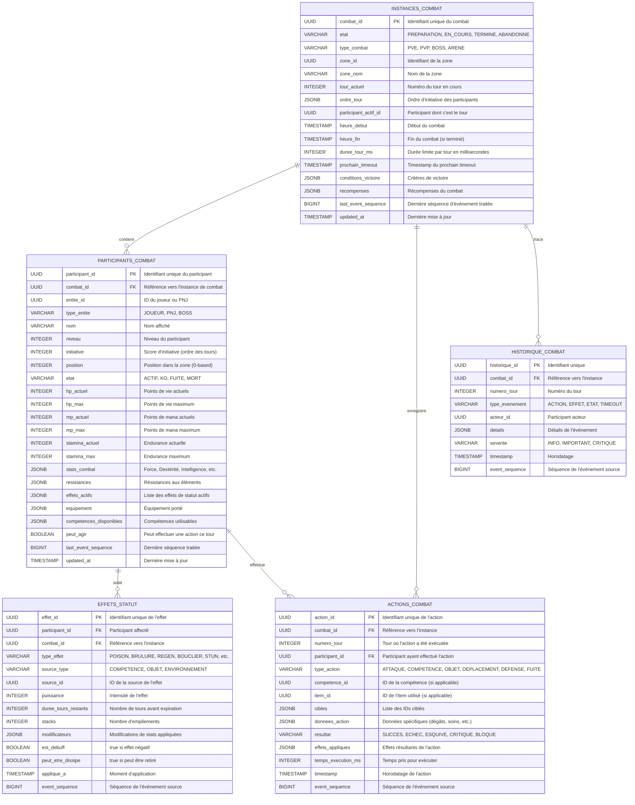

# Projections Combat - Modèles de Lecture

## Vue d'ensemble

Les projections de combat sont des modèles de lecture (read models) optimisés pour les requêtes temps-réel du système de combat. Elles sont construites à partir des événements de l'Event Store et maintenues à jour par les handlers de projection.

## Architecture

- **Base de données**: PostgreSQL (données persistantes) + Redis (cache temps-réel)
- **Pattern**: CQRS - Modèles de lecture séparés de l'écriture
- **Source**: Événements de l'agrégat Combat
- **Handlers**: CombatProjection, ParticipantProjection (voir event_handlers.md)
- **Synchronisation**: Eventual consistency via event_sequence

## Schéma des Projections



## Tables Détaillées

### INSTANCES_COMBAT

Projection de l'état actuel de chaque combat.

```sql
CREATE TABLE instances_combat (
    combat_id UUID PRIMARY KEY,
    etat VARCHAR(20) NOT NULL CHECK (etat IN ('PREPARATION', 'EN_COURS', 'TERMINE', 'ABANDONNE')),
    type_combat VARCHAR(20) NOT NULL CHECK (type_combat IN ('PVE', 'PVP', 'BOSS', 'ARENE')),
    zone_id UUID NOT NULL,
    zone_nom VARCHAR(100),
    tour_actuel INTEGER DEFAULT 0,
    ordre_tour JSONB NOT NULL DEFAULT '[]'::jsonb,
    participant_actif_id UUID,
    heure_debut TIMESTAMP NOT NULL,
    heure_fin TIMESTAMP,
    duree_tour_ms INTEGER DEFAULT 30000,
    prochain_timeout TIMESTAMP,
    conditions_victoire JSONB NOT NULL DEFAULT '{}'::jsonb,
    recompenses JSONB DEFAULT '{}'::jsonb,
    last_event_sequence BIGINT NOT NULL,
    updated_at TIMESTAMP NOT NULL DEFAULT NOW()
);

CREATE INDEX idx_instances_combat_etat ON instances_combat(etat);
CREATE INDEX idx_instances_combat_zone ON instances_combat(zone_id);
CREATE INDEX idx_instances_combat_sequence ON instances_combat(last_event_sequence);
CREATE INDEX idx_instances_combat_actif ON instances_combat(participant_actif_id) WHERE etat = 'EN_COURS';
```

**Événements Sources**:
- CombatDemarre → Création de l'instance
- TourDebute → Mise à jour tour_actuel, participant_actif_id
- CombatTermine → Passage à TERMINE, enregistrement recompenses

### PARTICIPANTS_COMBAT

Projection de l'état de chaque participant dans un combat.

```sql
CREATE TABLE participants_combat (
    participant_id UUID PRIMARY KEY,
    combat_id UUID NOT NULL REFERENCES instances_combat(combat_id) ON DELETE CASCADE,
    entite_id UUID NOT NULL,
    type_entite VARCHAR(10) NOT NULL CHECK (type_entite IN ('JOUEUR', 'PNJ', 'BOSS')),
    nom VARCHAR(100) NOT NULL,
    niveau INTEGER NOT NULL,
    initiative INTEGER NOT NULL,
    position INTEGER NOT NULL,
    etat VARCHAR(10) NOT NULL DEFAULT 'ACTIF' CHECK (etat IN ('ACTIF', 'KO', 'FUITE', 'MORT')),
    hp_actuel INTEGER NOT NULL,
    hp_max INTEGER NOT NULL,
    mp_actuel INTEGER NOT NULL,
    mp_max INTEGER NOT NULL,
    stamina_actuel INTEGER NOT NULL,
    stamina_max INTEGER NOT NULL,
    stats_combat JSONB NOT NULL DEFAULT '{}'::jsonb,
    resistances JSONB NOT NULL DEFAULT '{}'::jsonb,
    effets_actifs JSONB NOT NULL DEFAULT '[]'::jsonb,
    equipement JSONB NOT NULL DEFAULT '{}'::jsonb,
    competences_disponibles JSONB NOT NULL DEFAULT '[]'::jsonb,
    peut_agir BOOLEAN DEFAULT true,
    last_event_sequence BIGINT NOT NULL,
    updated_at TIMESTAMP NOT NULL DEFAULT NOW()
);

CREATE INDEX idx_participants_combat_combat ON participants_combat(combat_id);
CREATE INDEX idx_participants_combat_entite ON participants_combat(entite_id);
CREATE INDEX idx_participants_combat_etat ON participants_combat(combat_id, etat);
CREATE INDEX idx_participants_combat_initiative ON participants_combat(combat_id, initiative DESC);
```

**Événements Sources**:
- CombatDemarre → Création des participants
- DegatsInfliges → Mise à jour hp_actuel
- SoinsRecus → Mise à jour hp_actuel
- EffetStatutApplique → Ajout dans effets_actifs
- EffetStatutExpire → Retrait de effets_actifs

### ACTIONS_COMBAT

Historique de toutes les actions effectuées dans les combats.

```sql
CREATE TABLE actions_combat (
    action_id UUID PRIMARY KEY,
    combat_id UUID NOT NULL REFERENCES instances_combat(combat_id) ON DELETE CASCADE,
    numero_tour INTEGER NOT NULL,
    participant_id UUID NOT NULL REFERENCES participants_combat(participant_id),
    type_action VARCHAR(20) NOT NULL CHECK (type_action IN ('ATTAQUE', 'COMPETENCE', 'OBJET', 'DEPLACEMENT', 'DEFENSE', 'FUITE')),
    competence_id UUID,
    item_id UUID,
    cibles JSONB NOT NULL DEFAULT '[]'::jsonb,
    donnees_action JSONB NOT NULL DEFAULT '{}'::jsonb,
    resultat VARCHAR(20) NOT NULL CHECK (resultat IN ('SUCCES', 'ECHEC', 'ESQUIVE', 'CRITIQUE', 'BLOQUE')),
    effets_appliques JSONB NOT NULL DEFAULT '[]'::jsonb,
    temps_execution_ms INTEGER,
    timestamp TIMESTAMP NOT NULL,
    event_sequence BIGINT NOT NULL
);

CREATE INDEX idx_actions_combat_combat ON actions_combat(combat_id, numero_tour);
CREATE INDEX idx_actions_combat_participant ON actions_combat(participant_id);
CREATE INDEX idx_actions_combat_type ON actions_combat(type_action);
CREATE INDEX idx_actions_combat_timestamp ON actions_combat(timestamp);
```

**Événements Sources**:
- ActionExecutee → Création de l'enregistrement d'action

### EFFETS_STATUT

État actuel des effets de statut sur les participants.

```sql
CREATE TABLE effets_statut (
    effet_id UUID PRIMARY KEY,
    participant_id UUID NOT NULL REFERENCES participants_combat(participant_id) ON DELETE CASCADE,
    combat_id UUID NOT NULL REFERENCES instances_combat(combat_id) ON DELETE CASCADE,
    type_effet VARCHAR(30) NOT NULL,
    source_type VARCHAR(20) NOT NULL CHECK (source_type IN ('COMPETENCE', 'OBJET', 'ENVIRONNEMENT')),
    source_id UUID,
    puissance INTEGER NOT NULL DEFAULT 1,
    duree_tours_restants INTEGER NOT NULL,
    stacks INTEGER DEFAULT 1,
    modificateurs JSONB NOT NULL DEFAULT '{}'::jsonb,
    est_debuff BOOLEAN NOT NULL,
    peut_etre_dissipe BOOLEAN DEFAULT true,
    applique_a TIMESTAMP NOT NULL,
    event_sequence BIGINT NOT NULL
);

CREATE INDEX idx_effets_statut_participant ON effets_statut(participant_id);
CREATE INDEX idx_effets_statut_combat ON effets_statut(combat_id);
CREATE INDEX idx_effets_statut_type ON effets_statut(type_effet);
CREATE INDEX idx_effets_statut_actif ON effets_statut(participant_id) WHERE duree_tours_restants > 0;
```

**Événements Sources**:
- EffetStatutApplique → Création de l'effet
- TourDebute → Décrémentation duree_tours_restants
- EffetStatutExpire → Marquage pour suppression

### HISTORIQUE_COMBAT

Journal complet des événements d'un combat (pour replay et analyse).

```sql
CREATE TABLE historique_combat (
    historique_id UUID PRIMARY KEY DEFAULT gen_random_uuid(),
    combat_id UUID NOT NULL REFERENCES instances_combat(combat_id) ON DELETE CASCADE,
    numero_tour INTEGER NOT NULL,
    type_evenement VARCHAR(20) NOT NULL CHECK (type_evenement IN ('ACTION', 'EFFET', 'ETAT', 'TIMEOUT')),
    acteur_id UUID,
    details JSONB NOT NULL,
    severite VARCHAR(10) DEFAULT 'INFO' CHECK (severite IN ('INFO', 'IMPORTANT', 'CRITIQUE')),
    timestamp TIMESTAMP NOT NULL,
    event_sequence BIGINT NOT NULL
);

CREATE INDEX idx_historique_combat ON historique_combat(combat_id, numero_tour, timestamp);
CREATE INDEX idx_historique_combat_sequence ON historique_combat(event_sequence);
```

**Événements Sources**:
- Tous les événements de combat → Entrée dans l'historique

## Requêtes Typiques

### 1. État Actuel d'un Combat

```sql
SELECT 
    ic.*,
    json_agg(
        json_build_object(
            'participant_id', pc.participant_id,
            'nom', pc.nom,
            'hp', pc.hp_actuel,
            'mp', pc.mp_actuel,
            'etat', pc.etat,
            'initiative', pc.initiative
        ) ORDER BY pc.initiative DESC
    ) as participants
FROM instances_combat ic
LEFT JOIN participants_combat pc ON ic.combat_id = pc.combat_id
WHERE ic.combat_id = $1
GROUP BY ic.combat_id;
```

### 2. Participant Actif avec Actions Disponibles

```sql
SELECT 
    pc.*,
    ic.duree_tour_ms,
    ic.prochain_timeout
FROM participants_combat pc
JOIN instances_combat ic ON pc.combat_id = ic.combat_id
WHERE pc.participant_id = ic.participant_actif_id
  AND ic.etat = 'EN_COURS';
```

### 3. Historique d'Actions d'un Participant

```sql
SELECT 
    ac.numero_tour,
    ac.type_action,
    ac.resultat,
    ac.donnees_action,
    ac.timestamp
FROM actions_combat ac
WHERE ac.participant_id = $1
  AND ac.combat_id = $2
ORDER BY ac.numero_tour, ac.timestamp;
```

### 4. Effets Actifs sur un Participant

```sql
SELECT 
    es.type_effet,
    es.puissance,
    es.duree_tours_restants,
    es.stacks,
    es.modificateurs,
    es.est_debuff
FROM effets_statut es
WHERE es.participant_id = $1
  AND es.duree_tours_restants > 0
ORDER BY es.est_debuff DESC, es.applique_a;
```

### 5. Combats Actifs dans une Zone

```sql
SELECT 
    ic.combat_id,
    ic.type_combat,
    ic.tour_actuel,
    COUNT(pc.participant_id) as nb_participants,
    ic.heure_debut
FROM instances_combat ic
LEFT JOIN participants_combat pc ON ic.combat_id = pc.combat_id
WHERE ic.zone_id = $1
  AND ic.etat = 'EN_COURS'
GROUP BY ic.combat_id
ORDER BY ic.heure_debut DESC;
```

## Cache Redis

Les données de combat temps-réel sont également cachées dans Redis pour des performances optimales.

### Structure des Clés

```
combat:{combat_id}:state            → Hash de l'état du combat
combat:{combat_id}:participants     → Hash des participants
combat:{combat_id}:turn_order       → Liste ordonnée
combat:{combat_id}:actions          → Liste des actions récentes
combat:{zone_id}:active_combats     → Set des combats actifs
```

### Synchronisation

- **Write-through**: Mise à jour PostgreSQL + Redis simultanément
- **TTL**: Expiration automatique 1h après fin du combat
- **Invalidation**: Suppression explicite lors de CombatTermine

## Maintenance

### Nettoyage des Combats Terminés

```sql
-- Archiver les combats de plus de 30 jours
INSERT INTO instances_combat_archive
SELECT * FROM instances_combat
WHERE etat IN ('TERMINE', 'ABANDONNE')
  AND heure_fin < NOW() - INTERVAL '30 days';

-- Supprimer après archivage
DELETE FROM instances_combat
WHERE etat IN ('TERMINE', 'ABANDONNE')
  AND heure_fin < NOW() - INTERVAL '30 days';
```

### Recalcul de Projection

```sql
-- Retrouver la dernière séquence traitée
SELECT MAX(last_event_sequence) FROM instances_combat;

-- Rejouer les événements depuis cette séquence
-- (via le handler de projection)
```

## Références

- **event_store.md**: Source de vérité pour tous les événements
- **event_handlers.md**: CombatProjection, ParticipantProjection
- **timeline_evenements.md**: Flux de combat détaillés
- **matrice_evenements.md**: Structures des événements de combat
- **machines_etats/combat_core_p2.md**: Machine à états canonique du combat
