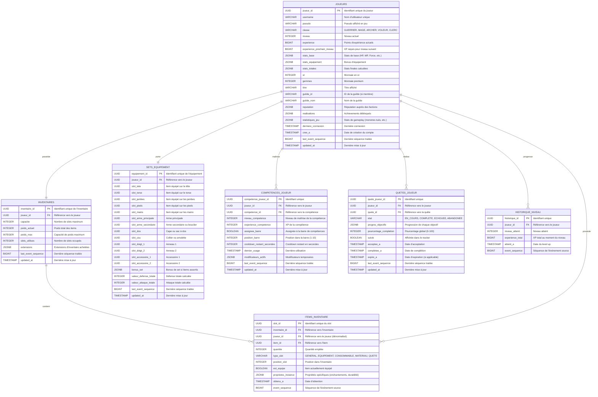

# Projections Joueur - Modèles de Lecture

## Vue d'ensemble

Les projections joueur constituent les modèles de lecture pour toutes les données relatives aux joueurs : profils, inventaires, équipements, compétences, quêtes et statistiques. Ces projections sont construites à partir des événements de l'agrégat Joueur et des agrégats associés.

## Architecture

- **Base de données**: PostgreSQL
- **Pattern**: CQRS - Modèles de lecture optimisés
- **Agrégats Sources**: Joueur, Inventaire, Equipement, Competence (instances joueur)
- **Handlers**: PlayerProjection, InventoryProjection, EquipmentProjection
- **Dénormalisation**: Données agrégées pour performance maximale

## Schéma des Projections



## Tables Détaillées

### JOUEURS

Profil complet du joueur avec stats agrégées.

```sql
CREATE TABLE joueurs (
    joueur_id UUID PRIMARY KEY,
    username VARCHAR(50) UNIQUE NOT NULL,
    pseudo VARCHAR(50) NOT NULL,
    classe VARCHAR(15) NOT NULL CHECK (classe IN ('GUERRIER', 'MAGE', 'ARCHER', 'VOLEUR', 'CLERC')),
    niveau INTEGER NOT NULL DEFAULT 1,
    experience BIGINT NOT NULL DEFAULT 0,
    experience_prochain_niveau BIGINT NOT NULL,
    stats_base JSONB NOT NULL DEFAULT '{}'::jsonb,
    stats_equipement JSONB NOT NULL DEFAULT '{}'::jsonb,
    stats_totales JSONB NOT NULL DEFAULT '{}'::jsonb,
    or INTEGER NOT NULL DEFAULT 0,
    gemmes INTEGER NOT NULL DEFAULT 0,
    titre VARCHAR(100),
    guilde_id VARCHAR(50),
    guilde_nom VARCHAR(100),
    reputation JSONB NOT NULL DEFAULT '{}'::jsonb,
    realisations JSONB NOT NULL DEFAULT '[]'::jsonb,
    statistiques_jeu JSONB NOT NULL DEFAULT '{}'::jsonb,
    derniere_connexion TIMESTAMP,
    cree_a TIMESTAMP NOT NULL DEFAULT NOW(),
    last_event_sequence BIGINT NOT NULL,
    updated_at TIMESTAMP NOT NULL DEFAULT NOW()
);

CREATE INDEX idx_joueurs_username ON joueurs(username);
CREATE INDEX idx_joueurs_pseudo ON joueurs(pseudo);
CREATE INDEX idx_joueurs_classe ON joueurs(classe);
CREATE INDEX idx_joueurs_niveau ON joueurs(niveau DESC);
CREATE INDEX idx_joueurs_guilde ON joueurs(guilde_id);
CREATE INDEX idx_joueurs_derniere_connexion ON joueurs(derniere_connexion DESC);
CREATE INDEX idx_joueurs_stats ON joueurs USING GIN(stats_totales);
```

**Événements Sources**:
- JoueurCree → Création du joueur
- ExperienceGagnee → Mise à jour experience
- NiveauAtteint → Incrémentation niveau
- StatsModifiees → Mise à jour stats_base/stats_totales
- ClasseChangee → Mise à jour classe

### INVENTAIRES

Container principal de l'inventaire.

```sql
CREATE TABLE inventaires (
    inventaire_id UUID PRIMARY KEY,
    joueur_id UUID UNIQUE NOT NULL REFERENCES joueurs(joueur_id) ON DELETE CASCADE,
    capacite INTEGER NOT NULL DEFAULT 50,
    poids_actuel INTEGER NOT NULL DEFAULT 0,
    poids_max INTEGER NOT NULL DEFAULT 1000,
    slots_utilises INTEGER NOT NULL DEFAULT 0,
    extensions JSONB NOT NULL DEFAULT '[]'::jsonb,
    last_event_sequence BIGINT NOT NULL,
    updated_at TIMESTAMP NOT NULL DEFAULT NOW()
);

CREATE INDEX idx_inventaires_joueur ON inventaires(joueur_id);
CREATE INDEX idx_inventaires_capacite ON inventaires(slots_utilises, capacite);
```

**Événements Sources**:
- JoueurCree → Création de l'inventaire
- CapaciteModifiee → Mise à jour capacite/poids_max

### ITEMS_INVENTAIRE

Items individuels dans l'inventaire.

```sql
CREATE TABLE items_inventaire (
    slot_id UUID PRIMARY KEY,
    inventaire_id UUID NOT NULL REFERENCES inventaires(inventaire_id) ON DELETE CASCADE,
    joueur_id UUID NOT NULL REFERENCES joueurs(joueur_id) ON DELETE CASCADE,
    item_id UUID NOT NULL,
    quantite INTEGER NOT NULL DEFAULT 1 CHECK (quantite > 0),
    type_slot VARCHAR(15) NOT NULL CHECK (type_slot IN ('GENERAL', 'EQUIPEMENT', 'CONSOMMABLE', 'MATERIAU', 'QUETE')),
    position_slot INTEGER NOT NULL,
    est_equipe BOOLEAN DEFAULT false,
    proprietes_instance JSONB NOT NULL DEFAULT '{}'::jsonb,
    obtenu_a TIMESTAMP NOT NULL DEFAULT NOW(),
    event_sequence BIGINT NOT NULL
);

CREATE INDEX idx_items_inventaire_inventaire ON items_inventaire(inventaire_id);
CREATE INDEX idx_items_inventaire_joueur ON items_inventaire(joueur_id);
CREATE INDEX idx_items_inventaire_item ON items_inventaire(item_id);
CREATE INDEX idx_items_inventaire_type ON items_inventaire(type_slot);
CREATE INDEX idx_items_inventaire_equipe ON items_inventaire(joueur_id, est_equipe) WHERE est_equipe = true;
CREATE UNIQUE INDEX idx_items_inventaire_position ON items_inventaire(inventaire_id, position_slot);
```

**Événements Sources**:
- ItemAjoute → Création du slot
- ItemRetire → Suppression du slot
- ItemUtilise → Décrémentation quantite
- ItemEquipe → Mise à jour est_equipe
- ItemDesequipe → Mise à jour est_equipe

### SETS_EQUIPEMENT

Équipement actuellement porté.

```sql
CREATE TABLE sets_equipement (
    equipement_id UUID PRIMARY KEY,
    joueur_id UUID UNIQUE NOT NULL REFERENCES joueurs(joueur_id) ON DELETE CASCADE,
    slot_tete UUID REFERENCES items_inventaire(slot_id) ON DELETE SET NULL,
    slot_torse UUID REFERENCES items_inventaire(slot_id) ON DELETE SET NULL,
    slot_jambes UUID REFERENCES items_inventaire(slot_id) ON DELETE SET NULL,
    slot_pieds UUID REFERENCES items_inventaire(slot_id) ON DELETE SET NULL,
    slot_mains UUID REFERENCES items_inventaire(slot_id) ON DELETE SET NULL,
    slot_arme_principale UUID REFERENCES items_inventaire(slot_id) ON DELETE SET NULL,
    slot_arme_secondaire UUID REFERENCES items_inventaire(slot_id) ON DELETE SET NULL,
    slot_dos UUID REFERENCES items_inventaire(slot_id) ON DELETE SET NULL,
    slot_cou UUID REFERENCES items_inventaire(slot_id) ON DELETE SET NULL,
    slot_doigt_1 UUID REFERENCES items_inventaire(slot_id) ON DELETE SET NULL,
    slot_doigt_2 UUID REFERENCES items_inventaire(slot_id) ON DELETE SET NULL,
    slot_accessoire_1 UUID REFERENCES items_inventaire(slot_id) ON DELETE SET NULL,
    slot_accessoire_2 UUID REFERENCES items_inventaire(slot_id) ON DELETE SET NULL,
    bonus_set JSONB NOT NULL DEFAULT '[]'::jsonb,
    valeur_defense_totale INTEGER NOT NULL DEFAULT 0,
    valeur_attaque_totale INTEGER NOT NULL DEFAULT 0,
    last_event_sequence BIGINT NOT NULL,
    updated_at TIMESTAMP NOT NULL DEFAULT NOW()
);

CREATE INDEX idx_sets_equipement_joueur ON sets_equipement(joueur_id);
```

**Événements Sources**:
- JoueurCree → Création du set vide
- ItemEquipe → Mise à jour du slot correspondant
- ItemDesequipe → Mise à NULL du slot correspondant
- EquipementAmeliore → Recalcul des valeurs

### COMPETENCES_JOUEUR

Compétences apprises par le joueur.

```sql
CREATE TABLE competences_joueur (
    competence_joueur_id UUID PRIMARY KEY,
    joueur_id UUID NOT NULL REFERENCES joueurs(joueur_id) ON DELETE CASCADE,
    competence_id UUID NOT NULL,
    niveau_competence INTEGER NOT NULL DEFAULT 1,
    experience_competence INTEGER NOT NULL DEFAULT 0,
    assignee_barre BOOLEAN DEFAULT false,
    position_barre INTEGER CHECK (position_barre BETWEEN 1 AND 10),
    cooldown_restant_secondes INTEGER DEFAULT 0,
    dernier_usage TIMESTAMP,
    modificateurs_actifs JSONB NOT NULL DEFAULT '[]'::jsonb,
    last_event_sequence BIGINT NOT NULL,
    updated_at TIMESTAMP NOT NULL DEFAULT NOW()
);

CREATE UNIQUE INDEX idx_competences_joueur_unique ON competences_joueur(joueur_id, competence_id);
CREATE INDEX idx_competences_joueur_joueur ON competences_joueur(joueur_id);
CREATE INDEX idx_competences_joueur_barre ON competences_joueur(joueur_id, assignee_barre, position_barre) WHERE assignee_barre = true;
CREATE INDEX idx_competences_joueur_cooldown ON competences_joueur(joueur_id, cooldown_restant_secondes) WHERE cooldown_restant_secondes > 0;
```

**Événements Sources**:
- CompetenceApprise → Création de la compétence
- CompetenceAmelioree → Incrémentation niveau_competence
- CompetenceUtilisee → Mise à jour dernier_usage, cooldown_restant_secondes
- CooldownDemarre → Mise à jour cooldown_restant_secondes

### QUETES_JOUEUR

Quêtes acceptées par le joueur.

```sql
CREATE TABLE quetes_joueur (
    quete_joueur_id UUID PRIMARY KEY,
    joueur_id UUID NOT NULL REFERENCES joueurs(joueur_id) ON DELETE CASCADE,
    quete_id UUID NOT NULL,
    etat VARCHAR(12) NOT NULL DEFAULT 'EN_COURS' CHECK (etat IN ('EN_COURS', 'COMPLETE', 'ECHOUEE', 'ABANDONEE')),
    progres_objectifs JSONB NOT NULL DEFAULT '[]'::jsonb,
    pourcentage_completion INTEGER NOT NULL DEFAULT 0 CHECK (pourcentage_completion BETWEEN 0 AND 100),
    suivie BOOLEAN DEFAULT false,
    acceptee_a TIMESTAMP NOT NULL DEFAULT NOW(),
    completee_a TIMESTAMP,
    expire_a TIMESTAMP,
    last_event_sequence BIGINT NOT NULL,
    updated_at TIMESTAMP NOT NULL DEFAULT NOW()
);

CREATE UNIQUE INDEX idx_quetes_joueur_unique ON quetes_joueur(joueur_id, quete_id) WHERE etat IN ('EN_COURS', 'ABANDONEE');
CREATE INDEX idx_quetes_joueur_joueur ON quetes_joueur(joueur_id);
CREATE INDEX idx_quetes_joueur_etat ON quetes_joueur(joueur_id, etat);
CREATE INDEX idx_quetes_joueur_suivie ON quetes_joueur(joueur_id, suivie) WHERE suivie = true;
CREATE INDEX idx_quetes_joueur_expiration ON quetes_joueur(expire_a) WHERE etat = 'EN_COURS' AND expire_a IS NOT NULL;
```

**Événements Sources**:
- QueteAcceptee → Création de la quête joueur
- ObjectifProgresse → Mise à jour progres_objectifs
- ObjectifComplete → Mise à jour progres_objectifs
- QueteTerminee → Mise à jour etat à COMPLETE
- QueteEchouee → Mise à jour etat à ECHOUEE

### HISTORIQUE_NIVEAU

Historique des niveaux atteints (pour stats et réalisations).

```sql
CREATE TABLE historique_niveau (
    historique_id UUID PRIMARY KEY DEFAULT gen_random_uuid(),
    joueur_id UUID NOT NULL REFERENCES joueurs(joueur_id) ON DELETE CASCADE,
    niveau_atteint INTEGER NOT NULL,
    experience_total BIGINT NOT NULL,
    atteint_a TIMESTAMP NOT NULL DEFAULT NOW(),
    event_sequence BIGINT NOT NULL
);

CREATE INDEX idx_historique_niveau_joueur ON historique_niveau(joueur_id, niveau_atteint DESC);
CREATE INDEX idx_historique_niveau_date ON historique_niveau(atteint_a);
```

**Événements Sources**:
- NiveauAtteint → Création d'une entrée d'historique

## Requêtes Typiques

### 1. Profil Complet du Joueur

```sql
SELECT 
    j.*,
    i.capacite as inventaire_capacite,
    i.slots_utilises as inventaire_slots_utilises,
    i.poids_actuel as inventaire_poids,
    se.valeur_defense_totale,
    se.valeur_attaque_totale,
    COUNT(DISTINCT cj.competence_id) as nb_competences,
    COUNT(DISTINCT qj.quete_id) FILTER (WHERE qj.etat = 'EN_COURS') as nb_quetes_actives
FROM joueurs j
LEFT JOIN inventaires i ON j.joueur_id = i.joueur_id
LEFT JOIN sets_equipement se ON j.joueur_id = se.joueur_id
LEFT JOIN competences_joueur cj ON j.joueur_id = cj.joueur_id
LEFT JOIN quetes_joueur qj ON j.joueur_id = qj.joueur_id
WHERE j.joueur_id = $1
GROUP BY j.joueur_id, i.inventaire_id, se.equipement_id;
```

### 2. Inventaire Complet avec Détails d'Items

```sql
SELECT 
    ii.*,
    i.nom as item_nom,
    i.description as item_description,
    i.type_item,
    i.rarete,
    i.icone_url
FROM items_inventaire ii
JOIN items i ON ii.item_id = i.item_id
WHERE ii.joueur_id = $1
ORDER BY ii.type_slot, ii.position_slot;
```

### 3. Équipement Actuel avec Détails

```sql
SELECT 
    'tete' as slot, i.nom, i.stats, ii.proprietes_instance
FROM sets_equipement se
JOIN items_inventaire ii ON se.slot_tete = ii.slot_id
JOIN items i ON ii.item_id = i.item_id
WHERE se.joueur_id = $1

UNION ALL

SELECT 
    'torse' as slot, i.nom, i.stats, ii.proprietes_instance
FROM sets_equipement se
JOIN items_inventaire ii ON se.slot_torse = ii.slot_id
JOIN items i ON ii.item_id = i.item_id
WHERE se.joueur_id = $1

-- ... autres slots ...

ORDER BY slot;
```

### 4. Compétences Disponibles (Cooldown Terminé)

```sql
SELECT 
    cj.*,
    c.nom as competence_nom,
    c.description,
    c.type_competence,
    c.cout_mana,
    c.cout_stamina,
    c.icone_url
FROM competences_joueur cj
JOIN competences c ON cj.competence_id = c.competence_id
WHERE cj.joueur_id = $1
  AND cj.cooldown_restant_secondes = 0
ORDER BY cj.position_barre NULLS LAST, c.nom;
```

### 5. Quêtes Actives avec Progression

```sql
SELECT 
    qj.*,
    q.nom as quete_nom,
    q.description,
    q.type_quete,
    q.objectifs as objectifs_totaux,
    q.recompenses
FROM quetes_joueur qj
JOIN quetes q ON qj.quete_id = q.quete_id
WHERE qj.joueur_id = $1
  AND qj.etat = 'EN_COURS'
ORDER BY qj.suivie DESC, qj.acceptee_a;
```

### 6. Classement par Niveau

```sql
SELECT 
    joueur_id,
    username,
    pseudo,
    classe,
    niveau,
    experience,
    titre,
    guilde_nom,
    ROW_NUMBER() OVER (ORDER BY niveau DESC, experience DESC) as rang
FROM joueurs
ORDER BY niveau DESC, experience DESC
LIMIT 100;
```

### 7. Statistiques Globales d'un Joueur

```sql
SELECT 
    j.joueur_id,
    j.pseudo,
    j.niveau,
    j.experience,
    j.statistiques_jeu->>'monstres_tues' as monstres_tues,
    j.statistiques_jeu->>'boss_vaincus' as boss_vaincus,
    COUNT(DISTINCT qj.quete_id) FILTER (WHERE qj.etat = 'COMPLETE') as quetes_completees,
    COUNT(DISTINCT ii.item_id) as items_uniques_collectes,
    MAX(hn.niveau_atteint) as niveau_max_atteint
FROM joueurs j
LEFT JOIN quetes_joueur qj ON j.joueur_id = qj.joueur_id
LEFT JOIN items_inventaire ii ON j.joueur_id = ii.joueur_id
LEFT JOIN historique_niveau hn ON j.joueur_id = hn.joueur_id
WHERE j.joueur_id = $1
GROUP BY j.joueur_id;
```

## Vues Matérialisées

### Vue: Leaderboard Global

```sql
CREATE MATERIALIZED VIEW vue_leaderboard_global AS
SELECT 
    j.joueur_id,
    j.pseudo,
    j.classe,
    j.niveau,
    j.titre,
    j.guilde_nom,
    j.stats_totales,
    ROW_NUMBER() OVER (ORDER BY j.niveau DESC, j.experience DESC) as rang_niveau,
    RANK() OVER (ORDER BY (j.statistiques_jeu->>'score_arene')::INTEGER DESC NULLS LAST) as rang_arene
FROM joueurs j
WHERE j.derniere_connexion >= NOW() - INTERVAL '30 days'
ORDER BY j.niveau DESC, j.experience DESC;

CREATE UNIQUE INDEX idx_vue_leaderboard_joueur ON vue_leaderboard_global(joueur_id);

-- Rafraîchir toutes les heures
```

### Vue: Items Populaires

```sql
CREATE MATERIALIZED VIEW vue_items_populaires AS
SELECT 
    i.item_id,
    i.nom,
    i.type_item,
    i.rarete,
    COUNT(DISTINCT ii.joueur_id) as nb_possesseurs,
    SUM(ii.quantite) as quantite_totale
FROM items i
LEFT JOIN items_inventaire ii ON i.item_id = ii.item_id
GROUP BY i.item_id
ORDER BY nb_possesseurs DESC;

CREATE UNIQUE INDEX idx_vue_items_populaires ON vue_items_populaires(item_id);

-- Rafraîchir quotidiennement
```

## Maintenance

### Recalcul des Stats Totales

```sql
-- Recalculer les stats d'un joueur (après changement d'équipement)
UPDATE joueurs j
SET 
    stats_equipement = subq.stats_eq,
    stats_totales = jsonb_merge(j.stats_base, subq.stats_eq),
    updated_at = NOW()
FROM (
    SELECT 
        se.joueur_id,
        jsonb_aggregate_stats(i.stats) as stats_eq
    FROM sets_equipement se
    JOIN items_inventaire ii ON 
        ii.slot_id IN (
            se.slot_tete, se.slot_torse, se.slot_jambes, se.slot_pieds,
            se.slot_mains, se.slot_arme_principale, se.slot_arme_secondaire,
            se.slot_dos, se.slot_cou, se.slot_doigt_1, se.slot_doigt_2,
            se.slot_accessoire_1, se.slot_accessoire_2
        )
    JOIN items i ON ii.item_id = i.item_id
    WHERE se.joueur_id = $1
    GROUP BY se.joueur_id
) subq
WHERE j.joueur_id = subq.joueur_id;
```

### Décrémenter les Cooldowns

```sql
-- Job exécuté chaque seconde
UPDATE competences_joueur
SET 
    cooldown_restant_secondes = GREATEST(0, cooldown_restant_secondes - 1),
    updated_at = NOW()
WHERE cooldown_restant_secondes > 0;
```

### Expiration des Quêtes

```sql
-- Job exécuté périodiquement
UPDATE quetes_joueur
SET 
    etat = 'ECHOUEE',
    updated_at = NOW()
WHERE etat = 'EN_COURS'
  AND expire_a IS NOT NULL
  AND expire_a < NOW();
```

### Nettoyage des Joueurs Inactifs

```sql
-- Archiver les comptes inactifs > 1 an
INSERT INTO joueurs_archive
SELECT * FROM joueurs
WHERE derniere_connexion < NOW() - INTERVAL '1 year';

-- Marquer comme archivés (ne pas supprimer pour préserver l'intégrité)
UPDATE joueurs
SET username = 'archived_' || joueur_id
WHERE derniere_connexion < NOW() - INTERVAL '1 year';
```

## Références

- **event_store.md**: Source de vérité
- **event_handlers.md**: PlayerProjection, InventoryProjection, EquipmentProjection
- **matrice_evenements.md**: Événements Joueur/Inventaire/Equipement/Competence
- **projections_monde.md**: Référence pour items/competences/quetes
- **projections_combat.md**: Référence pour participants de combat
