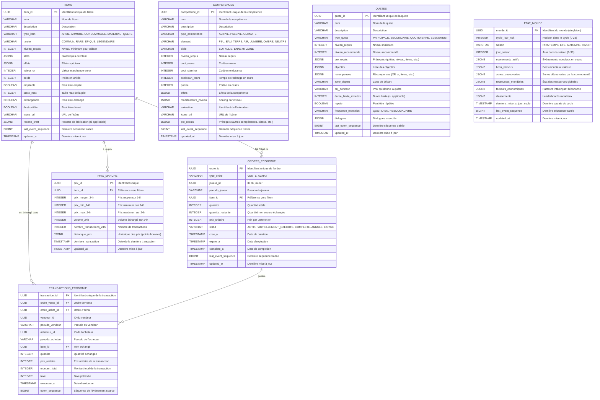

# Projections Monde - Modèles de Lecture

## Vue d'ensemble

Les projections monde regroupent les modèles de lecture pour les éléments du monde du jeu : items, compétences, quêtes, économie et état du monde. Ces projections sont construites à partir des événements des agrégats correspondants.

## Architecture

- **Base de données**: PostgreSQL
- **Pattern**: CQRS - Modèles de lecture optimisés pour les requêtes
- **Agrégats Sources**: Item, Competence, Quete, Economy, WorldState
- **Handlers**: ItemProjection, SkillProjection, QuestProjection, EconomyProjection, WorldProjection
- **Normalisation**: Dénormalisation pour performance des lectures

## Schéma des Projections



## Tables Détaillées

### ITEMS

Catalogue complet des items du jeu.

```sql
CREATE TABLE items (
    item_id UUID PRIMARY KEY,
    nom VARCHAR(100) NOT NULL,
    description TEXT,
    type_item VARCHAR(20) NOT NULL CHECK (type_item IN ('ARME', 'ARMURE', 'CONSOMMABLE', 'MATERIAU', 'QUETE', 'AUTRE')),
    rarete VARCHAR(15) NOT NULL CHECK (rarete IN ('COMMUN', 'RARE', 'EPIQUE', 'LEGENDAIRE', 'MYTHIQUE')),
    niveau_requis INTEGER DEFAULT 1,
    stats JSONB NOT NULL DEFAULT '{}'::jsonb,
    effets JSONB NOT NULL DEFAULT '[]'::jsonb,
    valeur_or INTEGER NOT NULL DEFAULT 0,
    poids INTEGER NOT NULL DEFAULT 1,
    empilable BOOLEAN DEFAULT false,
    stack_max INTEGER DEFAULT 1,
    echangeable BOOLEAN DEFAULT true,
    destructible BOOLEAN DEFAULT true,
    icone_url VARCHAR(255),
    recette_craft JSONB,
    last_event_sequence BIGINT NOT NULL,
    updated_at TIMESTAMP NOT NULL DEFAULT NOW()
);

CREATE INDEX idx_items_type ON items(type_item);
CREATE INDEX idx_items_rarete ON items(rarete);
CREATE INDEX idx_items_niveau ON items(niveau_requis);
CREATE INDEX idx_items_nom ON items(nom);
CREATE INDEX idx_items_echangeable ON items(echangeable) WHERE echangeable = true;
CREATE INDEX idx_items_stats ON items USING GIN(stats);
```

**Événements Sources**:
- ItemCree → Création de l'item
- ItemModifie → Mise à jour des propriétés
- ProprietesModifiees → Mise à jour stats/effets

### COMPETENCES

Catalogue des compétences disponibles.

```sql
CREATE TABLE competences (
    competence_id UUID PRIMARY KEY,
    nom VARCHAR(100) NOT NULL,
    description TEXT,
    type_competence VARCHAR(10) NOT NULL CHECK (type_competence IN ('ACTIVE', 'PASSIVE', 'ULTIMATE')),
    element VARCHAR(10) CHECK (element IN ('FEU', 'EAU', 'TERRE', 'AIR', 'LUMIERE', 'OMBRE', 'NEUTRE')),
    cible VARCHAR(10) NOT NULL CHECK (cible IN ('SOI', 'ALLIE', 'ENNEMI', 'ZONE', 'TOUS')),
    niveau_requis INTEGER DEFAULT 1,
    cout_mana INTEGER DEFAULT 0,
    cout_stamina INTEGER DEFAULT 0,
    cooldown_tours INTEGER DEFAULT 0,
    portee INTEGER DEFAULT 1,
    effets JSONB NOT NULL DEFAULT '[]'::jsonb,
    modificateurs_niveau JSONB DEFAULT '{}'::jsonb,
    animation VARCHAR(50),
    icone_url VARCHAR(255),
    pre_requis JSONB DEFAULT '{}'::jsonb,
    last_event_sequence BIGINT NOT NULL,
    updated_at TIMESTAMP NOT NULL DEFAULT NOW()
);

CREATE INDEX idx_competences_type ON competences(type_competence);
CREATE INDEX idx_competences_element ON competences(element);
CREATE INDEX idx_competences_niveau ON competences(niveau_requis);
CREATE INDEX idx_competences_nom ON competences(nom);
```

**Événements Sources**:
- CompetenceApprise (au niveau agrégat Joueur, mais création dans catalogue)
- CompetenceAmelioree → Mise à jour modificateurs_niveau

### QUETES

Catalogue des quêtes disponibles.

```sql
CREATE TABLE quetes (
    quete_id UUID PRIMARY KEY,
    nom VARCHAR(100) NOT NULL,
    description TEXT,
    type_quete VARCHAR(15) NOT NULL CHECK (type_quete IN ('PRINCIPALE', 'SECONDAIRE', 'QUOTIDIENNE', 'EVENEMENT')),
    niveau_requis INTEGER DEFAULT 1,
    niveau_recommande INTEGER,
    pre_requis JSONB DEFAULT '{}'::jsonb,
    objectifs JSONB NOT NULL,
    recompenses JSONB NOT NULL DEFAULT '{}'::jsonb,
    zone_depart VARCHAR(100),
    pnj_donneur VARCHAR(100),
    duree_limite_minutes INTEGER,
    repete BOOLEAN DEFAULT false,
    frequence_repetition VARCHAR(15) CHECK (frequence_repetition IN ('QUOTIDIEN', 'HEBDOMADAIRE')),
    dialogues JSONB DEFAULT '[]'::jsonb,
    last_event_sequence BIGINT NOT NULL,
    updated_at TIMESTAMP NOT NULL DEFAULT NOW()
);

CREATE INDEX idx_quetes_type ON quetes(type_quete);
CREATE INDEX idx_quetes_niveau ON quetes(niveau_requis);
CREATE INDEX idx_quetes_zone ON quetes(zone_depart);
CREATE INDEX idx_quetes_nom ON quetes(nom);
CREATE INDEX idx_quetes_repete ON quetes(repete) WHERE repete = true;
```

**Événements Sources**:
- QueteCreee → Création de la quête
- ObjectifProgresse → Mise à jour objectifs (au niveau Joueur)
- QueteTerminee → Stats globales de complétion

### ETAT_MONDE

État global du monde (singleton).

```sql
CREATE TABLE etat_monde (
    monde_id UUID PRIMARY KEY DEFAULT '00000000-0000-0000-0000-000000000000',
    cycle_jour_nuit INTEGER NOT NULL DEFAULT 0 CHECK (cycle_jour_nuit BETWEEN 0 AND 23),
    saison VARCHAR(10) NOT NULL DEFAULT 'PRINTEMPS' CHECK (saison IN ('PRINTEMPS', 'ETE', 'AUTOMNE', 'HIVER')),
    jour_saison INTEGER NOT NULL DEFAULT 1 CHECK (jour_saison BETWEEN 1 AND 30),
    evenements_actifs JSONB NOT NULL DEFAULT '[]'::jsonb,
    boss_vaincus JSONB NOT NULL DEFAULT '[]'::jsonb,
    zones_decouvertes JSONB NOT NULL DEFAULT '[]'::jsonb,
    ressources_mondiales JSONB NOT NULL DEFAULT '{}'::jsonb,
    facteurs_economiques JSONB NOT NULL DEFAULT '{}'::jsonb,
    classements JSONB NOT NULL DEFAULT '{}'::jsonb,
    derniere_mise_a_jour_cycle TIMESTAMP NOT NULL DEFAULT NOW(),
    last_event_sequence BIGINT NOT NULL,
    updated_at TIMESTAMP NOT NULL DEFAULT NOW()
);

-- S'assurer qu'il n'y a qu'une seule ligne
CREATE UNIQUE INDEX idx_etat_monde_singleton ON etat_monde((monde_id = '00000000-0000-0000-0000-000000000000'));
```

**Événements Sources**:
- EvenementMondialDeclenche → Ajout dans evenements_actifs
- ZoneDecouverte → Ajout dans zones_decouvertes
- BossVaincu → Ajout dans boss_vaincus
- RessourceRegeneree → Mise à jour ressources_mondiales

### ORDRES_ECONOMIE

Ordres d'achat/vente sur le marché.

```sql
CREATE TABLE ordres_economie (
    ordre_id UUID PRIMARY KEY,
    type_ordre VARCHAR(10) NOT NULL CHECK (type_ordre IN ('VENTE', 'ACHAT')),
    joueur_id UUID NOT NULL,
    pseudo_joueur VARCHAR(50) NOT NULL,
    item_id UUID NOT NULL REFERENCES items(item_id),
    quantite INTEGER NOT NULL CHECK (quantite > 0),
    quantite_restante INTEGER NOT NULL CHECK (quantite_restante >= 0),
    prix_unitaire INTEGER NOT NULL CHECK (prix_unitaire > 0),
    statut VARCHAR(25) NOT NULL DEFAULT 'ACTIF' CHECK (statut IN ('ACTIF', 'PARTIELLEMENT_EXECUTE', 'COMPLETE', 'ANNULE', 'EXPIRE')),
    cree_a TIMESTAMP NOT NULL,
    expire_a TIMESTAMP,
    complete_a TIMESTAMP,
    last_event_sequence BIGINT NOT NULL,
    updated_at TIMESTAMP NOT NULL DEFAULT NOW()
);

CREATE INDEX idx_ordres_economie_joueur ON ordres_economie(joueur_id);
CREATE INDEX idx_ordres_economie_item ON ordres_economie(item_id, statut);
CREATE INDEX idx_ordres_economie_type ON ordres_economie(type_ordre, statut);
CREATE INDEX idx_ordres_economie_statut ON ordres_economie(statut);
CREATE INDEX idx_ordres_economie_prix ON ordres_economie(item_id, type_ordre, prix_unitaire) WHERE statut = 'ACTIF';
```

**Événements Sources**:
- OrdreVenteCree → Création ordre de vente
- OrdreAchatCree → Création ordre d'achat
- TransactionExecutee → Mise à jour quantite_restante, statut
- OrdreAnnule → Mise à jour statut

### TRANSACTIONS_ECONOMIE

Historique des transactions du marché.

```sql
CREATE TABLE transactions_economie (
    transaction_id UUID PRIMARY KEY,
    ordre_vente_id UUID NOT NULL REFERENCES ordres_economie(ordre_id),
    ordre_achat_id UUID NOT NULL REFERENCES ordres_economie(ordre_id),
    vendeur_id UUID NOT NULL,
    pseudo_vendeur VARCHAR(50) NOT NULL,
    acheteur_id UUID NOT NULL,
    pseudo_acheteur VARCHAR(50) NOT NULL,
    item_id UUID NOT NULL REFERENCES items(item_id),
    quantite INTEGER NOT NULL,
    prix_unitaire INTEGER NOT NULL,
    montant_total INTEGER NOT NULL,
    taxe INTEGER NOT NULL DEFAULT 0,
    executee_a TIMESTAMP NOT NULL,
    event_sequence BIGINT NOT NULL
);

CREATE INDEX idx_transactions_vendeur ON transactions_economie(vendeur_id);
CREATE INDEX idx_transactions_acheteur ON transactions_economie(acheteur_id);
CREATE INDEX idx_transactions_item ON transactions_economie(item_id, executee_a DESC);
CREATE INDEX idx_transactions_date ON transactions_economie(executee_a);
```

**Événements Sources**:
- TransactionExecutee → Création de la transaction

### PRIX_MARCHE

Statistiques et historique des prix.

```sql
CREATE TABLE prix_marche (
    prix_id UUID PRIMARY KEY DEFAULT gen_random_uuid(),
    item_id UUID NOT NULL REFERENCES items(item_id),
    prix_moyen_24h INTEGER,
    prix_min_24h INTEGER,
    prix_max_24h INTEGER,
    volume_24h INTEGER DEFAULT 0,
    nombre_transactions_24h INTEGER DEFAULT 0,
    historique_prix JSONB DEFAULT '[]'::jsonb,
    derniere_transaction TIMESTAMP,
    updated_at TIMESTAMP NOT NULL DEFAULT NOW()
);

CREATE UNIQUE INDEX idx_prix_marche_item ON prix_marche(item_id);
CREATE INDEX idx_prix_marche_volume ON prix_marche(volume_24h DESC);
```

**Événements Sources**:
- TransactionExecutee → Recalcul des statistiques
- PrixMisAJour → Mise à jour des données

## Requêtes Typiques

### 1. Recherche d'Items par Filtres

```sql
SELECT *
FROM items
WHERE type_item = $1
  AND rarete = ANY($2::text[])
  AND niveau_requis <= $3
  AND echangeable = true
ORDER BY nom;
```

### 2. Compétences Disponibles pour un Niveau

```sql
SELECT *
FROM competences
WHERE niveau_requis <= $1
  AND type_competence = 'ACTIVE'
ORDER BY element, nom;
```

### 3. Quêtes Disponibles pour un Joueur

```sql
SELECT q.*
FROM quetes q
WHERE q.niveau_requis <= $1
  AND q.niveau_recommande <= $1 + 5
  AND (q.repete = true OR q.quete_id NOT IN (
    -- Quêtes déjà complétées par le joueur
    SELECT quete_id FROM quetes_joueur WHERE joueur_id = $2 AND statut = 'COMPLETE'
  ))
ORDER BY q.type_quete, q.niveau_requis;
```

### 4. Meilleurs Prix d'Achat/Vente

```sql
-- Meilleurs prix de vente (pour acheter)
SELECT o.*, i.nom as item_nom
FROM ordres_economie o
JOIN items i ON o.item_id = i.item_id
WHERE o.type_ordre = 'VENTE'
  AND o.statut = 'ACTIF'
  AND o.item_id = $1
ORDER BY o.prix_unitaire ASC
LIMIT 10;

-- Meilleurs prix d'achat (pour vendre)
SELECT o.*, i.nom as item_nom
FROM ordres_economie o
JOIN items i ON o.item_id = i.item_id
WHERE o.type_ordre = 'ACHAT'
  AND o.statut = 'ACTIF'
  AND o.item_id = $1
ORDER BY o.prix_unitaire DESC
LIMIT 10;
```

### 5. Historique de Prix d'un Item

```sql
SELECT 
    pm.prix_moyen_24h,
    pm.prix_min_24h,
    pm.prix_max_24h,
    pm.volume_24h,
    pm.historique_prix
FROM prix_marche pm
WHERE pm.item_id = $1;
```

### 6. État Actuel du Monde

```sql
SELECT 
    cycle_jour_nuit,
    saison,
    jour_saison,
    evenements_actifs,
    classements
FROM etat_monde
WHERE monde_id = '00000000-0000-0000-0000-000000000000';
```

### 7. Transactions Récentes d'un Joueur

```sql
SELECT 
    t.*,
    i.nom as item_nom,
    i.icone_url
FROM transactions_economie t
JOIN items i ON t.item_id = i.item_id
WHERE t.vendeur_id = $1 OR t.acheteur_id = $1
ORDER BY t.executee_a DESC
LIMIT 50;
```

## Maintenance

### Recalcul des Prix du Marché

```sql
-- Job exécuté toutes les heures
UPDATE prix_marche pm
SET 
    prix_moyen_24h = subq.prix_moyen,
    prix_min_24h = subq.prix_min,
    prix_max_24h = subq.prix_max,
    volume_24h = subq.volume,
    nombre_transactions_24h = subq.nb_trans,
    derniere_transaction = subq.derniere,
    updated_at = NOW()
FROM (
    SELECT 
        item_id,
        CAST(AVG(prix_unitaire) AS INTEGER) as prix_moyen,
        MIN(prix_unitaire) as prix_min,
        MAX(prix_unitaire) as prix_max,
        SUM(quantite) as volume,
        COUNT(*) as nb_trans,
        MAX(executee_a) as derniere
    FROM transactions_economie
    WHERE executee_a >= NOW() - INTERVAL '24 hours'
    GROUP BY item_id
) subq
WHERE pm.item_id = subq.item_id;
```

### Expiration des Ordres

```sql
-- Job exécuté périodiquement
UPDATE ordres_economie
SET 
    statut = 'EXPIRE',
    updated_at = NOW()
WHERE statut = 'ACTIF'
  AND expire_a IS NOT NULL
  AND expire_a < NOW();
```

### Archivage des Transactions

```sql
-- Archiver les transactions > 90 jours
INSERT INTO transactions_economie_archive
SELECT * FROM transactions_economie
WHERE executee_a < NOW() - INTERVAL '90 days';

DELETE FROM transactions_economie
WHERE executee_a < NOW() - INTERVAL '90 days';
```

## Références

- **event_store.md**: Source de vérité
- **event_handlers.md**: ItemProjection, SkillProjection, QuestProjection, EconomyProjection, WorldProjection
- **matrice_evenements.md**: Structures des événements Item/Quete/Competence/Economy/WorldState
