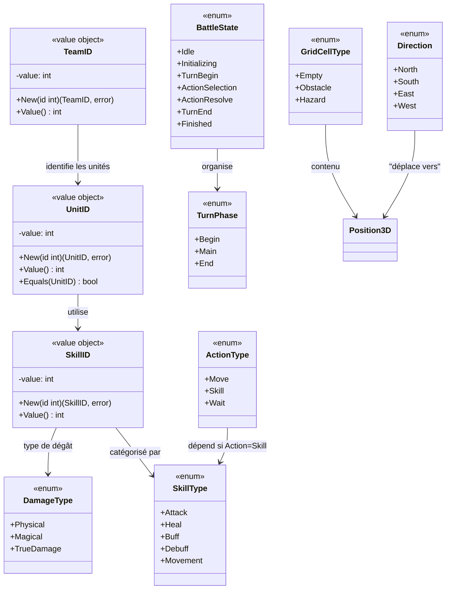

```mermaid

classDiagram

%% ===========================
%% ENUMS / VALUE OBJECT ENUM-LIKE
%% ===========================

class BattleState {
    <<enum>>
    +Idle
    +Initializing
    +TurnBegin
    +ActionSelection
    +ActionResolve
    +TurnEnd
    +Finished
}

class TeamID {
    <<value object>>
    -value: int
    +New(id int) (TeamID, error)
    +Value() int
}

class UnitID {
    <<value object>>
    -value: int
    +New(id int) (UnitID, error)
    +Value() int
    +Equals(UnitID) bool
}

class SkillID {
    <<value object>>
    -value: int
    +New(id int) (SkillID, error)
    +Value() int
}

class DamageType {
    <<enum>>
    +Physical
    +Magical
    +TrueDamage
}

class SkillType {
    <<enum>>
    +Attack
    +Heal
    +Buff
    +Debuff
    +Movement
}

class Direction {
    <<enum>>
    +North
    +South
    +East
    +West
}

class ActionType {
    <<enum>>
    +Move
    +Skill
    +Wait
}

class TurnPhase {
    <<enum>>
    +Begin
    +Main
    +End
}

class GridCellType {
    <<enum>>
    +Empty
    +Obstacle
    +Hazard
}

%% ===========================
%% RELATIONS
%% ===========================

TeamID --> UnitID : identifie les unités
UnitID --> SkillID : utilise
SkillID --> SkillType : catégorisé par
SkillID --> DamageType : type de dégât

BattleState --> TurnPhase : organise
ActionType --> SkillType : dépend si Action=Skill

Direction --> Position3D : "déplace vers"
GridCellType --> Position3D : contenu
```