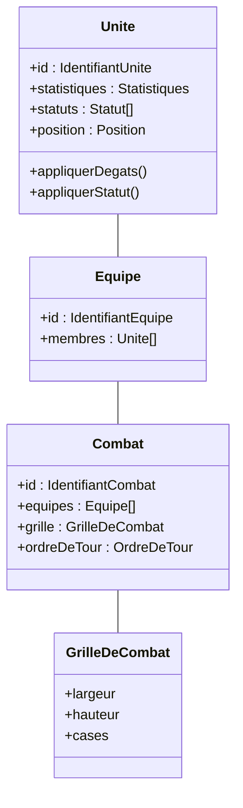

# Diagramme de classe – Tactical RPG

---

**Légende** :
- `+` : attribut ou méthode publique
- Les relations montrent la composition/agrégation entre les entités principales du moteur de combat.

Ce diagramme modélise la structure objet du cœur du serveur tactical RPG.