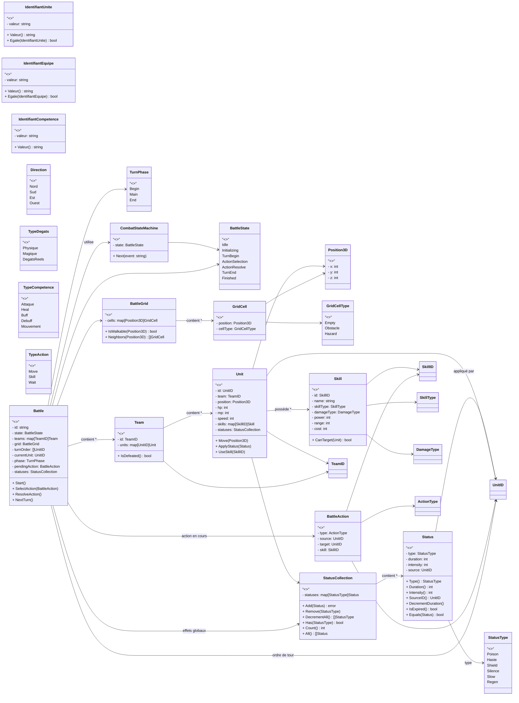

```mermaid
classDiagram
direction LR

%% =========================
%% VALUE OBJECTS & ENUMS (fr)
%% =========================

%% Note de synchronisation :
%% Ce diagramme utilise le nommage français, sauf pour les termes internationalement utilisés (item, Tank, DPS, Heal, etc.).
%% Les définitions détaillées sont centralisées dans `/doc/Agrégats.md`.

class IdentifiantUnite {
    "<<value object>>"
    - valeur: string
    + Valeur() string
    + Egale(IdentifiantUnite) bool
}

class IdentifiantEquipe {
    "<<value object>>"
    - valeur: string
    + Valeur() string
    + Egale(IdentifiantEquipe) bool
}

class IdentifiantCompetence {
    "<<value object>>"
    - valeur: string
    + Valeur() string
}

class Position3D {
    "<<value object>>"
    - x: int
    - y: int
    - z: int
}

class Direction {
    "<<enum>>"
    Nord
    Sud
    Est
    Ouest
}

class TypeDegats {
    "<<enum>>"
    Physique
    Magique
    DegatsReels
}

class TypeCompetence {
    "<<enum>>"
    Attaque
    Heal
    Buff
    Debuff
    Mouvement
}

class TypeAction {
    "<<enum>>"
    Move
    Skill
    Wait
}

class TurnPhase {
    "<<enum>>"
    Begin
    Main
    End
}

class GridCellType {
    "<<enum>>"
    Empty
    Obstacle
    Hazard
}

class BattleState {
    "<<enum>>"
    Idle
    Initializing
    TurnBegin
    ActionSelection
    ActionResolve
    TurnEnd
    Finished
}

class StatusType {
    "<<enum>>"
    Poison
    Haste
    Shield
    Silence
    Slow
    Regen
}

%% =========================
%% STATUS & STATUS COLLECTION
%% =========================

class Status {
    "<<entity>>"
    - type: StatusType
    - duration: int
    - intensity: int
    - source: UnitID
    + Type() StatusType
    + Duration() int
    + Intensity() int
    + SourceID() UnitID
    + DecrementDuration()
    + IsExpired() bool
    + Equals(Status) bool
}

class StatusCollection {
    "<<entity>>"
    - statuses: map[StatusType]Status
    + Add(Status) error
    + Remove(StatusType)
    + DecrementAll() []StatusType
    + Has(StatusType) bool
    + Count() int
    + All() []Status
}

StatusCollection --> Status : contient *
Status --> StatusType : type
Status --> UnitID : appliqué par

%% =========================
%% SKILLS
%% =========================

class Skill {
    "<<entity>>"
    - id: SkillID
    - name: string
    - skillType: SkillType
    - damageType: DamageType
    - power: int
    - range: int
    - cost: int
    + CanTarget(Unit) bool
}

Skill --> SkillID
Skill --> SkillType
Skill --> DamageType

%% =========================
%% UNIT
%% =========================

class Unit {
    "<<entity>>"
    - id: UnitID
    - team: TeamID
    - position: Position3D
    - hp: int
    - mp: int
    - speed: int
    - skills: map[SkillID]Skill
    - statuses: StatusCollection
    + Move(Position3D)
    + ApplyStatus(Status)
    + UseSkill(SkillID)
}

Unit --> UnitID
Unit --> TeamID
Unit --> Position3D
Unit --> StatusCollection
Unit --> Skill : possède *

%% =========================
%% TEAM
%% =========================

class Team {
    "<<entity>>"
    - id: TeamID
    - units: map[UnitID]Unit
    + IsDefeated() bool
}

Team --> TeamID
Team --> Unit : contient *

%% =========================
%% GRID & CELLS
%% =========================

class GridCell {
    "<<entity>>"
    - position: Position3D
    - cellType: GridCellType
}

GridCell --> Position3D
GridCell --> GridCellType

class BattleGrid {
    "<<entity>>"
    - cells: map[Position3D]GridCell
    + IsWalkable(Position3D) bool
    + Neighbors(Position3D) []GridCell
}

BattleGrid --> GridCell : contient *

%% =========================
%% ACTIONS
%% =========================

class BattleAction {
    "<<value object>>"
    - type: ActionType
    - source: UnitID
    - target: UnitID
    - skill: SkillID
}

BattleAction --> ActionType
BattleAction --> UnitID
BattleAction --> SkillID

%% =========================
%% STATE MACHINE
%% =========================

class CombatStateMachine {
    "<<service>>"
    - state: BattleState
    + Next(event: string)
}

CombatStateMachine --> BattleState

%% =========================
%% BATTLE AGGREGATE ROOT
%% =========================

class Battle {
    "<<aggregate>>"
    - id: string
    - state: BattleState
    - teams: map[TeamID]Team
    - grid: BattleGrid
    - turnOrder: []UnitID
    - currentUnit: UnitID
    - phase: TurnPhase
    - pendingAction: BattleAction
    - statuses: StatusCollection
    + Start()
    + SelectAction(BattleAction)
    + ResolveAction()
    + NextTurn()
}

Battle --> CombatStateMachine : utilise
Battle --> Team : contient *
Battle --> BattleGrid
Battle --> UnitID : ordre de tour
Battle --> BattleAction : action en cours
Battle --> StatusCollection : effets globaux
Battle --> TurnPhase
Battle --> BattleState
```
