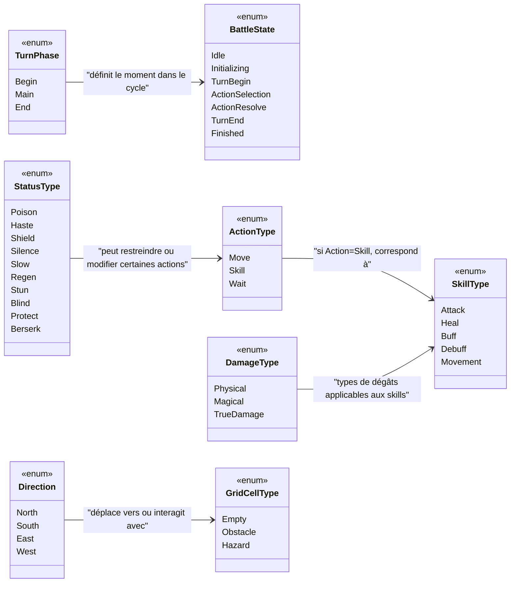

```mermaid
classDiagram
direction LR

%% =========================
%% ENUMS DU DOMAINE
%% =========================

class BattleState {
    <<enum>>
    Idle
    Initializing
    TurnBegin
    ActionSelection
    ActionResolve
    TurnEnd
    Finished
}

class TurnPhase {
    <<enum>>
    Begin
    Main
    End
}

class ActionType {
    <<enum>>
    Move
    Skill
    Wait
}

class SkillType {
    <<enum>>
    Attack
    Heal
    Buff
    Debuff
    Movement
}

class DamageType {
    <<enum>>
    Physical
    Magical
    TrueDamage
}

class Direction {
    <<enum>>
    North
    South
    East
    West
}

class GridCellType {
    <<enum>>
    Empty
    Obstacle
    Hazard
}

class StatusType {
    <<enum>>
    Poison
    Haste
    Shield
    Silence
    Slow
    Regen
    Stun
    Blind
    Protect
    Berserk
}

%% =========================
%% RELATIONS CONCEPTUELLES ENTRE ENUMS
%% =========================

ActionType --> SkillType : "si Action=Skill, correspond à"
TurnPhase --> BattleState : "définit le moment dans le cycle"
DamageType --> SkillType : "types de dégâts applicables aux skills"
StatusType --> ActionType : "peut restreindre ou modifier certaines actions"
Direction --> GridCellType : "déplace vers ou interagit avec"


```