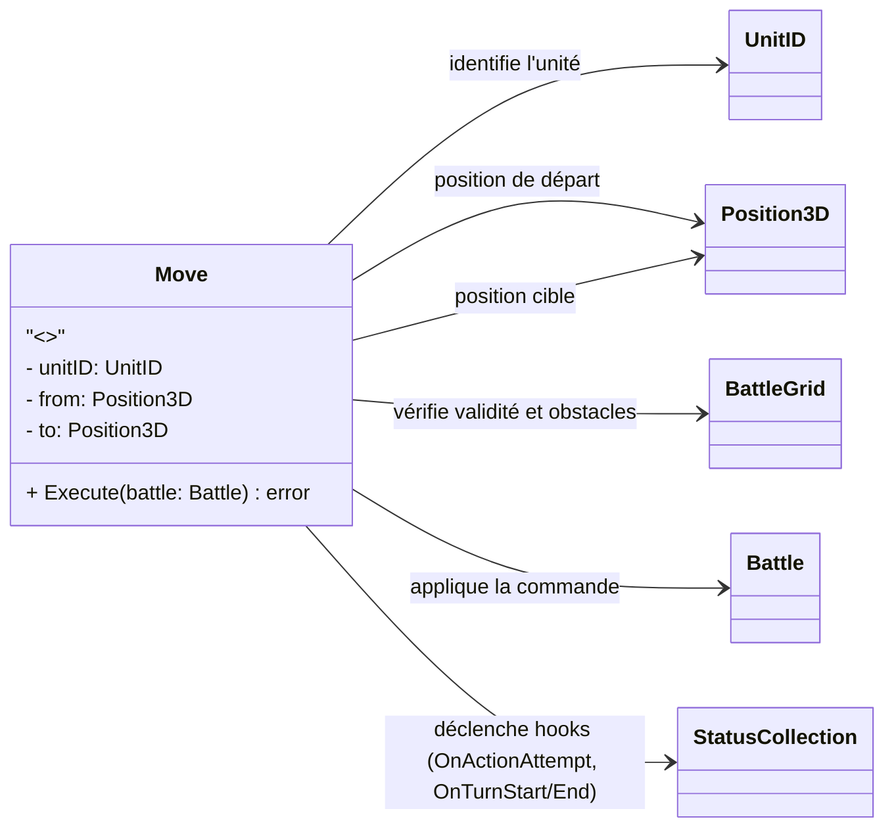

```mermaid 
classDiagram
direction LR

%% =========================
%% COMMAND MOVE
%% =========================

class Move {
    "<<value object / command>>"
    - unitID: UnitID
    - from: Position3D
    - to: Position3D
    + Execute(battle: Battle) error
}

%% =========================
%% RELATIONS
%% =========================

Move --> UnitID : identifie l'unité
Move --> Position3D : position de départ
Move --> Position3D : position cible
Move --> BattleGrid : vérifie validité et obstacles
Move --> Battle : applique la commande
Move --> StatusCollection : déclenche hooks (OnActionAttempt, OnTurnStart/End)
```