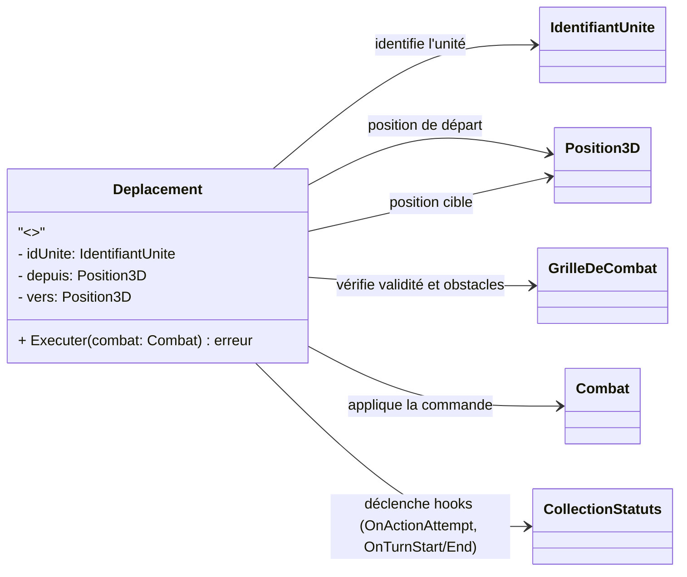

```mermaid
classDiagram
direction LR

%% =========================
%% COMMANDE DEPLACEMENT (fr)
%% =========================

%% Note de synchronisation :
%% Ce diagramme utilise le nommage français, sauf pour les termes internationalement utilisés (item, Tank, DPS, Heal, etc.).
%% Les définitions détaillées sont centralisées dans `/doc/Agrégats.md`.

class Deplacement {
    "<<value object / commande>>"
    - idUnite: IdentifiantUnite
    - depuis: Position3D
    - vers: Position3D
    + Executer(combat: Combat) erreur
}

%% =========================
%% RELATIONS
%% =========================

Deplacement --> IdentifiantUnite : identifie l'unité
Deplacement --> Position3D : position de départ
Deplacement --> Position3D : position cible
Deplacement --> GrilleDeCombat : vérifie validité et obstacles
Deplacement --> Combat : applique la commande
Deplacement --> CollectionStatuts : déclenche hooks (OnActionAttempt, OnTurnStart/End)
```