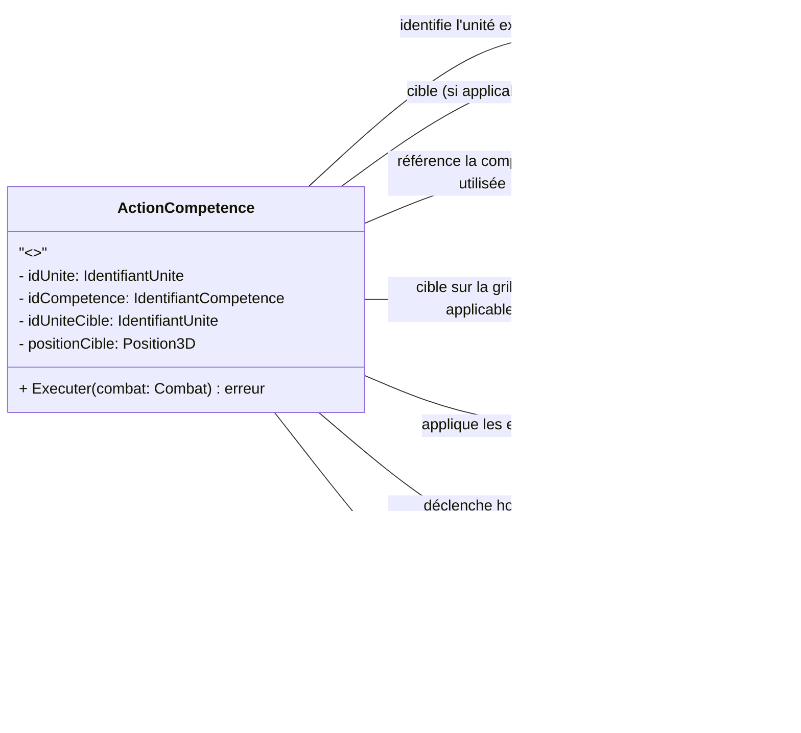

```mermaid
classDiagram
direction LR

%% =========================
%% COMMANDE COMPETENCE (fr)
%% =========================

%% Note de synchronisation :
%% Ce diagramme utilise le nommage français, sauf pour les termes internationalement utilisés (item, Tank, DPS, Heal, etc.).
%% Les définitions détaillées sont centralisées dans `/doc/Agrégats.md`.

class ActionCompetence {
    "<<value object / commande>>"
    - idUnite: IdentifiantUnite
    - idCompetence: IdentifiantCompetence
    - idUniteCible: IdentifiantUnite
    - positionCible: Position3D
    + Executer(combat: Combat) erreur
}

%% =========================
%% RELATIONS
%% =========================

ActionCompetence --> IdentifiantUnite : identifie l'unité exécutant
ActionCompetence --> IdentifiantCompetence : référence la compétence utilisée
ActionCompetence --> IdentifiantUnite : cible (si applicable)
ActionCompetence --> Position3D : cible sur la grille (si applicable)
ActionCompetence --> Combat : applique les effets
ActionCompetence --> CollectionStatuts : déclenche hooks (OnActionAttempt, OnIncomingDamage, OnOutgoingDamage, OnExpire)
ActionCompetence --> GrilleDeCombat : vérifie portée, obstacles, zone d'effet
```