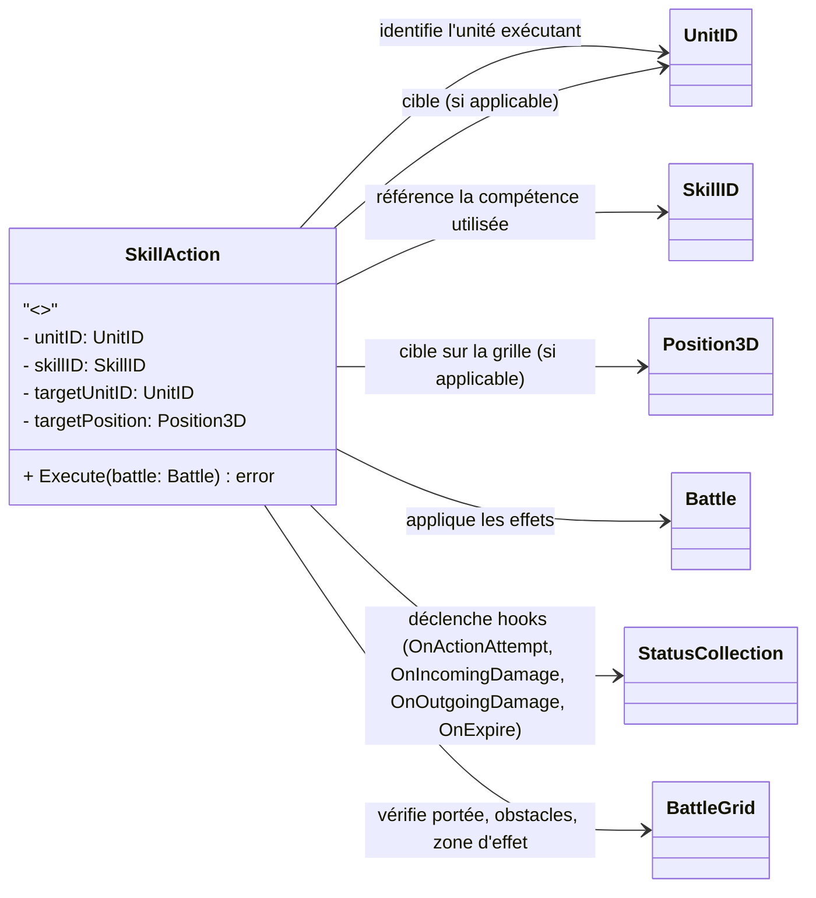

```mermaid
classDiagram
direction LR

%% =========================
%% COMMAND SKILL
%% =========================

class SkillAction {
    "<<value object / command>>"
    - unitID: UnitID
    - skillID: SkillID
    - targetUnitID: UnitID
    - targetPosition: Position3D
    + Execute(battle: Battle) error
}

%% =========================
%% RELATIONS
%% =========================

SkillAction --> UnitID : identifie l'unité exécutant
SkillAction --> SkillID : référence la compétence utilisée
SkillAction --> UnitID : cible (si applicable)
SkillAction --> Position3D : cible sur la grille (si applicable)
SkillAction --> Battle : applique les effets
SkillAction --> StatusCollection : déclenche hooks (OnActionAttempt, OnIncomingDamage, OnOutgoingDamage, OnExpire)
SkillAction --> BattleGrid : vérifie portée, obstacles, zone d'effet

```