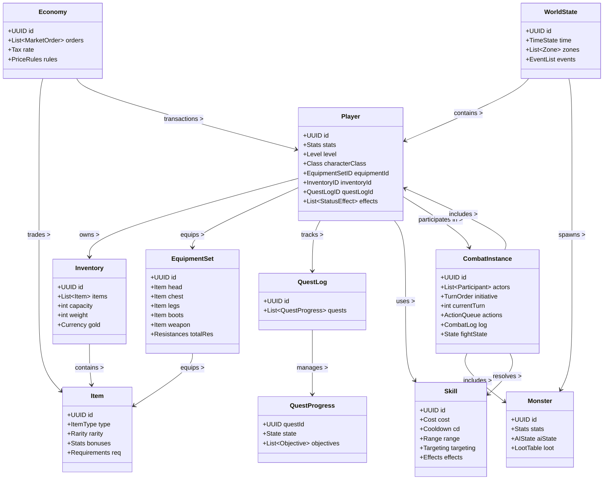

```mermaid
classDiagram
    %% ================================
    %%      AGGREGATS PRINCIPAUX
    %% ================================

    class Player {
        +UUID id
        +Stats stats
        +Level level
        +Class characterClass
        +EquipmentSetID equipmentId
        +InventoryID inventoryId
        +QuestLogID questLogId
        +List~StatusEffect~ effects
    }

    class CombatInstance {
        +UUID id
        +List~Participant~ actors
        +TurnOrder initiative
        +int currentTurn
        +ActionQueue actions
        +CombatLog log
        +State fightState
    }

    class Inventory {
        +UUID id
        +List~Item~ items
        +int capacity
        +int weight
        +Currency gold
    }

    class EquipmentSet {
        +UUID id
        +Item head
        +Item chest
        +Item legs
        +Item boots
        +Item weapon
        +Resistances totalRes
    }

    class Item {
        +UUID id
        +ItemType type
        +Rarity rarity
        +Stats bonuses
        +Requirements req
    }

    class Skill {
        +UUID id
        +Cost cost
        +Cooldown cd
        +Range range
        +Targeting targeting
        +Effects effects
    }

    class QuestLog {
        +UUID id
        +List~QuestProgress~ quests
    }

    class QuestProgress {
        +UUID questId
        +State state
        +List~Objective~ objectives
    }

    class Monster {
        +UUID id
        +Stats stats
        +AIState aiState
        +LootTable loot
    }

    class Economy {
        +UUID id
        +List~MarketOrder~ orders
        +Tax rate
        +PriceRules rules
    }

    class WorldState {
        +UUID id
        +TimeState time
        +List~Zone~ zones
        +EventList events
    }


    %% ================================
    %%      RELATIONS ENTRE AGGREGATS
    %% ================================

    %% Player relations
    Player --> Inventory : owns >
    Player --> EquipmentSet : equips >
    Player --> QuestLog : tracks >
    Player --> Skill : uses >
    Player --> CombatInstance : participates in >

    %% Combat relations
    CombatInstance --> Player : includes >
    CombatInstance --> Monster : includes >
    CombatInstance --> Skill : resolves >

    %% Inventory relations
    Inventory --> Item : contains >

    %% Equipment relations
    EquipmentSet --> Item : equips >

    %% Quest system
    QuestLog --> QuestProgress : manages >

    %% Economy system
    Economy --> Item : trades >
    Economy --> Player : transactions >

    %% World
    WorldState --> Player : contains >
    WorldState --> Monster : spawns >
```