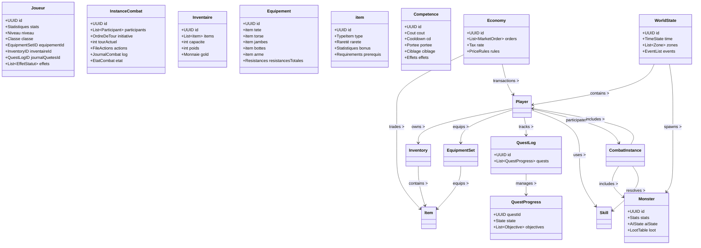

```mermaid
classDiagram
%% ================================
%%      AGRÉGATS PRINCIPAUX (fr)
%% ================================

%% Note de synchronisation :
%% Ce diagramme utilise le nommage français, sauf pour les termes internationalement utilisés (item, Tank, DPS, Heal, etc.).
%% Les définitions détaillées sont centralisées dans `/doc/agregats.md`.

class Joueur {
    +UUID id
    +Statistiques stats
    +Niveau niveau
    +Classe classe
    +EquipmentSetID equipementId
    +InventoryID inventaireId
    +QuestLogID journalQuetesId
    +List~EffetStatut~ effets
}

class InstanceCombat {
    +UUID id
    +List~Participant~ participants
    +OrdreDeTour initiative
    +int tourActuel
    +FileActions actions
    +JournalCombat log
    +EtatCombat etat
}

class Inventaire {
    +UUID id
    +List~item~ items
    +int capacite
    +int poids
    +Monnaie gold
}

class Equipement {
    +UUID id
    +item tete
    +item torse
    +item jambes
    +item bottes
    +item arme
    +Resistances resistancesTotales
}

class item {
    +UUID id
    +TypeItem type
    +Rareté rarete
    +Statistiques bonus
    +Requirements prerequis
}

class Competence {
    +UUID id
    +Cout cout
    +Cooldown cd
    +Portee portee
    +Ciblage ciblage
    +Effets effets
}

    class QuestLog {
        +UUID id
        +List~QuestProgress~ quests
    }

    class QuestProgress {
        +UUID questId
        +State state
        +List~Objective~ objectives
    }

    class Monster {
        +UUID id
        +Stats stats
        +AIState aiState
        +LootTable loot
    }

    class Economy {
        +UUID id
        +List~MarketOrder~ orders
        +Tax rate
        +PriceRules rules
    }

    class WorldState {
        +UUID id
        +TimeState time
        +List~Zone~ zones
        +EventList events
    }


    %% ================================
    %%      RELATIONS ENTRE AGGREGATS
    %% ================================

    %% Player relations
    Player --> Inventory : owns >
    Player --> EquipmentSet : equips >
    Player --> QuestLog : tracks >
    Player --> Skill : uses >
    Player --> CombatInstance : participates in >

    %% Combat relations
    CombatInstance --> Player : includes >
    CombatInstance --> Monster : includes >
    CombatInstance --> Skill : resolves >

    %% Inventory relations
    Inventory --> Item : contains >

    %% Equipment relations
    EquipmentSet --> Item : equips >

    %% Quest system
    QuestLog --> QuestProgress : manages >

    %% Economy system
    Economy --> Item : trades >
    Economy --> Player : transactions >

    %% World
    WorldState --> Player : contains >
    WorldState --> Monster : spawns >
```