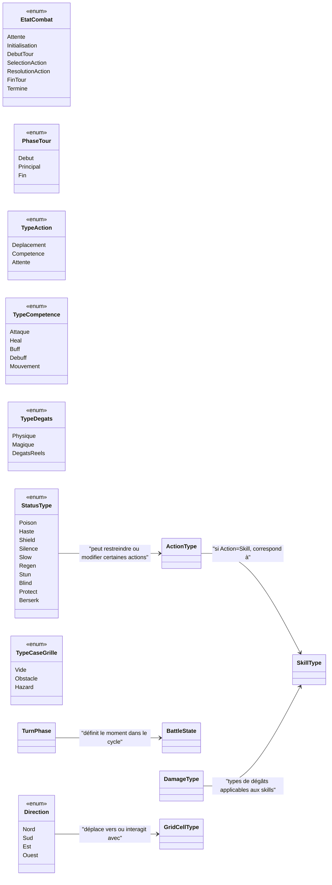

```mermaid
classDiagram
direction LR

%% =========================
%% ENUMS DU DOMAINE (fr)
%% =========================

%% Note de synchronisation :
%% Ce diagramme utilise le nommage français, sauf pour les termes internationalement utilisés (item, Tank, DPS, Heal, etc.).
%% Les définitions détaillées sont centralisées dans `/doc/agregats.md`.

class EtatCombat {
    <<enum>>
    Attente
    Initialisation
    DebutTour
    SelectionAction
    ResolutionAction
    FinTour
    Termine
}

class PhaseTour {
    <<enum>>
    Debut
    Principal
    Fin
}

class TypeAction {
    <<enum>>
    Deplacement
    Competence
    Attente
}

class TypeCompetence {
    <<enum>>
    Attaque
    Heal
    Buff
    Debuff
    Mouvement
}

class TypeDegats {
    <<enum>>
    Physique
    Magique
    DegatsReels
}

class Direction {
    <<enum>>
    Nord
    Sud
    Est
    Ouest
}

class TypeCaseGrille {
    <<enum>>
    Vide
    Obstacle
    Hazard
}

class StatusType {
    <<enum>>
    Poison
    Haste
    Shield
    Silence
    Slow
    Regen
    Stun
    Blind
    Protect
    Berserk
}

%% =========================
%% RELATIONS CONCEPTUELLES ENTRE ENUMS
%% =========================

ActionType --> SkillType : "si Action=Skill, correspond à"
TurnPhase --> BattleState : "définit le moment dans le cycle"
DamageType --> SkillType : "types de dégâts applicables aux skills"
StatusType --> ActionType : "peut restreindre ou modifier certaines actions"
Direction --> GridCellType : "déplace vers ou interagit avec"


```