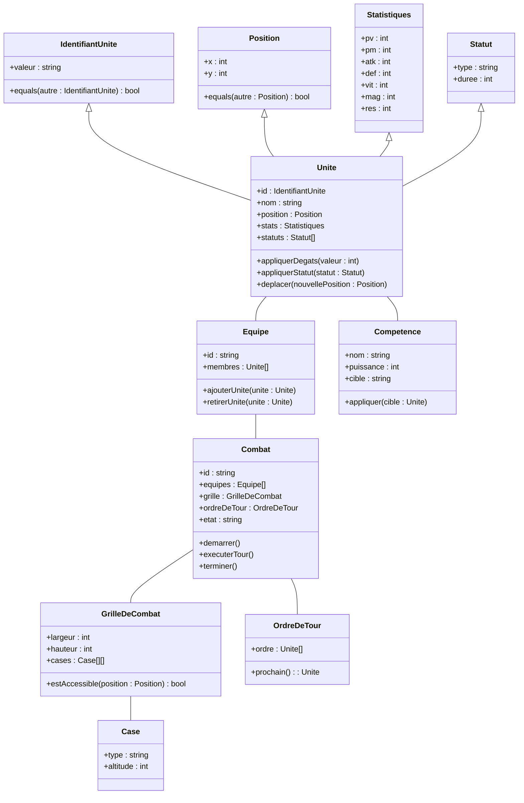

# Diagramme de classe global – Tactical RPG (francisé)

> **Note de synchronisation** : Ce diagramme utilise le nommage français pour tous les concepts, sauf les termes internationalement utilisés (item, Tank, DPS, Heal, etc.).
> Les définitions d'agrégats et Value Objects sont centralisées dans `/doc/agregats.md`.

---

