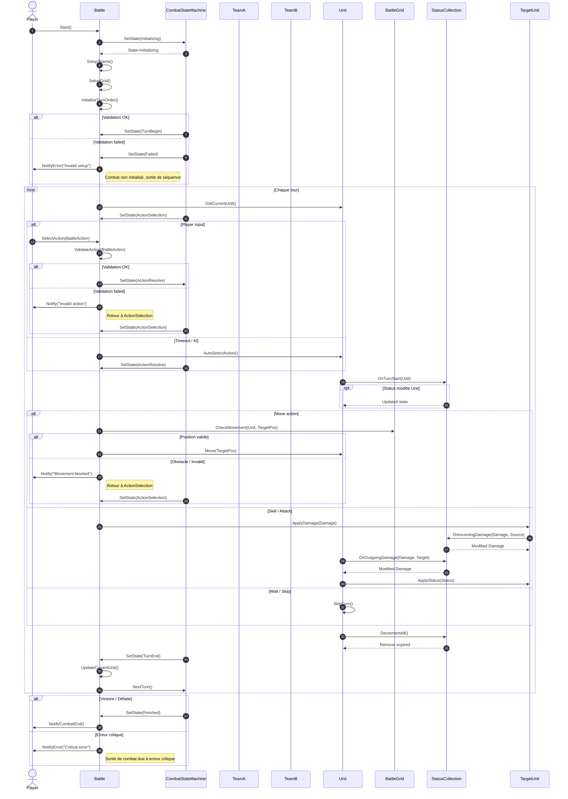

```mermaid
sequenceDiagram
    autonumber
    actor Player
    participant Battle
    participant CombatStateMachine
    participant TeamA
    participant TeamB
    participant Unit
    participant BattleGrid
    participant StatusCollection

    %% INITIALISATION
    Player ->> Battle: Start()
    Battle ->> CombatStateMachine: SetState(Initializing)
    CombatStateMachine -->> Battle: State=Initializing
    Battle ->> Battle: SetupTeams()
    Battle ->> Battle: SetupGrid()
    Battle ->> Battle: InitializeTurnOrder()
    
    alt Validation OK
        CombatStateMachine ->> Battle: SetState(TurnBegin)
    else Validation failed
        CombatStateMachine ->> Battle: SetState(Failed)
        Battle ->> Player: NotifyError("Invalid setup")
        note right of Battle: Combat non initialisé, sortie de séquence
    end

    %% BOUCLE DE TOUR
    loop Chaque tour
        Battle ->> Unit: GetCurrentUnit()
        CombatStateMachine ->> Battle: SetState(ActionSelection)

        alt Player input
            Player ->> Battle: SelectAction(BattleAction)
            Battle ->> Battle: ValidateAction(BattleAction)
            alt Validation OK
                Battle ->> CombatStateMachine: SetState(ActionResolve)
            else Validation failed
                Battle ->> Player: Notify("Invalid action")
                note right of Battle: Retour à ActionSelection
                CombatStateMachine ->> Battle: SetState(ActionSelection)
            end
        else Timeout / AI
            Battle ->> Unit: AutoSelectAction()
            CombatStateMachine ->> Battle: SetState(ActionResolve)
        end

        %% Début de tour : Status
        Unit ->> StatusCollection: OnTurnStart(Unit)
        opt Status modifie Unit
            StatusCollection -->> Unit: Updated stats
        end

        %% Résolution de l'action
        alt Move action
            Battle ->> BattleGrid: CheckMovement(Unit, TargetPos)
            alt Position valide
                Battle ->> Unit: Move(TargetPos)
            else Obstacle / Invalid
                Battle ->> Player: Notify("Movement blocked")
                note right of Battle: Retour à ActionSelection
                CombatStateMachine ->> Battle: SetState(ActionSelection)
            end
        else Skill / Attack
            Battle ->> TargetUnit: ApplyDamage(Damage)
            TargetUnit ->> StatusCollection: OnIncomingDamage(Damage, Source)
            StatusCollection -->> TargetUnit: Modified Damage
            Unit ->> StatusCollection: OnOutgoingDamage(Damage, Target)
            StatusCollection -->> Unit: Modified Damage
            Unit ->> TargetUnit: ApplyStatus(Status)
        else Wait / Skip
            Unit ->> Unit: SkipTurn()
        end

        %% Décrémente les status
        Unit ->> StatusCollection: DecrementAll()
        StatusCollection -->> Unit: Remove expired

        %% Fin de tour
        CombatStateMachine ->> Battle: SetState(TurnEnd)
        Battle ->> Battle: UpdateCurrentUnit()
        Battle ->> CombatStateMachine: NextTurn()
    end

    %% FIN DE COMBAT
    alt Victoire / Défaite
        CombatStateMachine ->> Battle: SetState(Finished)
        Battle ->> Player: NotifyCombatEnd()
    else Erreur critique
        Battle ->> Player: NotifyError("Critical error")
        note right of Battle: Sortie de combat due à erreur critique
    end

```
