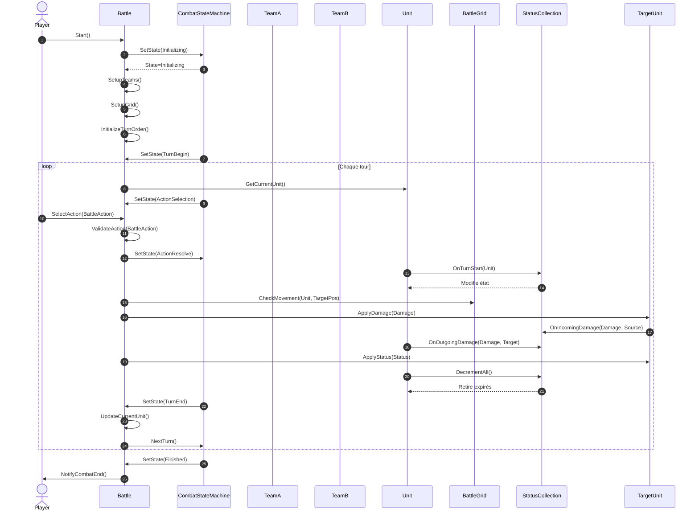

```mermaid
sequenceDiagram
    autonumber
    actor Player
    participant Battle
    participant CombatStateMachine
    participant TeamA
    participant TeamB
    participant Unit
    participant BattleGrid
    participant StatusCollection

    %% =========================
    %% INITIALISATION
    %% =========================
    Player ->> Battle: Start()
    Battle ->> CombatStateMachine: SetState(Initializing)
    CombatStateMachine -->> Battle: State=Initializing
    Battle ->> Battle: SetupTeams()
    Battle ->> Battle: SetupGrid()
    Battle ->> Battle: InitializeTurnOrder()
    CombatStateMachine ->> Battle: SetState(TurnBegin)

    %% =========================
    %% BOUCLE DE TOUR
    %% =========================
    loop Chaque tour
        Battle ->> Unit: GetCurrentUnit()
        CombatStateMachine ->> Battle: SetState(ActionSelection)
        Player ->> Battle: SelectAction(BattleAction)
        Battle ->> Battle: ValidateAction(BattleAction)
        Battle ->> CombatStateMachine: SetState(ActionResolve)

        %% Appliquer status de début de tour
        Unit ->> StatusCollection: OnTurnStart(Unit)
        StatusCollection -->> Unit: Modifie état

        %% Résolution de l'action
        Battle ->> BattleGrid: CheckMovement(Unit, TargetPos)
        Battle ->> TargetUnit: ApplyDamage(Damage)
        TargetUnit ->> StatusCollection: OnIncomingDamage(Damage, Source)
        Unit ->> StatusCollection: OnOutgoingDamage(Damage, Target)
        Battle ->> TargetUnit: ApplyStatus(Status)

        %% Décrémente les status
        Unit ->> StatusCollection: DecrementAll()
        StatusCollection -->> Unit: Retire expirés

        %% Fin de tour du joueur
        CombatStateMachine ->> Battle: SetState(TurnEnd)
        Battle ->> Battle: UpdateCurrentUnit()
        Battle ->> CombatStateMachine: NextTurn()
    end

    %% =========================
    %% FIN DE COMBAT
    %% =========================
    CombatStateMachine ->> Battle: SetState(Finished)
    Battle ->> Player: NotifyCombatEnd()
```
