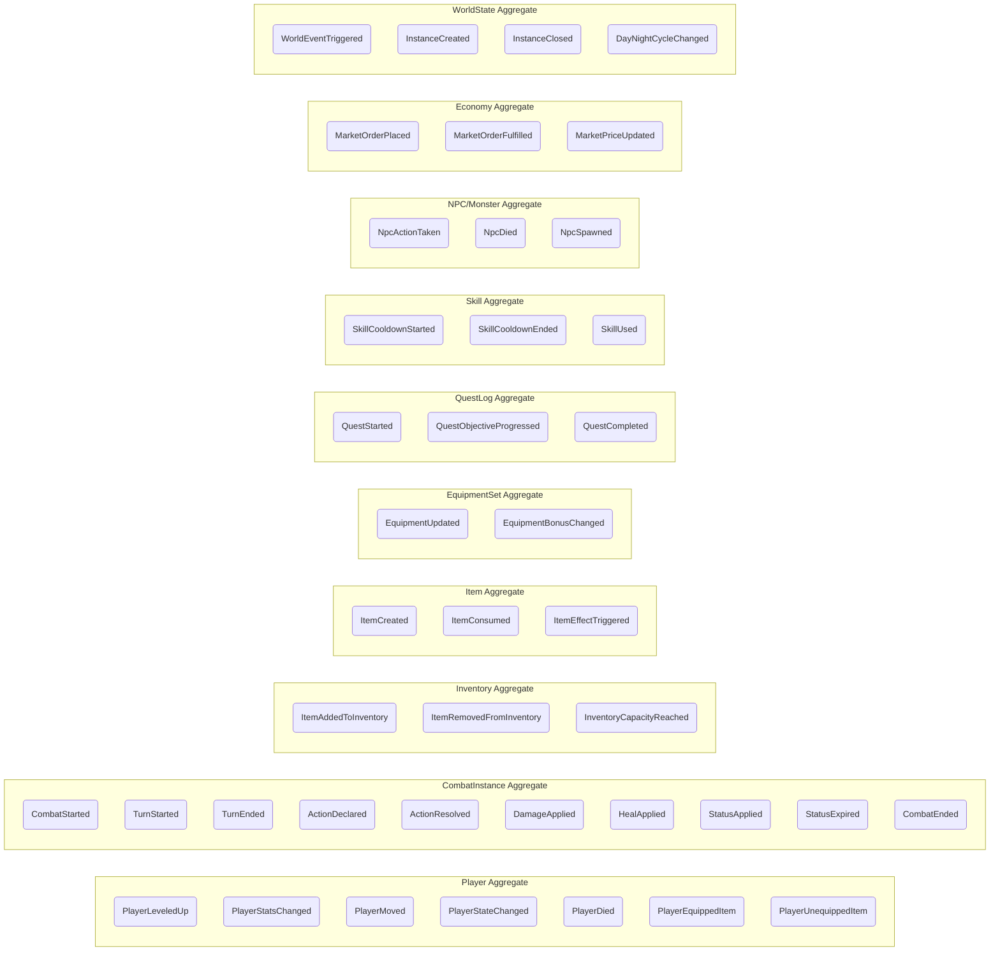

```mermaid
flowchart LR

    subgraph Player[Player Aggregate]
        PE1(PlayerLeveledUp)
        PE2(PlayerStatsChanged)
        PE3(PlayerMoved)
        PE4(PlayerStateChanged)
        PE5(PlayerDied)
        PE6(PlayerEquippedItem)
        PE7(PlayerUnequippedItem)
    end

    subgraph Combat[CombatInstance Aggregate]
        CE1(CombatStarted)
        CE2(TurnStarted)
        CE3(TurnEnded)
        CE4(ActionDeclared)
        CE5(ActionResolved)
        CE6(DamageApplied)
        CE7(HealApplied)
        CE8(StatusApplied)
        CE9(StatusExpired)
        CE10(CombatEnded)
    end

    subgraph Inventory[Inventory Aggregate]
        IE1(ItemAddedToInventory)
        IE2(ItemRemovedFromInventory)
        IE3(InventoryCapacityReached)
    end

    subgraph Item[Item Aggregate]
        IT1(ItemCreated)
        IT2(ItemConsumed)
        IT3(ItemEffectTriggered)
    end

    subgraph Equipment[EquipmentSet Aggregate]
        EQ1(EquipmentUpdated)
        EQ2(EquipmentBonusChanged)
    end

    subgraph Quest[QuestLog Aggregate]
        QE1(QuestStarted)
        QE2(QuestObjectiveProgressed)
        QE3(QuestCompleted)
    end

    subgraph Skill[Skill Aggregate]
        SK1(SkillCooldownStarted)
        SK2(SkillCooldownEnded)
        SK3(SkillUsed)
    end

    subgraph NPC[NPC/Monster Aggregate]
        NE1(NpcActionTaken)
        NE2(NpcDied)
        NE3(NpcSpawned)
    end

    subgraph Economy[Economy Aggregate]
        EC1(MarketOrderPlaced)
        EC2(MarketOrderFulfilled)
        EC3(MarketPriceUpdated)
    end

    subgraph World[WorldState Aggregate]
        WS1(WorldEventTriggered)
        WS2(InstanceCreated)
        WS3(InstanceClosed)
        WS4(DayNightCycleChanged)
    end
```