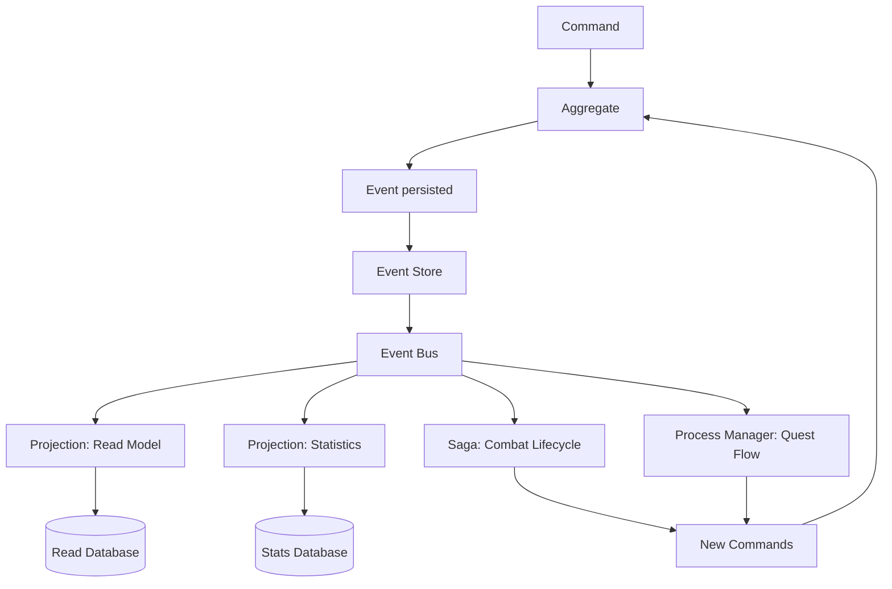

# Event Handlers – Aether-Engine

> **Note de synchronisation** :
> Ce document décrit tous les Event Handlers du système : Projections, Sagas et Process Managers.
> Les événements sources sont définis dans `/doc/matrice_evenements.md`.

---

## Architecture Event Sourcing



---

## Types de Handlers

### 1. Projections (Read Models)
- **Rôle** : Construire des vues optimisées pour les queries
- **Idempotent** : Oui (peut être rejoué)
- **Émet des commandes** : Non
- **Exemples** : Profil joueur, classements, statistiques

### 2. Sagas (Orchestration de processus)
- **Rôle** : Coordonner des transactions longues distribuées
- **Idempotent** : Oui
- **Émet des commandes** : Oui
- **Exemples** : Combat lifecycle, market transaction

### 3. Process Managers (Workflows complexes)
- **Rôle** : Gérer des workflows multi-étapes avec état
- **Idempotent** : Oui
- **Émet des commandes** : Oui
- **Exemples** : Progression de quête, événement monde

---

## 1. Projections

### 1.1. ProfilJoueurProjection

**Responsabilité** : Maintenir une vue complète du profil joueur pour affichage rapide.

**Événements écoutés** :
- `JoueurMonteNiveau`
- `StatsJoueurModifiées`
- `JoueurEquipeItem`
- `JoueurDesequipeItem`
- `ExperienceGained`

**Modèle de données** (PostgreSQL) :
```sql
CREATE TABLE player_profile (
    player_id UUID PRIMARY KEY,
    nom VARCHAR(50),
    niveau INT,
    experience BIGINT,
    hp_max INT,
    mp_max INT,
    force INT,
    agilite INT,
    intelligence INT,
    equipment JSONB,
    last_updated TIMESTAMP
);
```

**Handler logic** :
```go
func (p *ProfilJoueurProjection) Handle(event Event) error {
    switch e := event.(type) {
    case JoueurMonteNiveau:
        return p.db.Exec(`
            UPDATE player_profile 
            SET niveau = $1, 
                hp_max = hp_max + $2,
                mp_max = mp_max + $3,
                force = force + $4,
                last_updated = NOW()
            WHERE player_id = $5
        `, e.NouveauNiveau, e.StatsAugmentees.HpMax, 
           e.StatsAugmentees.MpMax, e.StatsAugmentees.Force, e.JoueurId)
    
    case StatsJoueurModifiées:
        // Update stats in database
        return p.updateStats(e)
    
    case JoueurEquipeItem:
        // Update equipment slot
        return p.updateEquipment(e)
    }
    return nil
}
```

---

### 1.2. ClassementJoueursProjection

**Responsabilité** : Maintenir le leaderboard (top 100 joueurs).

**Événements écoutés** :
- `JoueurMonteNiveau`
- `CombatTerminé` (pour calcul ELO)

**Modèle de données** (Redis) :
```
ZADD leaderboard:level {niveau} {playerId}
ZADD leaderboard:elo {elo_score} {playerId}
```

**Handler logic** :
```go
func (c *ClassementJoueursProjection) Handle(event Event) error {
    switch e := event.(type) {
    case JoueurMonteNiveau:
        return c.redis.ZAdd("leaderboard:level", e.NouveauNiveau, e.JoueurId)
    
    case CombatTerminé:
        // Calculate ELO change
        newElo := c.calculateElo(e)
        return c.redis.ZAdd("leaderboard:elo", newElo, e.VainqueursIds[0])
    }
    return nil
}
```

---

### 1.3. StatistiquesCombatProjection

**Responsabilité** : Agréger les statistiques de combat pour analytics.

**Événements écoutés** :
- `CombatTerminé`
- `DégâtsAppliqués`
- `SoinAppliqué`
- `JoueurMort`

**Modèle de données** (PostgreSQL) :
```sql
CREATE TABLE combat_statistics (
    player_id UUID,
    total_combats INT,
    victoires INT,
    defaites INT,
    degats_infliges BIGINT,
    soins_produits BIGINT,
    morts INT,
    kills INT,
    PRIMARY KEY (player_id)
);
```

**Handler logic** :
```go
func (s *StatistiquesCombatProjection) Handle(event Event) error {
    switch e := event.(type) {
    case CombatTerminé:
        for _, vainqueur := range e.Vainqueurs {
            s.db.Exec(`
                UPDATE combat_statistics 
                SET total_combats = total_combats + 1,
                    victoires = victoires + 1
                WHERE player_id = $1
            `, vainqueur)
        }
        
        for _, vaincu := range e.Vaincus {
            s.db.Exec(`
                UPDATE combat_statistics 
                SET total_combats = total_combats + 1,
                    defaites = defaites + 1
                WHERE player_id = $1
            `, vaincu)
        }
    
    case DégâtsAppliqués:
        s.db.Exec(`
            UPDATE combat_statistics 
            SET degats_infliges = degats_infliges + $1
            WHERE player_id = $2
        `, e.DegatsFinaux, e.Source)
    }
    return nil
}
```

---

### 1.4. InventaireProjection

**Responsabilité** : Vue rapide de l'inventaire joueur (cache Redis).

**Événements écoutés** :
- `ItemAjoutéInventaire`
- `ItemRetiréInventaire`
- `JoueurEquipeItem`
- `JoueurDesequipeItem`

**Modèle de données** (Redis) :
```
HSET inventory:{playerId} slot-1 {itemId}
HSET inventory:{playerId} slot-2 {itemId}
HSET inventory:{playerId}:count {total_items}
```

**Handler logic** :
```go
func (i *InventaireProjection) Handle(event Event) error {
    switch e := event.(type) {
    case ItemAjoutéInventaire:
        key := fmt.Sprintf("inventory:%s", e.JoueurId)
        i.redis.HSet(key, fmt.Sprintf("slot-%d", e.Slot), e.ItemId)
        i.redis.HIncrBy(key+":count", 1)
    
    case ItemRetiréInventaire:
        key := fmt.Sprintf("inventory:%s", e.JoueurId)
        i.redis.HDel(key, fmt.Sprintf("slot-%d", e.Slot))
        i.redis.HIncrBy(key+":count", -1)
    }
    return nil
}
```

---

### 1.5. EtatCombatProjection

**Responsabilité** : Maintenir l'état actuel du combat en mémoire (Redis).

**Événements écoutés** :
- Tous les événements de `InstanceCombat`

**Modèle de données** (Redis) :
```json
{
  "combatId": "combat-789",
  "participants": [
    {
      "uniteId": "player-123",
      "hp": 800,
      "mp": 150,
      "position": {"x": 5, "y": 7},
      "statuts": ["Brulure"]
    }
  ],
  "tourActuel": 5,
  "uniteActive": "player-456"
}
```

**Handler logic** :
```go
func (e *EtatCombatProjection) Handle(event Event) error {
    combatState := e.redis.Get("combat:" + event.AggregateId)
    
    switch evt := event.(type) {
    case TourCommencé:
        combatState.TourActuel++
        combatState.UniteActive = evt.UniteActive
    
    case DégâtsAppliqués:
        // Update HP of target unit
        for i, unit := range combatState.Participants {
            if unit.UniteId == evt.Cible {
                combatState.Participants[i].Hp = evt.HpApres
            }
        }
    }
    
    return e.redis.Set("combat:"+event.AggregateId, combatState)
}
```

---

## 2. Sagas

### 2.1. CombatLifecycleSaga

**Responsabilité** : Orchestrer le cycle de vie complet d'un combat.

**Événements déclencheurs** :
- `CombatCommencé`

**Événements écoutés** :
- `TourTerminé`
- `JoueurMort`
- `PnjMort`
- `TimeoutCombat`

**Commandes émises** :
- `StartNextTurn`
- `EndCombat`
- `DistributeRewards`

**État interne** :
```go
type CombatLifecycleSaga struct {
    CombatId         string
    ParticipantsVivants []string
    ToursEcoules     int
    LimiteTemps      int
    Status           string // "InProgress", "Completed"
}
```

**Logique** :
```go
func (s *CombatLifecycleSaga) Handle(event Event) ([]Command, error) {
    switch e := event.(type) {
    case CombatCommencé:
        s.CombatId = e.CombatId
        s.ParticipantsVivants = e.ParticipantsIds
        s.Status = "InProgress"
        
        return []Command{
            StartNextTurnCommand{CombatId: s.CombatId}
        }, nil
    
    case TourTerminé:
        s.ToursEcoules++
        
        // Check combat end conditions
        if s.checkVictoryCondition() {
            return []Command{
                EndCombatCommand{CombatId: s.CombatId, Resultat: "Victoire"}
            }, nil
        }
        
        // Continue combat
        return []Command{
            StartNextTurnCommand{CombatId: s.CombatId}
        }, nil
    
    case JoueurMort:
        s.ParticipantsVivants = remove(s.ParticipantsVivants, e.JoueurId)
        
        if len(s.ParticipantsVivants) == 0 {
            return []Command{
                EndCombatCommand{CombatId: s.CombatId, Resultat: "Defaite"}
            }, nil
        }
    
    case CombatTerminé:
        s.Status = "Completed"
        
        return []Command{
            DistributeRewardsCommand{
                CombatId: s.CombatId,
                Vainqueurs: e.Vainqueurs,
                Recompenses: e.Recompenses
            }
        }, nil
    }
    
    return nil, nil
}
```

---

### 2.2. TransactionMarcheSaga

**Responsabilité** : Assurer la cohérence des transactions marché (achat/vente).

**Événements déclencheurs** :
- `MarketOrderPlaced`

**Événements écoutés** :
- `MarketOrderFulfilled`
- `PaymentFailed`
- `ItemTransferFailed`

**Commandes émises** :
- `TransferItem`
- `TransferGold`
- `RefundBuyer`
- `CancelOrder`

**État interne** :
```go
type TransactionMarcheSaga struct {
    OrderId         string
    Vendeur         string
    Acheteur        string
    ItemId          string
    Prix            int
    Status          string // "Pending", "ItemTransferred", "GoldTransferred", "Completed", "Failed"
}
```

**Logique** :
```go
func (s *TransactionMarcheSaga) Handle(event Event) ([]Command, error) {
    switch e := event.(type) {
    case MarketOrderPlaced:
        s.OrderId = e.OrderId
        s.Vendeur = e.Vendeur
        s.ItemId = e.ItemId
        s.Prix = e.Prix
        s.Status = "Pending"
        return nil, nil // Waiting for buyer
    
    case BuyOrderInitiated:
        s.Acheteur = e.Acheteur
        
        // Step 1: Verify buyer funds
        return []Command{
            VerifyFundsCommand{
                JoueurId: s.Acheteur,
                Montant: s.Prix
            }
        }, nil
    
    case FundsVerified:
        // Step 2: Transfer item from seller to buyer
        return []Command{
            TransferItemCommand{
                ItemId: s.ItemId,
                From: s.Vendeur,
                To: s.Acheteur
            }
        }, nil
    
    case ItemTransferred:
        s.Status = "ItemTransferred"
        
        // Step 3: Transfer gold from buyer to seller
        commission := s.Prix * 0.05
        vendeurRecu := s.Prix - commission
        
        return []Command{
            TransferGoldCommand{
                From: s.Acheteur,
                To: s.Vendeur,
                Montant: vendeurRecu
            },
            TransferGoldCommand{
                From: s.Acheteur,
                To: "system-treasury",
                Montant: commission
            }
        }, nil
    
    case GoldTransferred:
        s.Status = "Completed"
        
        return []Command{
            CompleteMarketOrderCommand{
                OrderId: s.OrderId,
                Status: "Fulfilled"
            }
        }, nil
    
    case PaymentFailed:
        // Rollback: return item to seller
        return []Command{
            TransferItemCommand{
                ItemId: s.ItemId,
                From: s.Acheteur,
                To: s.Vendeur
            },
            CancelOrderCommand{OrderId: s.OrderId}
        }, nil
    }
    
    return nil, nil
}
```

---

## 3. Process Managers

### 3.1. ProgressionQueteProcessManager

**Responsabilité** : Gérer la progression multi-objectifs d'une quête.

**Événements déclencheurs** :
- `QueteCommencée`

**Événements écoutés** :
- `PnjMort`
- `ItemCollecte`
- `ZoneExplorée`
- `DialogueComplété`

**Commandes émises** :
- `UpdateQuestProgress`
- `CompleteQuest`
- `UnlockNextObjective`

**État interne** :
```go
type ProgressionQueteProcessManager struct {
    QueteId         string
    JoueurId        string
    Objectifs       []Objectif
    ObjectifActuel  int
    Status          string // "InProgress", "Completed"
}

type Objectif struct {
    Id          string
    Type        string // "Kill", "Collect", "Explore", "Dialogue"
    Progression int
    Requis      int
    Statut      string // "Locked", "Active", "Completed"
}
```

**Logique** :
```go
func (pm *ProgressionQueteProcessManager) Handle(event Event) ([]Command, error) {
    switch e := event.(type) {
    case QueteCommencée:
        pm.QueteId = e.QueteId
        pm.JoueurId = e.JoueurId
        pm.Objectifs = e.Objectifs
        pm.Objectifs[0].Statut = "Active" // Unlock first objective
        return nil, nil
    
    case PnjMort:
        // Check if this kill progresses any active objective
        for i, obj := range pm.Objectifs {
            if obj.Statut == "Active" && obj.Type == "Kill" {
                if e.PnjId == obj.Cible {
                    pm.Objectifs[i].Progression++
                    
                    if pm.Objectifs[i].Progression >= obj.Requis {
                        pm.Objectifs[i].Statut = "Completed"
                        
                        // Unlock next objective
                        if i+1 < len(pm.Objectifs) {
                            pm.Objectifs[i+1].Statut = "Active"
                            return []Command{
                                UnlockNextObjectiveCommand{
                                    QueteId: pm.QueteId,
                                    ObjectifId: pm.Objectifs[i+1].Id
                                }
                            }, nil
                        } else {
                            // All objectives completed
                            return []Command{
                                CompleteQuestCommand{
                                    QueteId: pm.QueteId,
                                    JoueurId: pm.JoueurId
                                }
                            }, nil
                        }
                    }
                    
                    return []Command{
                        UpdateQuestProgressCommand{
                            QueteId: pm.QueteId,
                            ObjectifId: obj.Id,
                            Progression: pm.Objectifs[i].Progression
                        }
                    }, nil
                }
            }
        }
    }
    
    return nil, nil
}
```

---

### 3.2. EvenementMondeProcessManager

**Responsabilité** : Orchestrer les événements monde (invasions, boss mondiaux, etc.).

**Événements déclencheurs** :
- `WorldEventTriggered`

**Événements écoutés** :
- `PnjMort`
- `ZoneCapturée`
- `TimeoutEvent`

**Commandes émises** :
- `SpawnWorldBoss`
- `UpdateEventProgress`
- `EndWorldEvent`
- `DistributeGlobalRewards`

**État interne** :
```go
type EvenementMondeProcessManager struct {
    EventId         string
    Type            string // "Invasion", "BossWorld", "Siege"
    ObjectifPrincipal Objectif
    ParticipantsActifs []string
    Status          string
}
```

**Logique** :
```go
func (pm *EvenementMondeProcessManager) Handle(event Event) ([]Command, error) {
    switch e := event.(type) {
    case WorldEventTriggered:
        pm.EventId = e.EventId
        pm.Type = e.Type
        pm.ObjectifPrincipal = e.Objectifs[0]
        pm.Status = "Active"
        
        // Spawn monsters for invasion
        if e.Type == "Invasion" {
            commands := []Command{}
            for i := 0; i < 50; i++ {
                commands = append(commands, SpawnMonsterCommand{
                    Type: "Dragon",
                    Zone: e.Zone,
                    EventId: pm.EventId
                })
            }
            return commands, nil
        }
    
    case PnjMort:
        // Check if this death is part of world event
        if e.Metadata["eventId"] == pm.EventId {
            pm.ObjectifPrincipal.Progression++
            pm.trackParticipant(e.TuePar)
            
            if pm.ObjectifPrincipal.Progression >= pm.ObjectifPrincipal.Requis {
                // Event completed
                return []Command{
                    EndWorldEventCommand{
                        EventId: pm.EventId,
                        Status: "Success"
                    },
                    DistributeGlobalRewardsCommand{
                        EventId: pm.EventId,
                        Participants: pm.ParticipantsActifs,
                        Recompenses: pm.calculateRewards()
                    }
                }, nil
            }
            
            return []Command{
                UpdateEventProgressCommand{
                    EventId: pm.EventId,
                    Progression: pm.ObjectifPrincipal.Progression
                }
            }, nil
        }
    
    case TimeoutEvent:
        // Event failed (timeout)
        return []Command{
            EndWorldEventCommand{
                EventId: pm.EventId,
                Status: "Failed"
            }
        }, nil
    }
    
    return nil, nil
}
```

---

## 4. Tableau récapitulatif des Handlers

| Handler | Type | Événements écoutés | Commandes émises | Persistence |
|---------|------|-------------------|-----------------|-------------|
| ProfilJoueurProjection | Projection | JoueurMonteNiveau, StatsJoueurModifiées, etc. | Aucune | PostgreSQL |
| ClassementJoueursProjection | Projection | JoueurMonteNiveau, CombatTerminé | Aucune | Redis |
| StatistiquesCombatProjection | Projection | CombatTerminé, DégâtsAppliqués, etc. | Aucune | PostgreSQL |
| InventaireProjection | Projection | ItemAjouté, ItemRetiré, etc. | Aucune | Redis |
| EtatCombatProjection | Projection | Tous événements combat | Aucune | Redis |
| CombatLifecycleSaga | Saga | CombatCommencé, TourTerminé, JoueurMort | StartNextTurn, EndCombat | PostgreSQL |
| TransactionMarcheSaga | Saga | MarketOrderPlaced, ItemTransferred, etc. | TransferItem, TransferGold | PostgreSQL |
| ProgressionQueteProcessManager | Process Manager | QueteCommencée, PnjMort, ItemCollecte | UpdateQuestProgress, CompleteQuest | PostgreSQL |
| EvenementMondeProcessManager | Process Manager | WorldEventTriggered, PnjMort | SpawnMonster, EndWorldEvent | PostgreSQL |

---

## 5. Garanties de Delivery

### At-Least-Once Delivery

Tous les handlers doivent être **idempotents** car le système garantit "at-least-once delivery" :

```go
func (h *Handler) Handle(event Event) error {
    // Check if event already processed
    if h.eventRegistry.IsProcessed(event.EventId) {
        return nil // Already processed, skip
    }
    
    // Process event
    err := h.processEvent(event)
    if err != nil {
        return err // Retry later
    }
    
    // Mark as processed
    h.eventRegistry.MarkProcessed(event.EventId)
    return nil
}
```

### Dead Letter Queue

Événements qui échouent après 3 retries sont envoyés dans une Dead Letter Queue (DLQ) :

```
Event Bus → Handler (tentative 1) → Échec
         → Handler (tentative 2) → Échec
         → Handler (tentative 3) → Échec
         → Dead Letter Queue
```

---

## 6. Monitoring des Handlers

### Métriques Prometheus

```
event_handler_processed_total{handler="ProfilJoueurProjection"} 15000
event_handler_failed_total{handler="ProfilJoueurProjection"} 5
event_handler_processing_duration_seconds{handler="ProfilJoueurProjection", quantile="0.95"} 0.02
event_handler_dlq_total{handler="ProfilJoueurProjection"} 1
```

### Alertes

```yaml
- name: HandlerHighFailureRate
  condition: rate(event_handler_failed_total[5m]) > 0.05
  severity: warning
  action: Notification Slack

- name: HandlerDLQ
  condition: event_handler_dlq_total > 0
  severity: critical
  action: PagerDuty
```

---

## Résumé

L'architecture Event Sourcing d'Aether-Engine repose sur :

- **5 Projections** : Vues optimisées en lecture (profils, classements, stats, inventaire, état combat)
- **2 Sagas** : Orchestration de transactions distribuées (combat, marché)
- **2 Process Managers** : Workflows complexes multi-étapes (quêtes, événements monde)

Tous les handlers sont **idempotents** et garantissent la cohérence éventuelle du système.
