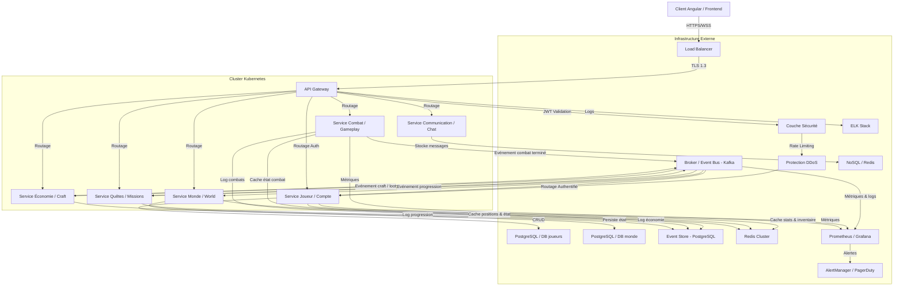
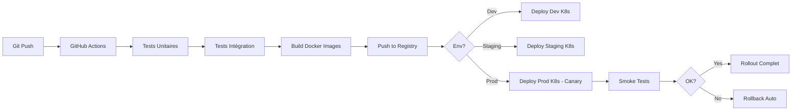

# Architecture Réseau & Infrastructure – Aether-Engine

> **Note de synchronisation** :
> Ce document utilise le nommage français, sauf pour les termes internationalement utilisés (item, Tank, DPS, Heal, etc.).
> Les concepts d'agrégats, Value Objects, etc. sont centralisés dans `/doc/agregats.md`.

---

## Vue d'ensemble

L'architecture d'Aether-Engine est conçue pour :
- **Scalabilité horizontale** : Support de milliers de joueurs simultanés
- **Résilience** : Tolérance aux pannes avec Event Sourcing
- **Sécurité** : Validation serveur autoritatif, chiffrement bout-en-bout
- **Performance** : Cache distribué, optimisation réseau

---

## 1. Diagramme de flux complet



---

## 2. Couche Sécurité

### 2.1. Authentification & Autorisation

#### **JWT (JSON Web Tokens)**
- **Émission** : Service Joueur après login réussi
- **Durée de vie** : 1h (access token) + 7j (refresh token)
- **Contenu** : `{ userId, roles, permissions, exp, iat }`
- **Validation** : Middleware sur API Gateway (vérification signature + expiration)

#### **OAuth 2.0 / OIDC**
- **Providers** : Google, Discord, Steam (optionnel)
- **Flow** : Authorization Code + PKCE
- **Scope** : `profile`, `email`, `gaming`

#### **RBAC (Role-Based Access Control)**
| Rôle | Permissions |
|------|-------------|
| Player | Jouer, consulter stats, chat |
| Moderator | Ban temporaire, mute, kick |
| Admin | Gestion serveur, configuration |
| SuperAdmin | Accès base de données, infrastructure |

### 2.2. Protection des flux

#### **Chiffrement**
- **TLS 1.3** : Toutes les communications client ↔ serveur
- **Certificat** : Let's Encrypt (auto-renouvelé)
- **Cipher Suites** : `TLS_AES_256_GCM_SHA384`, `TLS_CHACHA20_POLY1305_SHA256`

#### **Rate Limiting**
- **Par IP** : 100 req/min (burst 150)
- **Par utilisateur** : 200 req/min (burst 250)
- **Actions critiques** : 10 req/min (combat, trade)
- **Sanction** : Throttling progressif → ban temporaire (1h, 24h, permanent)

#### **Protection DDoS**
- **Cloudflare** : Filtrage L3/L4/L7
- **WAF** : Règles OWASP Top 10
- **Bot Detection** : Captcha, fingerprinting
- **Blacklist/Whitelist** : IP, ASN, pays

### 2.3. Validation côté serveur

**Principe** : Tout input client est considéré comme non fiable.

#### **Validation des actions de combat**
```
1. Vérifier JWT (utilisateur authentifié)
2. Vérifier ownership (l'utilisateur contrôle bien cette unité)
3. Vérifier état du combat (tour actif, unité peut agir)
4. Vérifier coûts (MP, HP suffisants)
5. Vérifier portée et ligne de vue
6. Vérifier restrictions (silence, stun, etc.)
7. Appliquer l'action uniquement si toutes validations passées
```

#### **Validation des transactions économiques**
```
1. Vérifier solde (fonds suffisants)
2. Vérifier existence de l'item
3. Vérifier ownership de l'item
4. Transaction atomique (rollback si échec)
5. Audit log complet (Event Store)
```

---

## 3. Stratégie de Scalabilité

### 3.1. Architecture Kubernetes

#### **Pods par service**
```yaml
Service Combat:
  replicas: 5-20 (auto-scaling)
  resources:
    requests: { cpu: 500m, memory: 1Gi }
    limits: { cpu: 2, memory: 4Gi }
  
Service Joueur:
  replicas: 3-10
  resources:
    requests: { cpu: 300m, memory: 512Mi }
    limits: { cpu: 1, memory: 2Gi }

Service Monde:
  replicas: 2-8
  resources:
    requests: { cpu: 400m, memory: 768Mi }
    limits: { cpu: 1.5, memory: 3Gi }
```

#### **Auto-scaling**
- **HPA (Horizontal Pod Autoscaler)** : basé sur CPU/Memory (70% threshold)
- **VPA (Vertical Pod Autoscaler)** : ajustement des limites de ressources
- **Custom Metrics** : nombre de combats actifs, latence P95

#### **Affinity & Anti-affinity**
- **Pod Anti-affinity** : Pods d'un même service sur des nœuds différents
- **Node Affinity** : Services critiques sur nœuds haute performance

### 3.2. Load Balancing

#### **Niveau L4 (Transport)**
- **Nginx Ingress Controller** : routage HTTP/WebSocket
- **Algorithme** : Round-robin avec session affinity (sticky sessions)

#### **Niveau L7 (Application)**
- **API Gateway** : routage intelligent par type de requête
- **Combat** : Sticky session (un combat = un pod fixe)
- **Autres services** : Load balancing standard

### 3.3. Partitionnement des données

#### **Sharding par zone géographique**
```
Zone NA (Amérique du Nord) → Cluster K8s US-East
Zone EU (Europe)           → Cluster K8s EU-West
Zone APAC (Asie-Pacifique) → Cluster K8s AP-Southeast
```

#### **Sharding par instance de combat**
- **Combat ID** : `combatId % nb_pods` → assignation déterministe
- **Verrouillage Redis** : clé `combat:{combatId}:lock` pour exclusion mutuelle

#### **Réplication de données**
- **PostgreSQL** : Streaming replication (1 master + 2 replicas)
- **Redis** : Sentinel (3 nœuds) + Cluster mode (6 shards)

---

## 4. Monitoring & Alerting

### 4.1. Métriques Prometheus

#### **Métriques système**
- `cpu_usage_percent` : Utilisation CPU par pod
- `memory_usage_bytes` : Mémoire consommée
- `network_io_bytes` : Débit réseau entrant/sortant
- `disk_io_operations` : Ops disque (IOPS)

#### **Métriques applicatives**
- `http_requests_total` : Nombre de requêtes HTTP (par endpoint, status)
- `http_request_duration_seconds` : Latence (P50, P95, P99)
- `websocket_connections_active` : Connexions WebSocket actives
- `combat_instances_active` : Nombre de combats en cours
- `combat_turn_duration_seconds` : Durée d'un tour de combat
- `event_bus_messages_total` : Messages publiés/consommés sur Kafka
- `cache_hit_rate` : Taux de hit Redis
- `db_query_duration_seconds` : Latence des requêtes DB

#### **Métriques métier**
- `players_online` : Joueurs connectés
- `combats_started_total` : Combats démarrés
- `combats_completed_total` : Combats terminés (par résultat)
- `items_crafted_total` : Items craftés
- `gold_traded_total` : Or échangé

### 4.2. Dashboards Grafana

#### **Dashboard : Vue Globale**
- Players online (gauge)
- Active combats (gauge)
- Requests/sec (graph)
- Latency P95 (graph)
- Error rate (graph)

#### **Dashboard : Combat Service**
- Combat instances (par état)
- Turn duration (heatmap)
- Action validation errors (pie chart)
- Combat events timeline (table)

#### **Dashboard : Infrastructure**
- CPU/Memory par pod (graph)
- Network I/O (graph)
- Pod restarts (counter)
- Disk usage (gauge)

### 4.3. Alerting

#### **Règles d'alertes critiques**
```yaml
- name: HighLatency
  condition: http_request_duration_seconds{quantile="0.95"} > 1
  severity: warning
  action: Notification Slack + Email

- name: HighErrorRate
  condition: rate(http_requests_total{status=~"5.."}[5m]) > 0.05
  severity: critical
  action: PagerDuty + SMS

- name: ServiceDown
  condition: up{job="service-combat"} == 0
  severity: critical
  action: PagerDuty + Appel

- name: DatabaseConnectionFail
  condition: pg_up == 0
  severity: critical
  action: PagerDuty + Appel

- name: HighMemoryUsage
  condition: memory_usage_percent > 85
  severity: warning
  action: Auto-scaling + Notification

- name: RedisClusterDown
  condition: redis_up == 0
  severity: critical
  action: PagerDuty + Failover automatique
```

#### **Canaux de notification**
- **Slack** : Alertes warning + info
- **Email** : Alertes warning + critical
- **PagerDuty** : Alertes critical uniquement
- **SMS** : Alertes critical + on-call

#### **Escalade**
1. **Niveau 1** (0-15 min) : Dev on-call
2. **Niveau 2** (15-30 min) : Lead Dev + SRE
3. **Niveau 3** (30+ min) : CTO + équipe complète

---

## 5. Logging & Observabilité

### 5.1. ELK Stack

#### **Elasticsearch**
- **Index** : logs par service et par jour (`aether-combat-2025.12.01`)
- **Retention** : 30 jours (logs standards), 90 jours (logs d'audit)
- **Sharding** : 3 shards par index

#### **Logstash**
- **Pipeline** : filtrage, parsing, enrichissement
- **Grok patterns** : extraction des champs structurés
- **Output** : Elasticsearch + S3 (archivage long terme)

#### **Kibana**
- **Dashboards** : logs en temps réel par service
- **Saved Searches** : erreurs critiques, événements métier
- **Alertes** : détection d'anomalies (ML)

### 5.2. Distributed Tracing

#### **Jaeger**
- **Span** : requête HTTP → appels services → requêtes DB
- **Sampling** : 10% des requêtes (100% en cas d'erreur)
- **Correlation ID** : propagé dans tous les headers (`X-Request-ID`)

#### **Traces critiques**
- `StartCombat` : Client → Gateway → Combat Service → Event Store → Cache
- `ExecuteAction` : Client → Gateway → Combat Service → Validation → Execution → Event Bus
- `GetPlayerProfile` : Client → Gateway → Player Service → DB → Cache

---

## 6. CI/CD & Déploiement

### 6.1. Pipeline CI/CD



### 6.2. Stratégie de déploiement

#### **Canary Deployment**
1. Déployer 10% du trafic sur la nouvelle version
2. Monitorer métriques (erreurs, latence, CPU)
3. Si OK : augmenter progressivement (25%, 50%, 75%, 100%)
4. Si KO : rollback automatique

#### **Blue/Green Deployment**
- **Blue** : version actuelle (production)
- **Green** : nouvelle version (en attente)
- **Switch** : basculement instantané du Load Balancer
- **Rollback** : retour à Blue si problème

---

## 7. Disaster Recovery

### 7.1. Stratégie de backup

#### **Bases de données**
- **PostgreSQL** : Backup incrémental (toutes les 6h) + complet (1x/jour)
- **Redis** : RDB snapshot (toutes les heures) + AOF (append-only)
- **Event Store** : Archivage S3 (tous les événements, durée illimitée)

#### **Retention**
- **Backups incrémentiels** : 7 jours
- **Backups complets** : 30 jours
- **Archivage Event Store** : illimité (S3 Glacier)

### 7.2. Plan de reprise (RTO/RPO)

| Scénario | RTO (Recovery Time Objective) | RPO (Recovery Point Objective) |
|----------|-------------------------------|-------------------------------|
| Panne d'un pod | < 1 min (auto-healing K8s) | 0 (aucune perte) |
| Panne d'un nœud K8s | < 5 min (réplication) | 0 |
| Panne d'une DB replica | < 5 min (failover auto) | 0 |
| Panne d'un cluster K8s | < 30 min (basculement zone) | < 5 min |
| Corruption de données | < 2h (restore backup) | < 6h |
| Catastrophe datacenter | < 4h (basculement zone secondaire) | < 6h |

### 7.3. Tests de résilience

#### **Chaos Engineering (mensuel)**
- **Pod Failure** : kill aléatoire de pods
- **Network Latency** : simulation de latence réseau (100-500ms)
- **CPU Stress** : saturation CPU de pods
- **DB Failure** : arrêt temporaire d'une replica DB

---

## 8. Conformité & Sécurité

### 8.1. Standards de sécurité

- **OWASP Top 10** : Protection contre injections, XSS, CSRF
- **PCI DSS** : (si paiements in-game) Tokenization, chiffrement
- **RGPD** : Consentement utilisateur, droit à l'oubli, portabilité

### 8.2. Audit & Compliance

- **Logs d'audit** : Toutes actions sensibles (trade, admin, ban)
- **Retention** : 1 an minimum (légal)
- **Accès** : Chiffré, accès restreint (audit trail)

---

## 9. Coûts & Optimisation

### 9.1. Estimation mensuelle (1000 joueurs simultanés)

| Ressource | Coût mensuel (USD) |
|-----------|-------------------|
| Kubernetes Cluster (3 nœuds) | $300 |
| Load Balancer | $20 |
| PostgreSQL (managed) | $150 |
| Redis Cluster | $100 |
| Kafka (managed) | $200 |
| Monitoring (Prometheus + Grafana) | $50 |
| ELK Stack | $100 |
| CDN (Cloudflare) | $50 |
| Backup S3 | $30 |
| **Total** | **$1000/mois** |

### 9.2. Optimisations possibles

- **Spot Instances** : -70% coût K8s (non-critique)
- **Reserved Instances** : -40% coût DB (1 an commitment)
- **Compression** : -50% bande passante (gzip, brotli)
- **Cache agressif** : -30% requêtes DB

---

## Résumé

L'architecture d'Aether-Engine garantit :
- **Sécurité** : JWT, TLS 1.3, validation serveur, rate limiting
- **Scalabilité** : Kubernetes, auto-scaling, sharding
- **Monitoring** : Prometheus, Grafana, ELK, Jaeger
- **Résilience** : Event Sourcing, backups, disaster recovery
- **Performance** : Redis cache, load balancing, CDN
