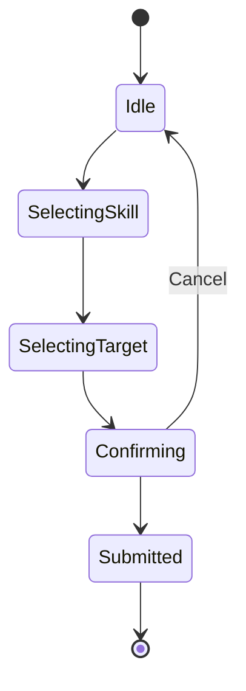

# Machine d'États : Action Joueur (Vue Interface/UX)

> **📊 VUE DÉRIVÉE**
> Cette machine d'états représente le **flux d'interface utilisateur** pour la sélection d'une action.
> **Source de vérité** : `/doc/machines_etats/combat_core_p2.md`
> **Mapping des états** : `/doc/machines_etats/mapping_vues.md`

---

## Vue orientée interface utilisateur

Cette vue est utile pour :
- Design de l'interface joueur (UI/UX)
- Flux de sélection d'action côté client
- Gestion de l'annulation et de la confirmation

---

## Description

Cette machine d'états minimaliste représente uniquement le **flux UI** de sélection d'action, vu depuis le client :

- **Idle** : Aucune action en cours
- **SelectingSkill** : Joueur sélectionne une compétence/action
- **SelectingTarget** : Joueur sélectionne la cible (si applicable)
- **Confirming** : Joueur confirme son choix
- **Submitted** : Action envoyée au serveur
- **Cancel** : Retour à l'état initial

---

## Mapping vers la machine canonique

| État UI | État(s) canonique(s) | Notes |
|---------|----------------------|-------|
| Idle | ActionSelection (en attente) | État initial de sélection |
| SelectingSkill | ActionSelection (partiel) | Sélection en cours côté client |
| SelectingTarget | ActionSelection (partiel) | Sélection de cible côté client |
| Confirming | ActionSelection (partiel) | Confirmation avant envoi |
| Submitted | Validating → Confirmed | Transmission au serveur, validation serveur |
| Cancel | ActionSelection | Retour à l'état initial |

---

## Notes spécifiques à cette vue

### Périmètre
Cette vue couvre **uniquement** le flux client de sélection d'action, **pas** la validation serveur ni l'exécution.

### Validation
- La validation côté client est implicite (avant `Submitted`)
- La validation authoritative se fait dans l'état canonique `Validating`
- Les erreurs de validation serveur ne sont pas représentées ici

### Utilisation
Cette vue est principalement utilisée pour :
- Documenter le flux UI/UX
- Implémenter la logique client (Angular)
- Tester l'interface utilisateur
