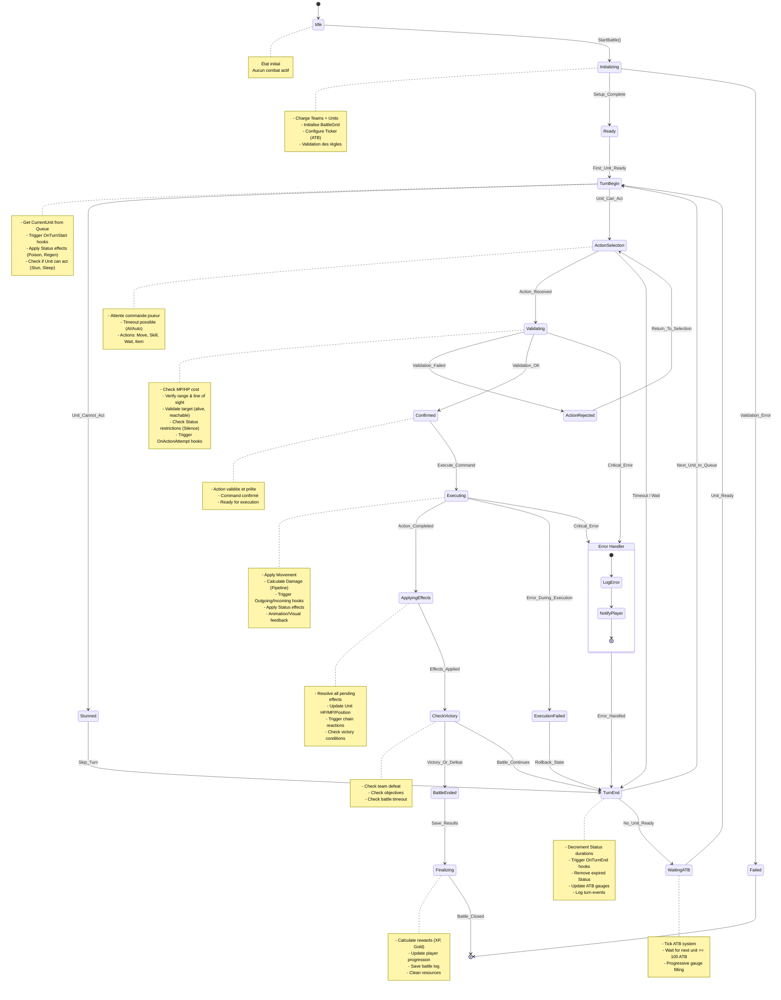

# Machine d'États Canonique du Combat (Phase 2)

> **⭐ SOURCE DE VÉRITÉ CANONIQUE**
> Cette machine d'états est la référence officielle pour l'implémentation du moteur de combat.
> Toutes les autres machines d'états sont des **vues dérivées** pour des besoins spécifiques.
> 
> **Voir le mapping des vues dérivées** : `/doc/machines_etats/mapping_vues.md`

---

## Diagramme complet

---

## Glossaire des états

| État | Description | Responsabilités |
|------|-------------|----------------|
| **Idle** | État initial, aucun combat actif | Attente de création d'instance |
| **Initializing** | Initialisation du combat | Chargement des équipes, grille, configuration ATB |
| **Ready** | Combat prêt, en attente du premier acteur | Validation complète, prêt à démarrer |
| **TurnBegin** | Début du tour d'une unité | Application des hooks OnTurnStart, vérification des statuts |
| **Stunned** | Unité ne peut pas agir (stun/sleep) | Skip automatique du tour |
| **ActionSelection** | Attente de la commande du joueur/IA | Timeout géré, actions disponibles affichées |
| **Validating** | Validation de l'action reçue | Vérification coût, portée, cible, restrictions |
| **ActionRejected** | Action invalide | Retour à la sélection avec message d'erreur |
| **Confirmed** | Action validée et confirmée | Prête pour l'exécution |
| **Executing** | Exécution de l'action | Mouvement, calcul dégâts, application hooks |
| **ExecutionFailed** | Erreur pendant l'exécution | Rollback et gestion d'erreur |
| **ApplyingEffects** | Application des effets de l'action | Mise à jour HP/MP, chaînes de réactions |
| **CheckVictory** | Vérification des conditions de victoire | Équipes mortes, objectifs, timeout |
| **TurnEnd** | Fin du tour de l'unité | Décrémentation statuts, mise à jour ATB |
| **WaitingATB** | Attente qu'une unité soit prête (ATB ≥ 100) | Tick du système ATB |
| **BattleEnded** | Combat terminé (victoire/défaite) | Préparation des résultats |
| **Finalizing** | Finalisation et nettoyage | Calcul récompenses, sauvegarde logs |
| **Failed** | Échec de l'initialisation | État terminal d'erreur |

---

## Événements déclencheurs

| Événement | Transition | Condition |
|-----------|------------|-----------|
| `StartBattle()` | Idle → Initializing | Commande externe |
| `Setup_Complete` | Initializing → Ready | Validation OK |
| `Validation_Error` | Initializing → Failed | Erreur critique |
| `First_Unit_Ready` | Ready → TurnBegin | ATB ≥ 100 |
| `Unit_Cannot_Act` | TurnBegin → Stunned | Statut bloquant |
| `Unit_Can_Act` | TurnBegin → ActionSelection | Peut agir |
| `Action_Received` | ActionSelection → Validating | Commande reçue |
| `Timeout / Wait` | ActionSelection → TurnEnd | Action "Attendre" ou timeout |
| `Validation_Failed` | Validating → ActionRejected | Règles non respectées |
| `Validation_OK` | Validating → Confirmed | Toutes vérifications passées |
| `Execute_Command` | Confirmed → Executing | Lancement exécution |
| `Action_Completed` | Executing → ApplyingEffects | Exécution réussie |
| `Error_During_Execution` | Executing → ExecutionFailed | Erreur technique |
| `Effects_Applied` | ApplyingEffects → CheckVictory | Effets résolus |
| `Victory_Or_Defeat` | CheckVictory → BattleEnded | Condition de fin |
| `Battle_Continues` | CheckVictory → TurnEnd | Combat continue |
| `Next_Unit_In_Queue` | TurnEnd → TurnBegin | Unité suivante prête |
| `No_Unit_Ready` | TurnEnd → WaitingATB | Aucune unité ATB ≥ 100 |
| `Unit_Ready` | WaitingATB → TurnBegin | ATB ≥ 100 |
| `Save_Results` | BattleEnded → Finalizing | Sauvegarde démarrée |
| `Battle_Closed` | Finalizing → [*] | Nettoyage terminé |

---

## Hooks et points d'extension

Les hooks du pattern Fabric sont déclenchés aux moments suivants :

- **OnTurnStart** : Lors de l'entrée dans `TurnBegin`
- **OnActionAttempt** : Dans l'état `Validating`
- **OnIncomingDamage** : Dans l'état `Executing` (pour la cible)
- **OnOutgoingDamage** : Dans l'état `Executing` (pour l'attaquant)
- **OnTurnEnd** : Lors de l'entrée dans `TurnEnd`
- **OnExpire** : Dans `TurnEnd` quand un statut expire

---

## Notes d'implémentation

### Gestion des erreurs
- Les erreurs critiques (Validating, Executing) passent par l'état `ErrorState`
- L'état `ErrorState` gère le logging et la notification joueur
- Après gestion, retour à `TurnEnd` pour continuer proprement

### Déterminisme
- Le système ATB est déterministe (pas de random dans le tick)
- Tous les événements sont loggés pour replay
- Les transitions sont purement événementielles

### Concurrence
- Un seul acteur actif à la fois (pas de parallélisme dans les tours)
- Les actions sont sérialisées via la file d'événements
- Le verrouillage de l'instance garantit l'atomicité
