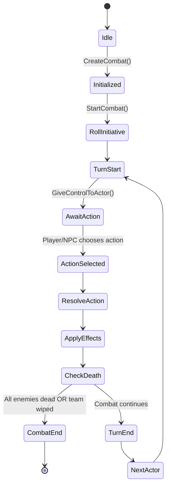

# Machine d'États : Instance de Combat (Vue Simplifiée)

> **📊 VUE DÉRIVÉE**
> Cette machine d'états est une **vue simplifiée** de la machine canonique.
> **Source de vérité** : `/doc/machines_etats/combat_core_p2.md`
> **Mapping des états** : `/doc/machines_etats/mapping_vues.md`

---

## Vue simplifiée pour la documentation conceptuelle

Cette vue présente une version simplifiée du cycle de combat, utile pour :
- Présentation haut niveau du système
- Communication avec les non-techniques
- Documentation conceptuelle initiale

---

## Description

Cette machine d'états représente le cycle de vie simplifié d'une instance de combat tour par tour. Les états principaux incluent :

- **Idle** : Aucun combat actif
- **Initialized** : Combat créé, mais pas encore démarré
- **RollInitiative** : Calcul de l'ordre de tour
- **TurnStart** : Début du tour d'une unité
- **AwaitAction** : Attente de la commande du joueur/IA
- **ActionSelected** : Action choisie par l'acteur
- **ResolveAction** : Résolution de l'action (dégâts, effets)
- **ApplyEffects** : Application des effets secondaires
- **CheckDeath** : Vérification des conditions de fin
- **TurnEnd** : Fin du tour de l'unité
- **NextActor** : Passage à l'acteur suivant
- **CombatEnd** : Fin du combat

---

## Mapping vers la machine canonique

| État simplifié | État(s) canonique(s) | Notes |
|----------------|----------------------|-------|
| Idle | Idle | Identique |
| Initialized | Initializing | Simplifié |
| RollInitiative | Ready | Fusion |
| TurnStart | TurnBegin | Identique |
| AwaitAction | ActionSelection | Identique |
| ActionSelected | Validating → Confirmed | Fusion de 3 états |
| ResolveAction | Executing | Simplifié |
| ApplyEffects | ApplyingEffects | Identique |
| CheckDeath | CheckVictory | Renommé |
| TurnEnd | TurnEnd | Identique |
| NextActor | WaitingATB (si nécessaire) | Simplifié |
| CombatEnd | BattleEnded → Finalizing | Fusion |

**Cette vue omet** : Validating, ActionRejected, Confirmed, ExecutionFailed, Stunned, WaitingATB, Failed.
