# Mapping des Vues de Machines d'États

> **Guide de correspondance entre la machine d'états canonique et ses vues dérivées**

Ce document établit la correspondance entre les différentes représentations de la machine d'états du combat dans Aether-Engine.

---

## Architecture des vues

```
combat_core_p2.md (⭐ SOURCE DE VÉRITÉ CANONIQUE)
    ├─> instance_combat.md (Vue simplifiée / Communication)
    ├─> tour.md (Vue focus unité / Débogage)
    └─> action_joueur.md (Vue UI/UX / Client)
```

---

## 1. Vue Canonique → Vue Simplifiée

**Fichier** : `instance_combat.md`
**Usage** : Documentation conceptuelle, communication avec non-techniques

| État Canonique | État Simplifié | Transformation |
|----------------|----------------|----------------|
| Idle | Idle | ✓ Identique |
| Initializing | Initialized | Simplifié (détails d'init omis) |
| Ready | RollInitiative | Renommé (focus sur l'initiative) |
| Failed | *(omis)* | Simplifié (gestion d'erreur omise) |
| TurnBegin | TurnStart | Identique |
| Stunned | *(omis)* | Simplifié (intégré dans TurnStart) |
| ActionSelection | AwaitAction | Identique |
| Validating | *(fusionné)* | Fusionné dans ActionSelected |
| ActionRejected | *(omis)* | Simplifié (erreurs omises) |
| Confirmed | *(fusionné)* | Fusionné dans ActionSelected |
| Executing | ResolveAction | Simplifié |
| ExecutionFailed | *(omis)* | Simplifié (erreurs omises) |
| ApplyingEffects | ApplyEffects | Identique |
| CheckVictory | CheckDeath | Renommé |
| TurnEnd | TurnEnd | Identique |
| WaitingATB | *(omis/intégré)* | Simplifié (intégré dans NextActor) |
| BattleEnded | *(fusionné)* | Fusionné dans CombatEnd |
| Finalizing | *(fusionné)* | Fusionné dans CombatEnd |

**États omis dans la vue simplifiée** : Failed, Stunned, Validating, ActionRejected, Confirmed, ExecutionFailed, WaitingATB

**Simplifications** :
- 3 états de validation (Validating, ActionRejected, Confirmed) → 1 état (ActionSelected)
- 2 états de fin (BattleEnded, Finalizing) → 1 état (CombatEnd)
- Gestion d'erreur complètement omise

---

## 2. Vue Canonique → Vue Focus Unité

**Fichier** : `tour.md`
**Usage** : Comprendre le cycle d'un tour individuel, débogage

| État Canonique | État Focus Unité | Transformation |
|----------------|------------------|----------------|
| WaitingATB | AwaitingTurn | Renommé (perspective unité) |
| TurnBegin | TurnStart | Détaillé avec sous-états composites |
| Stunned | SkipTurn | Renommé, flux séparé |
| ActionSelection | ActionSelection | Détaillé avec sous-états composites |
| Validating | Validating | Détaillé avec sous-états composites (Range, Cost, Restrictions) |
| ActionRejected | *(intégré)* | Intégré dans Validating (sous-état Invalid) |
| Confirmed | Confirmed | Identique |
| Executing | Executing | Détaillé avec sous-états composites (Movement, Skill, Statuses) |
| ExecutionFailed | ExecutionFailed | Identique |
| ApplyingEffects | ApplyEffects | Détaillé avec sous-états composites (Resolve, CheckDeath) |
| TurnEnd | TurnEnd | Détaillé avec sous-états composites (Decrement, Update ATB) |

**États omis dans la vue focus unité** : Idle, Initializing, Ready, Failed, CheckVictory, BattleEnded, Finalizing

**Spécificités** :
- Focus sur **un seul tour** d'une unité
- Utilisation d'**états composites** (nested states) pour détailler la logique interne
- Ne couvre pas l'initialisation ni la finalisation du combat (hors scope)

---

## 3. Vue Canonique → Vue UI/UX

**Fichier** : `action_joueur.md`
**Usage** : Implémentation client (Angular), flux UI

| État Canonique | État UI | Transformation |
|----------------|---------|----------------|
| ActionSelection | Idle → SelectingSkill → SelectingTarget → Confirming | Décomposé en flux UI multi-étapes |
| Validating | *(côté serveur)* | Validation côté serveur uniquement |
| ActionRejected | *(feedback UI)* | Feedback UI, pas un état |
| Confirmed | Submitted | Renommé |

**États omis dans la vue UI** : Tous sauf ceux liés à la sélection d'action côté client

**Spécificités** :
- **Périmètre très restreint** : uniquement sélection d'action côté client
- La validation serveur n'est **pas** représentée (elle se passe après `Submitted`)
- Focus sur l'**expérience utilisateur** et le flux d'interface

---

## 4. Tableau de correspondance complet

| État Canonique | Vue Simplifiée | Vue Focus Unité | Vue UI | Notes |
|----------------|----------------|-----------------|--------|-------|
| **Idle** | Idle | *(hors scope)* | *(hors scope)* | État initial du combat |
| **Initializing** | Initialized | *(hors scope)* | *(hors scope)* | Configuration du combat |
| **Ready** | RollInitiative | *(hors scope)* | *(hors scope)* | Prêt à démarrer |
| **Failed** | *(omis)* | *(hors scope)* | *(hors scope)* | Erreur d'initialisation |
| **TurnBegin** | TurnStart | TurnStart (détaillé) | *(hors scope)* | Début de tour |
| **Stunned** | *(omis)* | SkipTurn | *(hors scope)* | Unité bloquée |
| **ActionSelection** | AwaitAction | ActionSelection (détaillé) | Idle → ... → Confirming | Sélection d'action |
| **Validating** | *(fusionné)* | Validating (détaillé) | *(côté serveur)* | Validation serveur |
| **ActionRejected** | *(omis)* | *(intégré dans Validating)* | *(feedback)* | Action rejetée |
| **Confirmed** | *(fusionné)* | Confirmed | Submitted | Action confirmée |
| **Executing** | ResolveAction | Executing (détaillé) | *(hors scope)* | Exécution |
| **ExecutionFailed** | *(omis)* | ExecutionFailed | *(hors scope)* | Erreur d'exécution |
| **ApplyingEffects** | ApplyEffects | ApplyEffects (détaillé) | *(hors scope)* | Application effets |
| **CheckVictory** | CheckDeath | *(hors scope)* | *(hors scope)* | Vérification fin |
| **TurnEnd** | TurnEnd | TurnEnd (détaillé) | *(hors scope)* | Fin de tour |
| **WaitingATB** | *(intégré NextActor)* | AwaitingTurn | *(hors scope)* | Attente ATB |
| **BattleEnded** | *(fusionné CombatEnd)* | *(hors scope)* | *(hors scope)* | Combat terminé |
| **Finalizing** | *(fusionné CombatEnd)* | *(hors scope)* | *(hors scope)* | Finalisation |

---

## Diagramme de mapping visuel

```mermaid
graph TD
    subgraph Canonique["⭐ Vue Canonique (combat_core_p2.md)"]
        C1[Idle]
        C2[Initializing]
        C3[Ready]
        C4[TurnBegin]
        C5[ActionSelection]
        C6[Validating]
        C7[Confirmed]
        C8[Executing]
        C9[ApplyingEffects]
        C10[CheckVictory]
        C11[TurnEnd]
        C12[BattleEnded]
    end

    subgraph Simplifiée["📊 Vue Simplifiée (instance_combat.md)"]
        S1[Idle]
        S2[Initialized]
        S3[RollInitiative]
        S4[TurnStart]
        S5[AwaitAction]
        S6[ActionSelected]
        S7[ResolveAction]
        S8[ApplyEffects]
        S9[CheckDeath]
        S10[TurnEnd]
        S11[CombatEnd]
    end

    subgraph Unité["🎯 Vue Focus Unité (tour.md)"]
        U1[AwaitingTurn]
        U2[TurnStart]
        U3[ActionSelection]
        U4[Validating]
        U5[Confirmed]
        U6[Executing]
        U7[ApplyEffects]
        U8[TurnEnd]
    end

    subgraph UI["🖥️ Vue UI (action_joueur.md)"]
        UI1[Idle]
        UI2[SelectingSkill]
        UI3[SelectingTarget]
        UI4[Confirming]
        UI5[Submitted]
    end

    C1 --> S1
    C2 --> S2
    C3 --> S3
    C4 --> S4
    C5 --> S5
    C6 --> S6
    C7 --> S6
    C8 --> S7
    C9 --> S8
    C10 --> S9
    C11 --> S10
    C12 --> S11

    C4 --> U2
    C5 --> U3
    C6 --> U4
    C7 --> U5
    C8 --> U6
    C9 --> U7
    C11 --> U8

    C5 --> UI1
    C5 --> UI2
    C5 --> UI3
    C5 --> UI4
    C7 --> UI5
```



---

## Règles de cohérence

### Règle 1 : Source de vérité unique
**La machine canonique (`combat_core_p2.md`) est la seule source de vérité.**
- Toute modification de comportement doit être faite dans la vue canonique
- Les vues dérivées doivent être mises à jour en conséquence

### Règle 2 : Les vues dérivées sont en lecture seule
- Les vues dérivées documentent des **projections** de la vue canonique
- Elles ne doivent pas introduire de nouveaux états ou transitions non présents dans la canonique

### Règle 3 : Cohérence des noms
- Si un état est identique entre vues, il doit porter le **même nom**
- Si un état est renommé, le mapping doit être explicitement documenté ici

### Règle 4 : Mise à jour synchronisée
- Toute modification de la vue canonique doit déclencher une revue des vues dérivées
- Ce fichier de mapping doit être mis à jour lors de changements structurels

---

## Usage recommandé par contexte

| Contexte | Vue recommandée | Raison |
|----------|-----------------|--------|
| Implémentation Go du moteur | **Canonique** | Source de vérité complète |
| Présentation au client/PO | **Simplifiée** | Plus accessible, moins technique |
| Débogage d'un tour spécifique | **Focus Unité** | Détail des sous-étapes d'un tour |
| Implémentation client Angular | **UI** | Flux d'interface utilisateur |
| Formation des développeurs | **Canonique + Simplifiée** | Vue complète puis simplifiée |
| Documentation technique | **Canonique** | Référence authoritative |
| Tests d'intégration | **Canonique** | Couverture complète des états |

---

## Historique des modifications

| Date | Modification | Impacté |
|------|--------------|---------|
| 2025-12-01 | Création de la hiérarchie des vues | Toutes les vues |
| 2025-12-01 | Désignation de `combat_core_p2.md` comme source canonique | Toutes les vues |
| 2025-12-01 | Ajout des headers "VUE DÉRIVÉE" sur les vues secondaires | instance_combat, tour, action_joueur |
| 2025-12-01 | Création du fichier de mapping | Ce fichier |
