# Machine d'États : Cycle de Tour d'une Unité (Vue Focus Unité)

> **📊 VUE DÉRIVÉE**
> Cette machine d'états se concentre sur le **cycle de vie d'un tour d'une unité spécifique**.
> **Source de vérité** : `/doc/machines_etats/combat_core_p2.md`
> **Mapping des états** : `/doc/machines_etats/mapping_vues.md`

---

## Vue orientée cycle d'une unité

Cette vue est utile pour :
- Comprendre le déroulement d'un tour d'une unité individuelle
- Déboguer la logique de validation et d'exécution
- Documenter les hooks spécifiques à une unité

```mermaid
stateDiagram-v2
    [*] --> AwaitingTurn

    %% --- 1. L'unité devient active ---
    AwaitingTurn --> TurnStart : Unit_Ready

    state TurnStart {
        [*] --> ApplyStartEffects
        ApplyStartEffects --> CheckStun
        CheckStun --> SkipTurn : Unit_Stunned
        CheckStun --> TurnPlayable : Can_Act
    }

    %% --- 2. L'unité peut agir ---
    TurnStart --> ActionSelection : Ready_For_Input
    TurnPlayable --> ActionSelection

    state ActionSelection {
        [*] --> WaitingInput
        WaitingInput --> ReceivedInput : Command_Input
        WaitingInput --> WaitAction : Action_Wait
        WaitAction --> WaitDone : Auto_EndTurn
        WaitDone --> [*]
    }

    ActionSelection --> Validating : ReceivedInput

    %% --- 3. Validation ---
    state Validating {
        [*] --> CheckRange
        CheckRange --> CheckCost : Range_OK
        CheckRange --> Invalid : Range_Failed

        CheckCost --> CheckRestrictions : Cost_OK
        CheckCost --> Invalid : Cost_Failed

        CheckRestrictions --> Valid : Restrictions_OK
        CheckRestrictions --> Invalid : Restrictions_Failed
    }

    Validating --> ActionSelection : Invalid
    Validating --> Confirmed : Valid

    %% --- 4. Confirmation (facultatif mais propre dans ton système) ---
    Confirmed --> Executing : Execute

    %% --- 5. Exécution ---
    state Executing {
        [*] --> ApplyMovement
        ApplyMovement --> ApplySkill
        ApplySkill --> ApplyStatuses
        ApplyStatuses --> ExecDone
    }

    Executing --> ExecutionFailed : Error
    ExecutionFailed --> TurnEnd : Force_EndTurn

    Executing --> ApplyEffects : ExecDone

    %% --- 6. Résolution des effets & checks ---
    state ApplyEffects {
        [*] --> ResolveEffects
        ResolveEffects --> CheckDeath
        CheckDeath --> EffectsDone : OK
        CheckDeath --> EffectsDone : Target_Died
        CheckDeath --> EffectsDone : Self_Died
    }

    ApplyEffects --> TurnEnd : EffectsDone

    %% --- 7. Fin de tour ---
    state TurnEnd {
        [*] --> DecrementStatus
        DecrementStatus --> RemoveExpired
        RemoveExpired --> UpdateATB
        UpdateATB --> EndTurnDone
    }

    TurnEnd --> [*] : EndTurnDone

    %% --- 8. Skip turn (stun/sleep/etc.) ---
    SkipTurn --> TurnEnd : Skip_Resolved
```

---

## Mapping vers la machine canonique

Cette vue se focalise sur **un seul tour d'une seule unité**, contrairement à la machine canonique qui gère le cycle complet du combat.

| État focus unité | État(s) canonique(s) | Notes |
|------------------|----------------------|-------|
| AwaitingTurn | WaitingATB | En attente que l'ATB de l'unité soit prêt |
| TurnStart | TurnBegin | Début du tour avec hooks OnTurnStart |
| SkipTurn | Stunned | Unité bloquée (stun/sleep) |
| ActionSelection | ActionSelection | Identique |
| Validating | Validating | Détaillé avec sous-états composites |
| Confirmed | Confirmed | Identique |
| Executing | Executing | Détaillé avec sous-états composites |
| ExecutionFailed | ExecutionFailed | Identique |
| ApplyEffects | ApplyingEffects | Détaillé avec sous-états composites |
| TurnEnd | TurnEnd | Identique |

---

## Notes spécifiques à cette vue

### États composites
Cette vue utilise des **états composites** (nested states) pour décomposer la logique interne :
- `TurnStart` contient les vérifications de statut
- `ActionSelection` gère l'attente et l'action "Wait"
- `Validating` décompose les vérifications (Range, Cost, Restrictions)
- `Executing` décompose l'exécution (Movement, Skill, Statuses)
- `ApplyEffects` gère la résolution et la vérification des morts
- `TurnEnd` gère la décrémentation et la mise à jour ATB

### Omissions volontaires
Cette vue ne couvre **pas** :
- L'initialisation du combat (hors scope d'un tour)
- La vérification de victoire (responsabilité du combat global)
- Le passage à l'unité suivante (géré par le combat)
- La finalisation du combat (hors scope d'un tour)
