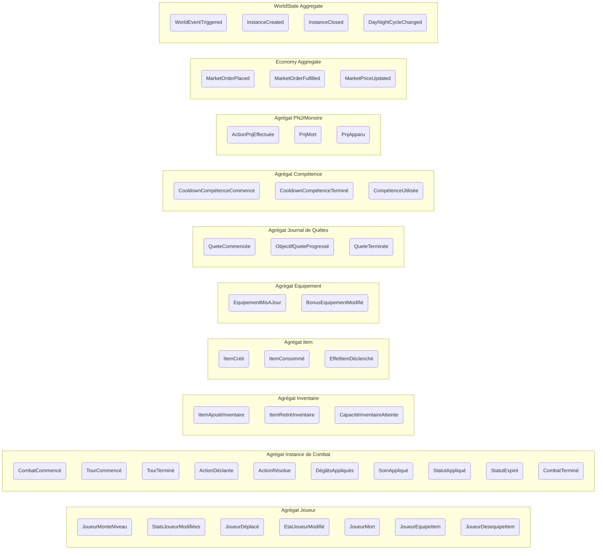

> **Note de synchronisation** :
> Cette matrice d'événements utilise le nommage français, sauf pour les termes internationalement utilisés (item, Tank, DPS, Heal, etc.).
> Les concepts d'agrégats, Value Objects, etc. sont centralisés dans `/doc/agregats.md`.

