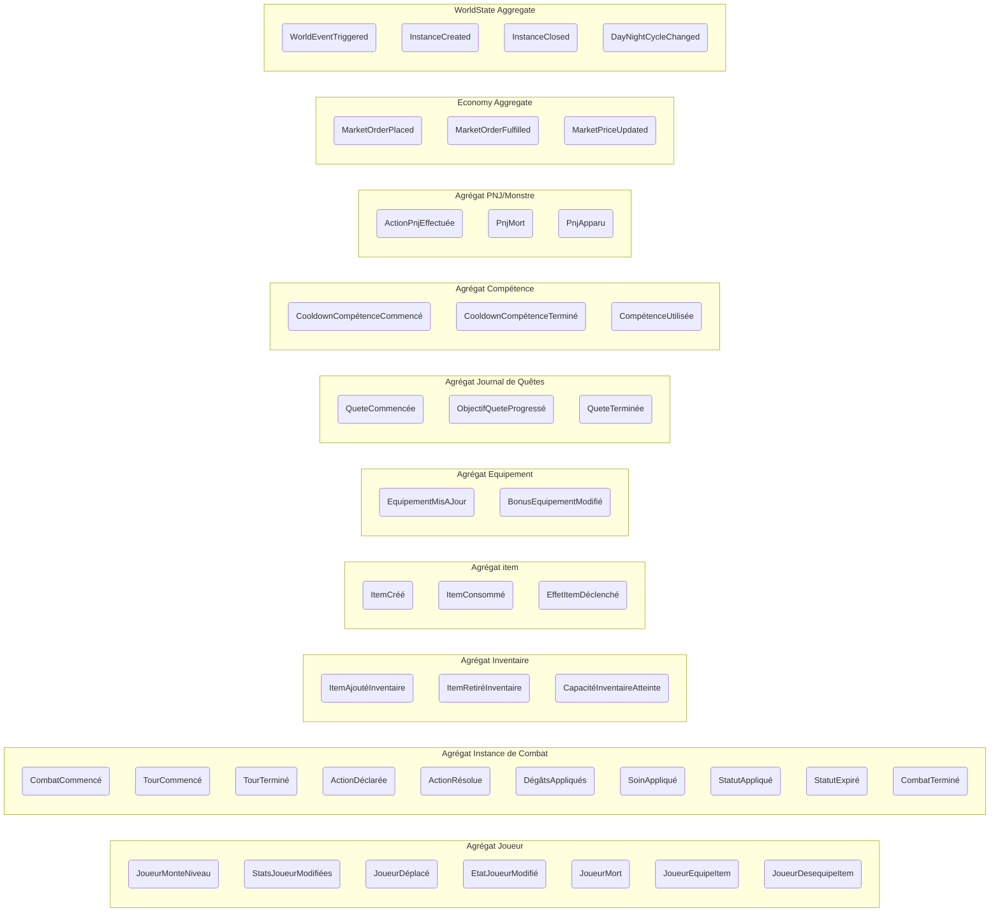

# Matrice des Événements – Aether-Engine

> **Note de synchronisation** :
> Cette matrice d'événements utilise le nommage français, sauf pour les termes internationalement utilisés (item, Tank, DPS, Heal, etc.).
> Les concepts d'agrégats, Value Objects, etc. sont centralisés dans `/doc/agregats.md`.

---

## Vue d'ensemble des événements



---

## Structures des événements (Event Payloads)

Chaque événement suit la structure standard Event Sourcing :
- **eventType** : Type de l'événement
- **eventId** : Identifiant unique (UUID)
- **timestamp** : Date/heure de création (ISO 8601)
- **aggregateId** : Identifiant de l'agrégat concerné
- **aggregateType** : Type d'agrégat
- **version** : Numéro de version de l'agrégat (incrémental)
- **payload** : Données spécifiques à l'événement
- **metadata** : Contexte additionnel (causalité, session, etc.)

---

### 1. Agrégat Joueur

#### `JoueurMonteNiveau`
```json
{
  "eventType": "JoueurMonteNiveau",
  "eventId": "uuid-v4",
  "timestamp": "2025-12-01T14:32:45Z",
  "aggregateId": "player-123",
  "aggregateType": "Joueur",
  "version": 42,
  "payload": {
    "joueurId": "player-123",
    "ancienNiveau": 10,
    "nouveauNiveau": 11,
    "pointsCompetenceGagnes": 5,
    "statsAugmentees": {
      "hpMax": 50,
      "mpMax": 30,
      "force": 2,
      "intelligence": 1
    }
  },
  "metadata": {
    "userId": "user-456",
    "sessionId": "session-789",
    "causedBy": "experience-gained"
  }
}
```

#### `StatsJoueurModifiées`
```json
{
  "eventType": "StatsJoueurModifiées",
  "eventId": "uuid-v4",
  "timestamp": "2025-12-01T14:32:45Z",
  "aggregateId": "player-123",
  "aggregateType": "Joueur",
  "version": 43,
  "payload": {
    "joueurId": "player-123",
    "statsModifiees": {
      "hp": { "avant": 200, "apres": 250 },
      "mp": { "avant": 100, "apres": 120 },
      "force": { "avant": 50, "apres": 52 },
      "agilite": { "avant": 30, "apres": 30 }
    },
    "raison": "buff-equipment"
  },
  "metadata": {
    "causedBy": "item-equipped",
    "itemId": "item-sword-001"
  }
}
```

#### `JoueurDéplacé`
```json
{
  "eventType": "JoueurDéplacé",
  "eventId": "uuid-v4",
  "timestamp": "2025-12-01T14:32:46Z",
  "aggregateId": "player-123",
  "aggregateType": "Joueur",
  "version": 44,
  "payload": {
    "joueurId": "player-123",
    "anciennePosition": { "x": 10, "y": 5, "z": 0 },
    "nouvellePosition": { "x": 12, "y": 5, "z": 0 },
    "chemin": [
      { "x": 10, "y": 5 },
      { "x": 11, "y": 5 },
      { "x": 12, "y": 5 }
    ],
    "mpConsommes": 2,
    "duree": 1.5
  },
  "metadata": {
    "combatId": "combat-789",
    "turnId": "turn-42"
  }
}
```

#### `EtatJoueurModifié`
```json
{
  "eventType": "EtatJoueurModifié",
  "eventId": "uuid-v4",
  "timestamp": "2025-12-01T14:32:47Z",
  "aggregateId": "player-123",
  "aggregateType": "Joueur",
  "version": 45,
  "payload": {
    "joueurId": "player-123",
    "ancienEtat": "Active",
    "nouvelEtat": "Stunned",
    "duree": 2,
    "causePar": "skill-earthquake"
  },
  "metadata": {
    "combatId": "combat-789",
    "sourceUniteId": "monster-456"
  }
}
```

#### `JoueurMort`
```json
{
  "eventType": "JoueurMort",
  "eventId": "uuid-v4",
  "timestamp": "2025-12-01T14:32:50Z",
  "aggregateId": "player-123",
  "aggregateType": "Joueur",
  "version": 46,
  "payload": {
    "joueurId": "player-123",
    "tuePar": "monster-666",
    "causeDecès": "DégâtsPhysiques",
    "degatsFinaux": 350,
    "positionMort": { "x": 12, "y": 5, "z": 0 },
    "experiencePerdue": 500,
    "penalites": {
      "durabiliteEquipement": -10,
      "tempsSurplace": 30
    }
  },
  "metadata": {
    "combatId": "combat-789",
    "turnId": "turn-50"
  }
}
```

#### `JoueurEquipeItem`
```json
{
  "eventType": "JoueurEquipeItem",
  "eventId": "uuid-v4",
  "timestamp": "2025-12-01T14:33:00Z",
  "aggregateId": "player-123",
  "aggregateType": "Joueur",
  "version": 47,
  "payload": {
    "joueurId": "player-123",
    "itemId": "item-sword-001",
    "slotEquipement": "MainDroite",
    "itemRemplace": "item-dagger-002",
    "bonusStats": {
      "force": 10,
      "critique": 5
    }
  },
  "metadata": {
    "source": "inventory"
  }
}
```

#### `JoueurDesequipeItem`
```json
{
  "eventType": "JoueurDesequipeItem",
  "eventId": "uuid-v4",
  "timestamp": "2025-12-01T14:33:05Z",
  "aggregateId": "player-123",
  "aggregateType": "Joueur",
  "version": 48,
  "payload": {
    "joueurId": "player-123",
    "itemId": "item-sword-001",
    "slotEquipement": "MainDroite",
    "malusStats": {
      "force": -10,
      "critique": -5
    }
  },
  "metadata": {
    "reason": "item-broken",
    "durabilite": 0
  }
}
```

---

### 2. Agrégat Instance de Combat

#### `CombatCommencé`
```json
{
  "eventType": "CombatCommencé",
  "eventId": "uuid-v4",
  "timestamp": "2025-12-01T14:30:00Z",
  "aggregateId": "combat-789",
  "aggregateType": "InstanceCombat",
  "version": 1,
  "payload": {
    "combatId": "combat-789",
    "type": "PvE",
    "carte": {
      "id": "map-dungeon-01",
      "nom": "Donjon des Ombres",
      "taille": { "largeur": 20, "hauteur": 15 }
    },
    "participants": [
      {
        "uniteId": "player-123",
        "type": "Joueur",
        "role": "Tank",
        "position": { "x": 2, "y": 7 }
      },
      {
        "uniteId": "player-456",
        "type": "Joueur",
        "role": "DPS",
        "position": { "x": 3, "y": 7 }
      },
      {
        "uniteId": "monster-666",
        "type": "Monstre",
        "nom": "Dragon Rouge",
        "position": { "x": 15, "y": 7 }
      }
    ],
    "ordreInitiative": ["player-456", "player-123", "monster-666"],
    "conditions": {
      "victoire": "DefaiteEnnemis",
      "defaite": "MortTousJoueurs",
      "limiteTemps": 600
    }
  },
  "metadata": {
    "initiePar": "player-123",
    "difficulte": "Hard"
  }
}
```

#### `TourCommencé`
```json
{
  "eventType": "TourCommencé",
  "eventId": "uuid-v4",
  "timestamp": "2025-12-01T14:30:05Z",
  "aggregateId": "combat-789",
  "aggregateType": "InstanceCombat",
  "version": 2,
  "payload": {
    "combatId": "combat-789",
    "tourId": "turn-1",
    "numeroTour": 1,
    "uniteActive": "player-456",
    "atbActuelle": 100,
    "actionsDisponibles": ["Deplacement", "AttaqueNormale", "Competence", "Item"],
    "dureeMaximale": 30
  }
}
```

#### `TourTerminé`
```json
{
  "eventType": "TourTerminé",
  "eventId": "uuid-v4",
  "timestamp": "2025-12-01T14:30:20Z",
  "aggregateId": "combat-789",
  "aggregateType": "InstanceCombat",
  "version": 3,
  "payload": {
    "combatId": "combat-789",
    "tourId": "turn-1",
    "uniteActive": "player-456",
    "actionChoisie": "Competence",
    "dureeReelle": 15,
    "prochainTour": "turn-2",
    "prochaineUnite": "player-123"
  }
}
```

#### `ActionDéclarée`
```json
{
  "eventType": "ActionDéclarée",
  "eventId": "uuid-v4",
  "timestamp": "2025-12-01T14:30:12Z",
  "aggregateId": "combat-789",
  "aggregateType": "InstanceCombat",
  "version": 4,
  "payload": {
    "combatId": "combat-789",
    "tourId": "turn-1",
    "acteur": "player-456",
    "typeAction": "Competence",
    "competenceId": "skill-fireball",
    "cibles": ["monster-666"],
    "coutRessources": {
      "mp": 30,
      "cooldown": 3
    },
    "validation": {
      "valide": true,
      "erreurs": []
    }
  }
}
```

#### `ActionRésolue`
```json
{
  "eventType": "ActionRésolue",
  "eventId": "uuid-v4",
  "timestamp": "2025-12-01T14:30:15Z",
  "aggregateId": "combat-789",
  "aggregateType": "InstanceCombat",
  "version": 5,
  "payload": {
    "combatId": "combat-789",
    "tourId": "turn-1",
    "acteur": "player-456",
    "typeAction": "Competence",
    "competenceId": "skill-fireball",
    "resultats": [
      {
        "cibleId": "monster-666",
        "succes": true,
        "degats": 250,
        "critique": false,
        "effetsSecondaires": [
          {
            "type": "Brulure",
            "duree": 3,
            "degatsParTour": 20
          }
        ]
      }
    ],
    "animationDuree": 2.5
  }
}
```

#### `DégâtsAppliqués`
```json
{
  "eventType": "DégâtsAppliqués",
  "eventId": "uuid-v4",
  "timestamp": "2025-12-01T14:30:16Z",
  "aggregateId": "combat-789",
  "aggregateType": "InstanceCombat",
  "version": 6,
  "payload": {
    "combatId": "combat-789",
    "tourId": "turn-1",
    "source": "player-456",
    "cible": "monster-666",
    "typeDegats": "Magique",
    "degatsBruts": 300,
    "reduction": {
      "armure": 30,
      "resistance": 20
    },
    "degatsFinaux": 250,
    "critique": false,
    "hpAvant": 1000,
    "hpApres": 750,
    "mort": false
  },
  "metadata": {
    "competenceId": "skill-fireball"
  }
}
```

#### `SoinAppliqué`
```json
{
  "eventType": "SoinAppliqué",
  "eventId": "uuid-v4",
  "timestamp": "2025-12-01T14:30:25Z",
  "aggregateId": "combat-789",
  "aggregateType": "InstanceCombat",
  "version": 7,
  "payload": {
    "combatId": "combat-789",
    "tourId": "turn-2",
    "source": "player-789",
    "cible": "player-123",
    "typeSoin": "Magique",
    "soinBrut": 150,
    "bonus": {
      "intelligence": 20,
      "critique": 30
    },
    "soinFinal": 200,
    "critique": true,
    "hpAvant": 300,
    "hpApres": 500,
    "overheal": 0
  },
  "metadata": {
    "competenceId": "skill-heal"
  }
}
```

#### `StatutAppliqué`
```json
{
  "eventType": "StatutAppliqué",
  "eventId": "uuid-v4",
  "timestamp": "2025-12-01T14:30:17Z",
  "aggregateId": "combat-789",
  "aggregateType": "InstanceCombat",
  "version": 8,
  "payload": {
    "combatId": "combat-789",
    "tourId": "turn-1",
    "source": "player-456",
    "cible": "monster-666",
    "statut": {
      "type": "Brulure",
      "duree": 3,
      "intensite": 20,
      "stackable": true,
      "stacks": 1
    },
    "effets": {
      "degatsParTour": 20,
      "reductionSoins": 0
    }
  },
  "metadata": {
    "competenceId": "skill-fireball"
  }
}
```

#### `StatutExpiré`
```json
{
  "eventType": "StatutExpiré",
  "eventId": "uuid-v4",
  "timestamp": "2025-12-01T14:31:00Z",
  "aggregateId": "combat-789",
  "aggregateType": "InstanceCombat",
  "version": 9,
  "payload": {
    "combatId": "combat-789",
    "tourId": "turn-4",
    "uniteId": "monster-666",
    "statut": {
      "type": "Brulure",
      "dureeTotale": 3,
      "dureeRestante": 0
    },
    "effetsFinis": {
      "degatsInfliges": 60
    }
  }
}
```

#### `CombatTerminé`
```json
{
  "eventType": "CombatTerminé",
  "eventId": "uuid-v4",
  "timestamp": "2025-12-01T14:35:00Z",
  "aggregateId": "combat-789",
  "aggregateType": "InstanceCombat",
  "version": 10,
  "payload": {
    "combatId": "combat-789",
    "resultat": "Victoire",
    "vainqueurs": ["player-123", "player-456", "player-789"],
    "vaincus": ["monster-666"],
    "statistiques": {
      "dureeTotale": 300,
      "nombreTours": 15,
      "degatsInfliges": 5000,
      "soinsProduits": 2000,
      "morts": 1
    },
    "recompenses": {
      "experience": 5000,
      "or": 1000,
      "items": ["item-potion-001", "item-sword-legendary-001"]
    }
  },
  "metadata": {
    "difficulte": "Hard"
  }
}
```

---

### 3. Agrégat Inventaire

#### `ItemAjoutéInventaire`
```json
{
  "eventType": "ItemAjoutéInventaire",
  "eventId": "uuid-v4",
  "timestamp": "2025-12-01T14:35:10Z",
  "aggregateId": "inventory-123",
  "aggregateType": "Inventaire",
  "version": 50,
  "payload": {
    "joueurId": "player-123",
    "itemId": "item-potion-001",
    "quantite": 5,
    "slot": 12,
    "source": "loot-combat",
    "capaciteRestante": 85
  },
  "metadata": {
    "combatId": "combat-789"
  }
}
```

#### `ItemRetiréInventaire`
```json
{
  "eventType": "ItemRetiréInventaire",
  "eventId": "uuid-v4",
  "timestamp": "2025-12-01T14:35:15Z",
  "aggregateId": "inventory-123",
  "aggregateType": "Inventaire",
  "version": 51,
  "payload": {
    "joueurId": "player-123",
    "itemId": "item-potion-001",
    "quantite": 1,
    "slot": 12,
    "raison": "consommation",
    "capaciteRestante": 86
  },
  "metadata": {
    "combatId": "combat-789"
  }
}
```

#### `CapacitéInventaireAtteinte`
```json
{
  "eventType": "CapacitéInventaireAtteinte",
  "eventId": "uuid-v4",
  "timestamp": "2025-12-01T14:35:20Z",
  "aggregateId": "inventory-123",
  "aggregateType": "Inventaire",
  "version": 52,
  "payload": {
    "joueurId": "player-123",
    "capaciteMaximale": 100,
    "capaciteUtilisee": 100,
    "itemsRefuses": [
      {
        "itemId": "item-potion-002",
        "quantite": 3
      }
    ]
  }
}
```

---

### 4. Agrégat Item

#### `ItemCréé`
```json
{
  "eventType": "ItemCréé",
  "eventId": "uuid-v4",
  "timestamp": "2025-12-01T14:35:25Z",
  "aggregateId": "item-sword-001",
  "aggregateType": "Item",
  "version": 1,
  "payload": {
    "itemId": "item-sword-001",
    "nom": "Épée Flamboyante",
    "type": "Arme",
    "rarete": "Legendaire",
    "stats": {
      "degats": 100,
      "force": 20,
      "critique": 10
    },
    "durabilite": {
      "actuelle": 100,
      "maximale": 100
    },
    "enchantements": [
      {
        "type": "Feu",
        "niveau": 3,
        "effets": "Brulure 20 dégâts/tour pendant 3 tours"
      }
    ],
    "valeur": 5000
  },
  "metadata": {
    "craftePar": "player-123"
  }
}
```

#### `ItemConsommé`
```json
{
  "eventType": "ItemConsommé",
  "eventId": "uuid-v4",
  "timestamp": "2025-12-01T14:35:30Z",
  "aggregateId": "item-potion-001",
  "aggregateType": "Item",
  "version": 2,
  "payload": {
    "itemId": "item-potion-001",
    "consommePar": "player-123",
    "effets": [
      {
        "type": "Soin",
        "valeur": 100
      }
    ],
    "quantiteConsommee": 1
  },
  "metadata": {
    "combatId": "combat-789"
  }
}
```

#### `EffetItemDéclenché`
```json
{
  "eventType": "EffetItemDéclenché",
  "eventId": "uuid-v4",
  "timestamp": "2025-12-01T14:35:35Z",
  "aggregateId": "item-sword-001",
  "aggregateType": "Item",
  "version": 3,
  "payload": {
    "itemId": "item-sword-001",
    "utilisePar": "player-123",
    "effet": {
      "type": "ProcEnchantement",
      "nom": "Feu",
      "chance": 20,
      "declenche": true,
      "cible": "monster-666",
      "resultat": {
        "degats": 50,
        "statut": "Brulure"
      }
    },
    "durabiliteReduite": 1
  },
  "metadata": {
    "combatId": "combat-789"
  }
}
```

---

### 5. Agrégat Equipement

#### `EquipementMisAJour`
```json
{
  "eventType": "EquipementMisAJour",
  "eventId": "uuid-v4",
  "timestamp": "2025-12-01T14:35:40Z",
  "aggregateId": "equipment-123",
  "aggregateType": "Equipement",
  "version": 20,
  "payload": {
    "joueurId": "player-123",
    "slots": {
      "Tete": "item-helmet-001",
      "Torse": "item-armor-001",
      "MainDroite": "item-sword-001",
      "MainGauche": "item-shield-001"
    },
    "statsBonus": {
      "force": 50,
      "agilite": 20,
      "armure": 100,
      "resistance": 50
    }
  }
}
```

#### `BonusEquipementModifié`
```json
{
  "eventType": "BonusEquipementModifié",
  "eventId": "uuid-v4",
  "timestamp": "2025-12-01T14:35:45Z",
  "aggregateId": "equipment-123",
  "aggregateType": "Equipement",
  "version": 21,
  "payload": {
    "joueurId": "player-123",
    "ancienBonus": {
      "force": 40,
      "agilite": 20
    },
    "nouveauBonus": {
      "force": 50,
      "agilite": 20
    },
    "raison": "item-upgraded",
    "itemConcerne": "item-sword-001"
  }
}
```

---

### 6. Agrégat Journal de Quêtes

#### `QueteCommencée`
```json
{
  "eventType": "QueteCommencée",
  "eventId": "uuid-v4",
  "timestamp": "2025-12-01T14:35:50Z",
  "aggregateId": "quest-journal-123",
  "aggregateType": "JournalQuetes",
  "version": 10,
  "payload": {
    "joueurId": "player-123",
    "queteId": "quest-dragon-slayer",
    "titre": "Tueur de Dragon",
    "description": "Vaincre le Dragon Rouge dans le Donjon des Ombres",
    "objectifs": [
      {
        "id": "obj-1",
        "description": "Vaincre le Dragon Rouge",
        "type": "Kill",
        "cible": "monster-666",
        "progression": 0,
        "requis": 1
      }
    ],
    "recompenses": {
      "experience": 10000,
      "or": 5000,
      "items": ["item-dragon-scale"]
    }
  },
  "metadata": {
    "pnjDonneurQuete": "npc-old-wizard"
  }
}
```

#### `ObjectifQueteProgressé`
```json
{
  "eventType": "ObjectifQueteProgressé",
  "eventId": "uuid-v4",
  "timestamp": "2025-12-01T14:36:00Z",
  "aggregateId": "quest-journal-123",
  "aggregateType": "JournalQuetes",
  "version": 11,
  "payload": {
    "joueurId": "player-123",
    "queteId": "quest-dragon-slayer",
    "objectifId": "obj-1",
    "progressionAvant": 0,
    "progressionApres": 1,
    "progressionRequise": 1,
    "complete": true
  },
  "metadata": {
    "declenchePar": "monster-killed",
    "monsterId": "monster-666"
  }
}
```

#### `QueteTerminée`
```json
{
  "eventType": "QueteTerminée",
  "eventId": "uuid-v4",
  "timestamp": "2025-12-01T14:36:10Z",
  "aggregateId": "quest-journal-123",
  "aggregateType": "JournalQuetes",
  "version": 12,
  "payload": {
    "joueurId": "player-123",
    "queteId": "quest-dragon-slayer",
    "resultat": "Succes",
    "objectifsCompletes": ["obj-1"],
    "recompensesObtenues": {
      "experience": 10000,
      "or": 5000,
      "items": ["item-dragon-scale"]
    },
    "tempsTotal": 300
  }
}
```

---

### 7. Agrégat Compétence

#### `CooldownCompétenceCommencé`
```json
{
  "eventType": "CooldownCompétenceCommencé",
  "eventId": "uuid-v4",
  "timestamp": "2025-12-01T14:36:15Z",
  "aggregateId": "skill-cooldown-123",
  "aggregateType": "Competence",
  "version": 30,
  "payload": {
    "joueurId": "player-123",
    "competenceId": "skill-fireball",
    "dureeCooldown": 3,
    "toursRestants": 3
  },
  "metadata": {
    "combatId": "combat-789"
  }
}
```

#### `CooldownCompétenceTerminé`
```json
{
  "eventType": "CooldownCompétenceTerminé",
  "eventId": "uuid-v4",
  "timestamp": "2025-12-01T14:36:30Z",
  "aggregateId": "skill-cooldown-123",
  "aggregateType": "Competence",
  "version": 31,
  "payload": {
    "joueurId": "player-123",
    "competenceId": "skill-fireball",
    "toursEcoules": 3,
    "disponible": true
  },
  "metadata": {
    "combatId": "combat-789"
  }
}
```

#### `CompétenceUtilisée`
```json
{
  "eventType": "CompétenceUtilisée",
  "eventId": "uuid-v4",
  "timestamp": "2025-12-01T14:36:35Z",
  "aggregateId": "skill-123",
  "aggregateType": "Competence",
  "version": 32,
  "payload": {
    "joueurId": "player-123",
    "competenceId": "skill-fireball",
    "cibles": ["monster-666"],
    "coutRessources": {
      "mp": 30,
      "hp": 0
    },
    "effets": {
      "degats": 250,
      "statuts": ["Brulure"]
    }
  },
  "metadata": {
    "combatId": "combat-789",
    "tourId": "turn-1"
  }
}
```

---

### 8. Agrégat PNJ/Monstre

#### `ActionPnjEffectuée`
```json
{
  "eventType": "ActionPnjEffectuée",
  "eventId": "uuid-v4",
  "timestamp": "2025-12-01T14:36:40Z",
  "aggregateId": "monster-666",
  "aggregateType": "Monstre",
  "version": 5,
  "payload": {
    "pnjId": "monster-666",
    "typeAction": "AttaqueNormale",
    "cible": "player-123",
    "degats": 80,
    "critique": false,
    "effetsSecondaires": []
  },
  "metadata": {
    "combatId": "combat-789",
    "tourId": "turn-3",
    "ia": "aggressive"
  }
}
```

#### `PnjMort`
```json
{
  "eventType": "PnjMort",
  "eventId": "uuid-v4",
  "timestamp": "2025-12-01T14:36:50Z",
  "aggregateId": "monster-666",
  "aggregateType": "Monstre",
  "version": 6,
  "payload": {
    "pnjId": "monster-666",
    "tuePar": "player-456",
    "causeDecès": "DégâtsMagiques",
    "degatsFinaux": 250,
    "loot": {
      "experience": 5000,
      "or": 1000,
      "items": ["item-dragon-scale", "item-potion-001"]
    }
  },
  "metadata": {
    "combatId": "combat-789",
    "tourId": "turn-15"
  }
}
```

#### `PnjApparu`
```json
{
  "eventType": "PnjApparu",
  "eventId": "uuid-v4",
  "timestamp": "2025-12-01T14:37:00Z",
  "aggregateId": "monster-777",
  "aggregateType": "Monstre",
  "version": 1,
  "payload": {
    "pnjId": "monster-777",
    "nom": "Gobelin Eclaireur",
    "type": "Monstre",
    "niveau": 5,
    "stats": {
      "hp": 200,
      "mp": 50,
      "force": 20,
      "agilite": 30
    },
    "position": { "x": 10, "y": 10 },
    "ia": "defensive"
  },
  "metadata": {
    "combatId": "combat-789",
    "spawn": "reinforcement"
  }
}
```

---

### 9. Economy Aggregate

#### `MarketOrderPlaced`
```json
{
  "eventType": "MarketOrderPlaced",
  "eventId": "uuid-v4",
  "timestamp": "2025-12-01T14:37:10Z",
  "aggregateId": "market-order-001",
  "aggregateType": "Economy",
  "version": 1,
  "payload": {
    "orderId": "market-order-001",
    "vendeur": "player-123",
    "itemId": "item-sword-001",
    "quantite": 1,
    "prixUnitaire": 5000,
    "prixTotal": 5000,
    "dureeValidite": 86400,
    "type": "Vente"
  }
}
```

#### `MarketOrderFulfilled`
```json
{
  "eventType": "MarketOrderFulfilled",
  "eventId": "uuid-v4",
  "timestamp": "2025-12-01T14:37:20Z",
  "aggregateId": "market-order-001",
  "aggregateType": "Economy",
  "version": 2,
  "payload": {
    "orderId": "market-order-001",
    "vendeur": "player-123",
    "acheteur": "player-456",
    "itemId": "item-sword-001",
    "quantite": 1,
    "prixFinal": 5000,
    "commissionMarche": 250,
    "vendeurRecu": 4750
  }
}
```

#### `MarketPriceUpdated`
```json
{
  "eventType": "MarketPriceUpdated",
  "eventId": "uuid-v4",
  "timestamp": "2025-12-01T14:37:30Z",
  "aggregateId": "market-price-001",
  "aggregateType": "Economy",
  "version": 3,
  "payload": {
    "itemId": "item-sword-001",
    "ancienPrixMoyen": 4500,
    "nouveauPrixMoyen": 5000,
    "nombreTransactions": 10,
    "volumeTotal": 50000,
    "tendance": "Hausse"
  }
}
```

---

### 10. WorldState Aggregate

#### `WorldEventTriggered`
```json
{
  "eventType": "WorldEventTriggered",
  "eventId": "uuid-v4",
  "timestamp": "2025-12-01T14:37:40Z",
  "aggregateId": "world-event-001",
  "aggregateType": "WorldState",
  "version": 1,
  "payload": {
    "eventId": "world-event-001",
    "titre": "Invasion de Dragons",
    "description": "Des dragons attaquent la capitale",
    "type": "Invasion",
    "zone": "Capitale",
    "duree": 3600,
    "objectifs": [
      {
        "description": "Vaincre 50 dragons",
        "progression": 0,
        "requis": 50
      }
    ],
    "recompensesGlobales": {
      "experience": 50000,
      "or": 10000
    }
  }
}
```

#### `InstanceCreated`
```json
{
  "eventType": "InstanceCreated",
  "eventId": "uuid-v4",
  "timestamp": "2025-12-01T14:37:50Z",
  "aggregateId": "instance-001",
  "aggregateType": "WorldState",
  "version": 2,
  "payload": {
    "instanceId": "instance-001",
    "type": "Donjon",
    "nom": "Donjon des Ombres",
    "difficulte": "Hard",
    "capaciteMaximale": 5,
    "participantsActuels": ["player-123", "player-456"],
    "dureeMaximale": 3600
  },
  "metadata": {
    "creePar": "player-123"
  }
}
```

#### `InstanceClosed`
```json
{
  "eventType": "InstanceClosed",
  "eventId": "uuid-v4",
  "timestamp": "2025-12-01T14:38:00Z",
  "aggregateId": "instance-001",
  "aggregateType": "WorldState",
  "version": 3,
  "payload": {
    "instanceId": "instance-001",
    "raison": "Terminee",
    "resultat": "Succes",
    "participantsFinaux": ["player-123", "player-456"],
    "dureeReelle": 300
  }
}
```

#### `DayNightCycleChanged`
```json
{
  "eventType": "DayNightCycleChanged",
  "eventId": "uuid-v4",
  "timestamp": "2025-12-01T14:38:10Z",
  "aggregateId": "world-time-001",
  "aggregateType": "WorldState",
  "version": 4,
  "payload": {
    "ancienEtat": "Jour",
    "nouvelEtat": "Nuit",
    "heureJeu": "20:00",
    "effetsActifs": [
      {
        "type": "BonusMonstres",
        "valeur": 20
      },
      {
        "type": "SpawnAugmente",
        "valeur": 50
      }
    ]
  }
}
```
