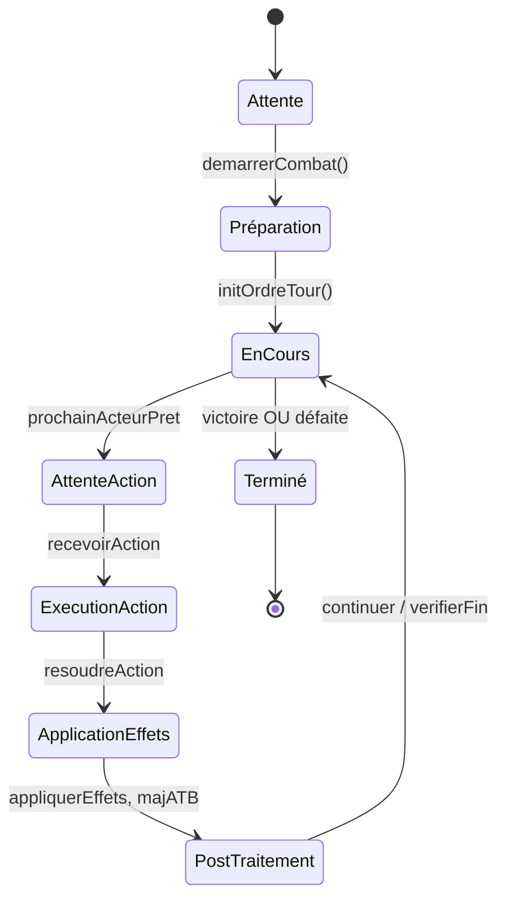
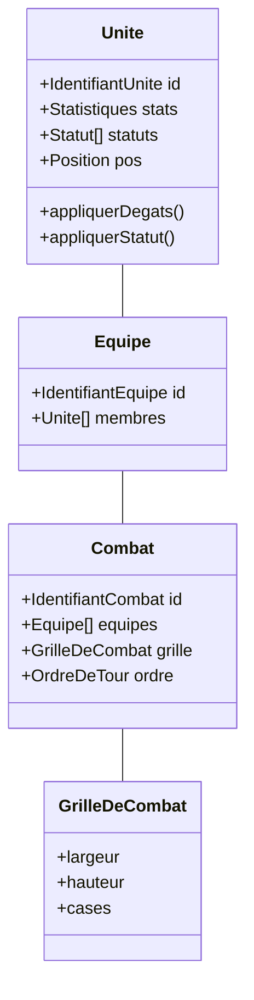
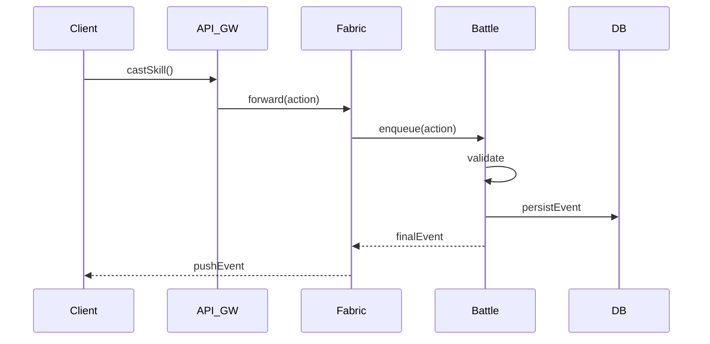

# Présentation du Projet Tactical RPG – Serveur avec un design pattern de type Fabric

> **Note de synchronisation** :
> Les concepts d'agrégats, Value Objects, etc. sont centralisés dans `/doc/agregats.md`.
> Les diagrammes utilisent le nommage français, sauf pour les termes internationalement utilisés (item, Tank, DPS, Heal, etc.).

## 1. Vision Générale

- **Serveur autoritatif** : Source de vérité, toutes les règles et validations sont côté serveur.
- **Tour par tour dynamique** : Système hybride avec gestion dynamique du CT/ATB.
- **Scalabilité** : Architecture pensée pour héberger de nombreuses instances de combat simultanées.
- **Client** : Angular 20, simple interface graphique reflétant l’état serveur.
- **Technos** : Go (serveur Fabric), API Gateway (Go/NestJS), Kafka/Redis, PostgreSQL.

---

---

## 2. Domain-Driven Design (DDD)

- **Agrégats principaux** :
  - Unité
  - Équipe
  - GrilleDeCombat
  - Combat (agrégat maître)
- **Compétence** : Value Object (immuable)

---

## 3. Machine d'états du Combat

> **Note** : Cette vue simplifiée est présentée ici pour la compréhension conceptuelle.
> **Machine canonique complète** : `/doc/machines_etats/combat_core_p2.md`
> **Mapping des vues** : `/doc/machines_etats/mapping_vues.md`

Cycle simplifié : Attente → Préparation → EnCours → AttenteAction → Exécution → ApplicationEffets → PostTraitement → Terminé

---

## 4. Diagramme de Classes (Mermaid)

---

## 5. Diagramme de Séquence (Action de compétence)

---

## 6. Architecture & Concurrence

- 1 goroutine Go par instance de combat
- Channels pour la synchronisation
- Snapshots réguliers de l’état

---

## 7. CQRS & Event Sourcing

- Émission d’événements de jeu
- Projections ReadModel pour statistiques et analyse

---

## 8. Stratégie de Tests

- Tests unitaires DDD
- Tests d’intégration
- Tests end-to-end
- Injection de simulateurs (Fake RNG)

---

## 9. Roadmap Technique

- Sprint 0 : Conception et tests
- Sprint 1 : Base Fabric
- Sprint 2 : Skills et résolution
- Sprint 3 : API Gateway + events
- Sprint 4 : Scalabilité et observabilité

---
