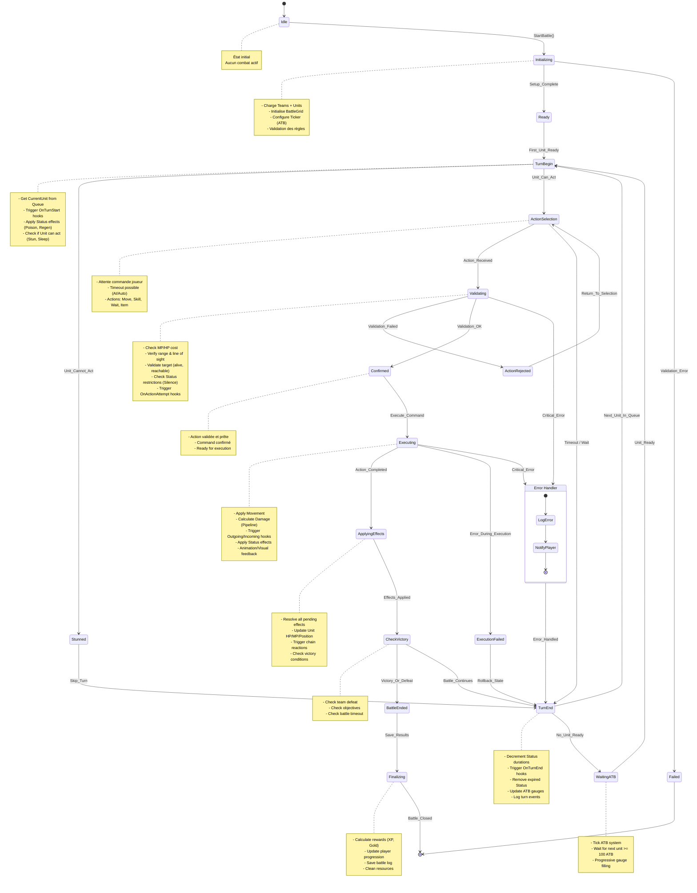

```mermaid
stateDiagram-v2
    [*] --> Idle
    
    note right of Idle
        État initial
        Aucun combat actif
    end note
    
    Idle --> Initializing : StartBattle()
    
    note right of Initializing
        - Charge Teams + Units
        - Initialise BattleGrid
        - Configure Ticker (ATB)
        - Validation des règles
    end note
    
    Initializing --> Ready : Setup_Complete
    Initializing --> Failed : Validation_Error
    Failed --> [*]
    
    Ready --> TurnBegin : First_Unit_Ready
    
    note right of TurnBegin
        - Get CurrentUnit from Queue
        - Trigger OnTurnStart hooks
        - Apply Status effects (Poison, Regen)
        - Check if Unit can act (Stun, Sleep)
    end note
    
    TurnBegin --> Stunned : Unit_Cannot_Act
    TurnBegin --> ActionSelection : Unit_Can_Act
    
    Stunned --> TurnEnd : Skip_Turn
    
    note right of ActionSelection
        - Attente commande joueur
        - Timeout possible (AI/Auto)
        - Actions: Move, Skill, Wait, Item
    end note
    
    ActionSelection --> Validating : Action_Received
    ActionSelection --> TurnEnd : Timeout / Wait
    
    note right of Validating
        - Check MP/HP cost
        - Verify range & line of sight
        - Validate target (alive, reachable)
        - Check Status restrictions (Silence)
        - Trigger OnActionAttempt hooks
    end note
    
    Validating --> ActionRejected : Validation_Failed
    Validating --> Confirmed : Validation_OK
    
    ActionRejected --> ActionSelection : Return_To_Selection
    
    note right of Confirmed
        - Action validée et prête
        - Command confirmé
        - Ready for execution
    end note
    
    Confirmed --> Executing : Execute_Command
    
    note right of Executing
        - Apply Movement
        - Calculate Damage (Pipeline)
        - Trigger Outgoing/Incoming hooks
        - Apply Status effects
        - Animation/Visual feedback
    end note
    
    Executing --> ApplyingEffects : Action_Completed
    Executing --> ExecutionFailed : Error_During_Execution
    
    ExecutionFailed --> TurnEnd : Rollback_State
    
    note right of ApplyingEffects
        - Resolve all pending effects
        - Update Unit HP/MP/Position
        - Trigger chain reactions
        - Check victory conditions
    end note
    
    ApplyingEffects --> CheckVictory : Effects_Applied
    
    note right of CheckVictory
        - Check team defeat
        - Check objectives
        - Check battle timeout
    end note
    
    CheckVictory --> BattleEnded : Victory_Or_Defeat
    CheckVictory --> TurnEnd : Battle_Continues
    
    note right of TurnEnd
        - Decrement Status durations
        - Trigger OnTurnEnd hooks
        - Remove expired Status
        - Update ATB gauges
        - Log turn events
    end note
    
    TurnEnd --> TurnBegin : Next_Unit_In_Queue
    TurnEnd --> WaitingATB : No_Unit_Ready
    
    note right of WaitingATB
        - Tick ATB system
        - Wait for next unit >= 100 ATB
        - Progressive gauge filling
    end note
    
    WaitingATB --> TurnBegin : Unit_Ready
    
    BattleEnded --> Finalizing : Save_Results
    
    note right of Finalizing
        - Calculate rewards (XP, Gold)
        - Update player progression
        - Save battle log
        - Clean resources
    end note
    
    Finalizing --> [*] : Battle_Closed
    
    %% États d'erreur
    state "Error Handler" as ErrorState {
        [*] --> LogError
        LogError --> NotifyPlayer
        NotifyPlayer --> [*]
    }
    
    Validating --> ErrorState : Critical_Error
    Executing --> ErrorState : Critical_Error
    ErrorState --> TurnEnd : Error_Handled
```
