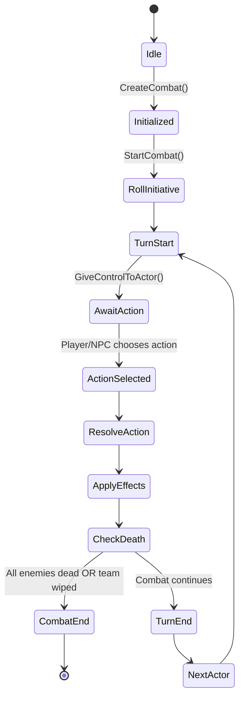

## Description
Nous avons ici un diagramme d'état représentant le cycle de vie d'une instance de combat tour par tour dans un jeu MMO. Les états principaux incluent l'initialisation du combat, le lancement du tour, l'attente de l'action du joueur ou du NPC, la résolution de l'action, l'application des effets, la vérification des morts, et la fin du combat. Chaque transition est déclenchée par des événements spécifiques tels que la création du combat, le choix d'une action, ou la fin du combat.