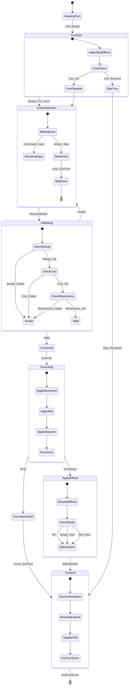

```mermaid
stateDiagram-v2
    [*] --> AwaitingTurn

    %% --- 1. L'unité devient active ---
    AwaitingTurn --> TurnStart : Unit_Ready

    state TurnStart {
        [*] --> ApplyStartEffects
        ApplyStartEffects --> CheckStun
        CheckStun --> SkipTurn : Unit_Stunned
        CheckStun --> TurnPlayable : Can_Act
    }

    %% --- 2. L'unité peut agir ---
    TurnStart --> ActionSelection : Ready_For_Input
    TurnPlayable --> ActionSelection

    state ActionSelection {
        [*] --> WaitingInput
        WaitingInput --> ReceivedInput : Command_Input
        WaitingInput --> WaitAction : Action_Wait
        WaitAction --> WaitDone : Auto_EndTurn
        WaitDone --> [*]
    }

    ActionSelection --> Validating : ReceivedInput

    %% --- 3. Validation ---
    state Validating {
        [*] --> CheckRange
        CheckRange --> CheckCost : Range_OK
        CheckRange --> Invalid : Range_Failed

        CheckCost --> CheckRestrictions : Cost_OK
        CheckCost --> Invalid : Cost_Failed

        CheckRestrictions --> Valid : Restrictions_OK
        CheckRestrictions --> Invalid : Restrictions_Failed
    }

    Validating --> ActionSelection : Invalid
    Validating --> Confirmed : Valid

    %% --- 4. Confirmation (facultatif mais propre dans ton système) ---
    Confirmed --> Executing : Execute

    %% --- 5. Exécution ---
    state Executing {
        [*] --> ApplyMovement
        ApplyMovement --> ApplySkill
        ApplySkill --> ApplyStatuses
        ApplyStatuses --> ExecDone
    }

    Executing --> ExecutionFailed : Error
    ExecutionFailed --> TurnEnd : Force_EndTurn

    Executing --> ApplyEffects : ExecDone

    %% --- 6. Résolution des effets & checks ---
    state ApplyEffects {
        [*] --> ResolveEffects
        ResolveEffects --> CheckDeath
        CheckDeath --> EffectsDone : OK
        CheckDeath --> EffectsDone : Target_Died
        CheckDeath --> EffectsDone : Self_Died
    }

    ApplyEffects --> TurnEnd : EffectsDone

    %% --- 7. Fin de tour ---
    state TurnEnd {
        [*] --> DecrementStatus
        DecrementStatus --> RemoveExpired
        RemoveExpired --> UpdateATB
        UpdateATB --> EndTurnDone
    }

    TurnEnd --> [*] : EndTurnDone

    %% --- 8. Skip turn (stun/sleep/etc.) ---
    SkipTurn --> TurnEnd : Skip_Resolved

```