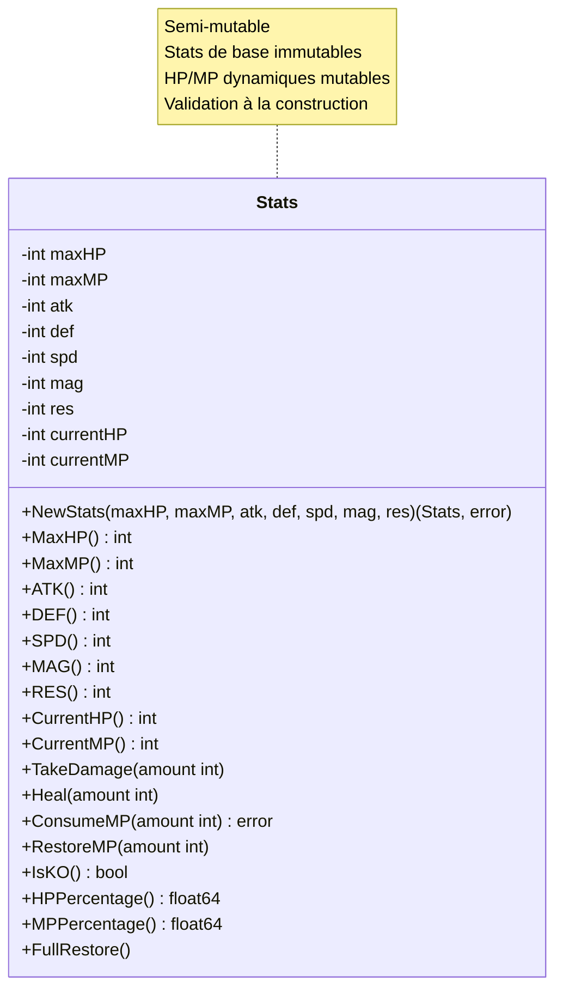

```mermaid
classDiagram
    class Stats {
        -int maxHP
        -int maxMP
        -int atk
        -int def
        -int spd
        -int mag
        -int res
        -int currentHP
        -int currentMP
        
        +NewStats(maxHP, maxMP, atk, def, spd, mag, res) (Stats, error)
        +MaxHP() int
        +MaxMP() int
        +ATK() int
        +DEF() int
        +SPD() int
        +MAG() int
        +RES() int
        +CurrentHP() int
        +CurrentMP() int
        +TakeDamage(amount int)
        +Heal(amount int)
        +ConsumeMP(amount int) error
        +RestoreMP(amount int)
        +IsKO() bool
        +HPPercentage() float64
        +MPPercentage() float64
        +FullRestore()
    }
    
    note for Stats "Semi-mutable
    Stats de base immutables
    HP/MP dynamiques mutables
    Validation à la construction"
```