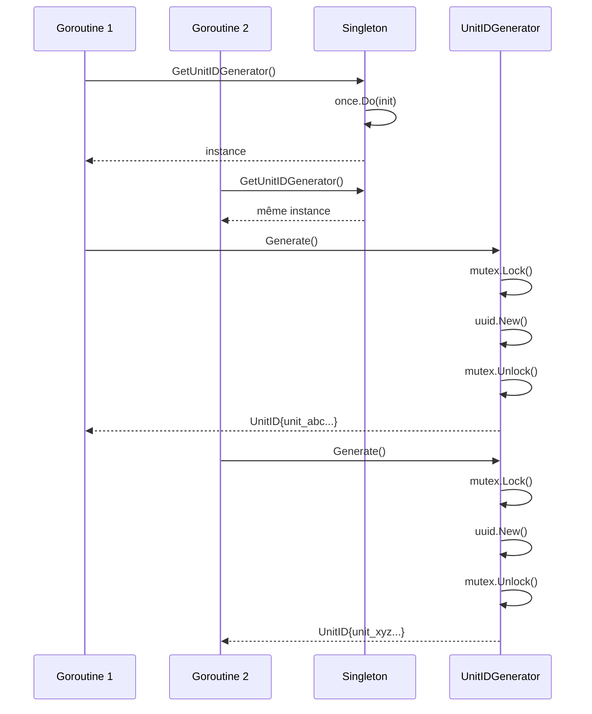

```mermaid
sequenceDiagram
    participant G1 as Goroutine 1
    participant G2 as Goroutine 2
    participant S as Singleton
    participant Gen as UnitIDGenerator
    
    G1->>S: GetUnitIDGenerator()
    S->>S: once.Do(init)
    S-->>G1: instance
    
    G2->>S: GetUnitIDGenerator()
    S-->>G2: même instance
    
    G1->>Gen: Generate()
    Gen->>Gen: mutex.Lock()
    Gen->>Gen: uuid.New()
    Gen->>Gen: mutex.Unlock()
    Gen-->>G1: UnitID{unit_abc...}
    
    G2->>Gen: Generate()
    Gen->>Gen: mutex.Lock()
    Gen->>Gen: uuid.New()
    Gen->>Gen: mutex.Unlock()
    Gen-->>G2: UnitID{unit_xyz...}
```