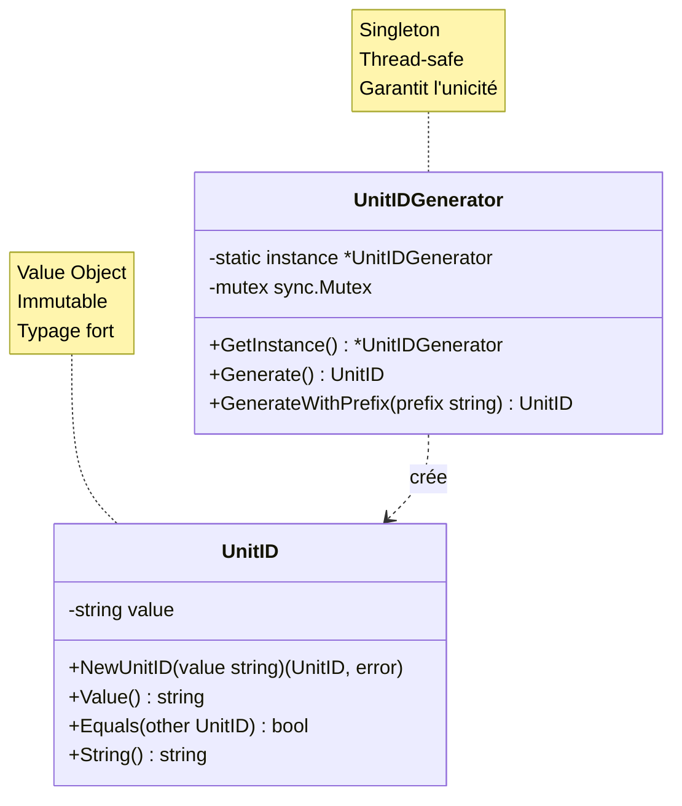

Test unitaire – UnitID (Version rigoureuse)
Objectif
Créer un identifiant typé fort pour les unités de combat, garantissant l'unicité, la validité et la traçabilité des unités dans le système.

Règles métier
Contraintes

Unicité : Chaque UnitID doit être unique dans le système
Non-vide : Un UnitID ne peut pas être vide ou composé uniquement d'espaces
Immutabilité : Une fois créé, un UnitID ne peut pas être modifié
Traçabilité : Format prévisible pour le debugging et les logs
Typage fort : Éviter les confusions avec d'autres IDs (BattleID, TeamID, etc.)

Format proposé

Préfixe : unit_ pour identifier le type
Identifiant unique : UUID v4 ou séquence incrémentale
Exemple : unit_550e8400-e29b-41d4-a716-446655440000

Comportements attendus

Création depuis string : Validation du format
Génération automatique : Via un générateur (Singleton)
Égalité : Comparaison par valeur
Sérialisation : Conversion string pour stockage/transport
Validation : Vérification du format

Architecture avec Singleton


Structure proposée
```go
package domain

import (
    "errors"
    "fmt"
    "strings"
    "sync"
    
    "github.com/google/uuid"
)

// UnitID représente un identifiant unique d'unité
type UnitID struct {
    value string
}

// NewUnitID crée un UnitID depuis une string (validation)
func NewUnitID(value string) (UnitID, error) {
    trimmed := strings.TrimSpace(value)
    
    if trimmed == "" {
        return UnitID{}, errors.New("unitID cannot be empty")
    }
    
    if !strings.HasPrefix(trimmed, "unit_") {
        return UnitID{}, errors.New("unitID must start with 'unit_' prefix")
    }
    
    if len(trimmed) < 6 { // "unit_" + au moins 1 caractère
        return UnitID{}, errors.New("unitID too short")
    }
    
    return UnitID{value: trimmed}, nil
}

// Value retourne la valeur de l'ID
func (id UnitID) Value() string {
    return id.value
}

// Equals compare deux UnitID
func (id UnitID) Equals(other UnitID) bool {
    return id.value == other.value
}

// String implémente fmt.Stringer
func (id UnitID) String() string {
    return id.value
}

// IsEmpty vérifie si l'ID est vide (pour les valeurs nulles)
func (id UnitID) IsEmpty() bool {
    return id.value == ""
}

// ===============================================
// UnitIDGenerator - Singleton Thread-safe
// ===============================================

type UnitIDGenerator struct {
    mutex sync.Mutex
}

var (
    generatorInstance *UnitIDGenerator
    once              sync.Once
)

// GetInstance retourne l'instance unique du générateur
func GetUnitIDGenerator() *UnitIDGenerator {
    once.Do(func() {
        generatorInstance = &UnitIDGenerator{}
    })
    return generatorInstance
}

// Generate crée un nouveau UnitID unique
func (g *UnitIDGenerator) Generate() UnitID {
    g.mutex.Lock()
    defer g.mutex.Unlock()
    
    id := uuid.New()
    return UnitID{value: fmt.Sprintf("unit_%s", id.String())}
}

// GenerateWithSuffix crée un UnitID avec un suffixe personnalisé
func (g *UnitIDGenerator) GenerateWithSuffix(suffix string) UnitID {
    g.mutex.Lock()
    defer g.mutex.Unlock()
    
    id := uuid.New()
    if suffix != "" {
        return UnitID{value: fmt.Sprintf("unit_%s_%s", id.String(), suffix)}
    }
    return UnitID{value: fmt.Sprintf("unit_%s", id.String())}
}
```

Test unitaire
```go
package domain_test

import (
    "sync"
    "testing"
    
    "github.com/stretchr/testify/assert"
    "aether-engine-server/internal/combat/domain"
)

// ========== Tests de création manuelle ==========

func TestNewUnitID_Valid(t *testing.T) {
    id, err := domain.NewUnitID("unit_abc123")
    
    assert.NoError(t, err)
    assert.Equal(t, "unit_abc123", id.Value())
}

func TestNewUnitID_ValidUUID(t *testing.T) {
    id, err := domain.NewUnitID("unit_550e8400-e29b-41d4-a716-446655440000")
    
    assert.NoError(t, err)
    assert.Equal(t, "unit_550e8400-e29b-41d4-a716-446655440000", id.Value())
}

func TestNewUnitID_EmptyString(t *testing.T) {
    _, err := domain.NewUnitID("")
    
    assert.Error(t, err)
    assert.Contains(t, err.Error(), "cannot be empty")
}

func TestNewUnitID_WhitespaceOnly(t *testing.T) {
    _, err := domain.NewUnitID("   ")
    
    assert.Error(t, err)
    assert.Contains(t, err.Error(), "cannot be empty")
}

func TestNewUnitID_MissingPrefix(t *testing.T) {
    _, err := domain.NewUnitID("abc123")
    
    assert.Error(t, err)
    assert.Contains(t, err.Error(), "must start with 'unit_' prefix")
}

func TestNewUnitID_WrongPrefix(t *testing.T) {
    _, err := domain.NewUnitID("team_abc123")
    
    assert.Error(t, err)
    assert.Contains(t, err.Error(), "must start with 'unit_' prefix")
}

func TestNewUnitID_TooShort(t *testing.T) {
    _, err := domain.NewUnitID("unit_")
    
    assert.Error(t, err)
    assert.Contains(t, err.Error(), "too short")
}

func TestNewUnitID_WithWhitespace(t *testing.T) {
    id, err := domain.NewUnitID("  unit_abc123  ")
    
    assert.NoError(t, err)
    assert.Equal(t, "unit_abc123", id.Value())
}

func TestNewUnitID_MinimalValid(t *testing.T) {
    id, err := domain.NewUnitID("unit_1")
    
    assert.NoError(t, err)
    assert.Equal(t, "unit_1", id.Value())
}

// ========== Tests d'égalité ==========

func TestUnitID_Equals_Same(t *testing.T) {
    id1, _ := domain.NewUnitID("unit_abc123")
    id2, _ := domain.NewUnitID("unit_abc123")
    
    assert.True(t, id1.Equals(id2))
}

func TestUnitID_Equals_Different(t *testing.T) {
    id1, _ := domain.NewUnitID("unit_abc123")
    id2, _ := domain.NewUnitID("unit_xyz789")
    
    assert.False(t, id1.Equals(id2))
}

func TestUnitID_Equals_CaseSensitive(t *testing.T) {
    id1, _ := domain.NewUnitID("unit_ABC")
    id2, _ := domain.NewUnitID("unit_abc")
    
    assert.False(t, id1.Equals(id2))
}

// ========== Tests de String() ==========

func TestUnitID_String(t *testing.T) {
    id, _ := domain.NewUnitID("unit_test123")
    
    str := id.String()
    
    assert.Equal(t, "unit_test123", str)
}

func TestUnitID_StringForLogging(t *testing.T) {
    id, _ := domain.NewUnitID("unit_hero")
    
    // Simule un log
    logged := fmt.Sprintf("Unit %s attacked", id)
    
    assert.Equal(t, "Unit unit_hero attacked", logged)
}

// ========== Tests IsEmpty ==========

func TestUnitID_IsEmpty_NotEmpty(t *testing.T) {
    id, _ := domain.NewUnitID("unit_test")
    
    assert.False(t, id.IsEmpty())
}

func TestUnitID_IsEmpty_DefaultValue(t *testing.T) {
    var id domain.UnitID // Valeur zéro
    
    assert.True(t, id.IsEmpty())
}

// ========== Tests du générateur (Singleton) ==========

func TestGetUnitIDGenerator_ReturnsSameInstance(t *testing.T) {
    gen1 := domain.GetUnitIDGenerator()
    gen2 := domain.GetUnitIDGenerator()
    
    // Même pointeur
    assert.Equal(t, gen1, gen2)
}

func TestGetUnitIDGenerator_MultipleCallsSameInstance(t *testing.T) {
    instances := make([]*domain.UnitIDGenerator, 100)
    
    for i := 0; i < 100; i++ {
        instances[i] = domain.GetUnitIDGenerator()
    }
    
    // Toutes les instances doivent être identiques
    for i := 1; i < 100; i++ {
        assert.Equal(t, instances[0], instances[i])
    }
}

func TestUnitIDGenerator_Generate(t *testing.T) {
    gen := domain.GetUnitIDGenerator()
    
    id := gen.Generate()
    
    assert.NotEmpty(t, id.Value())
    assert.True(t, strings.HasPrefix(id.Value(), "unit_"))
}

func TestUnitIDGenerator_GenerateUnique(t *testing.T) {
    gen := domain.GetUnitIDGenerator()
    
    id1 := gen.Generate()
    id2 := gen.Generate()
    
    assert.False(t, id1.Equals(id2))
}

func TestUnitIDGenerator_Generate100Unique(t *testing.T) {
    gen := domain.GetUnitIDGenerator()
    ids := make(map[string]bool)
    
    for i := 0; i < 100; i++ {
        id := gen.Generate()
        
        // Vérifier l'unicité
        assert.False(t, ids[id.Value()], "Duplicate ID generated: %s", id.Value())
        ids[id.Value()] = true
    }
    
    assert.Equal(t, 100, len(ids))
}

func TestUnitIDGenerator_GenerateWithSuffix(t *testing.T) {
    gen := domain.GetUnitIDGenerator()
    
    id := gen.GenerateWithSuffix("hero")
    
    assert.True(t, strings.HasPrefix(id.Value(), "unit_"))
    assert.True(t, strings.HasSuffix(id.Value(), "_hero"))
}

func TestUnitIDGenerator_GenerateWithSuffixEmpty(t *testing.T) {
    gen := domain.GetUnitIDGenerator()
    
    id := gen.GenerateWithSuffix("")
    
    assert.True(t, strings.HasPrefix(id.Value(), "unit_"))
    assert.False(t, strings.Contains(id.Value(), "__"))
}

func TestUnitIDGenerator_GenerateWithSuffixUnique(t *testing.T) {
    gen := domain.GetUnitIDGenerator()
    
    id1 := gen.GenerateWithSuffix("warrior")
    id2 := gen.GenerateWithSuffix("warrior")
    
    // Même suffixe mais IDs différents
    assert.False(t, id1.Equals(id2))
}

// ========== Tests de concurrence ==========

func TestUnitIDGenerator_ConcurrentGeneration(t *testing.T) {
    gen := domain.GetUnitIDGenerator()
    
    var wg sync.WaitGroup
    ids := make(chan domain.UnitID, 100)
    
    // 100 goroutines générant des IDs simultanément
    for i := 0; i < 100; i++ {
        wg.Add(1)
        go func() {
            defer wg.Done()
            id := gen.Generate()
            ids <- id
        }()
    }
    
    wg.Wait()
    close(ids)
    
    // Vérifier l'unicité
    uniqueIDs := make(map[string]bool)
    for id := range ids {
        assert.False(t, uniqueIDs[id.Value()], "Duplicate ID in concurrent generation")
        uniqueIDs[id.Value()] = true
    }
    
    assert.Equal(t, 100, len(uniqueIDs))
}

func TestUnitIDGenerator_ConcurrentGetInstance(t *testing.T) {
    var wg sync.WaitGroup
    instances := make(chan *domain.UnitIDGenerator, 50)
    
    // 50 goroutines tentant d'obtenir l'instance
    for i := 0; i < 50; i++ {
        wg.Add(1)
        go func() {
            defer wg.Done()
            gen := domain.GetUnitIDGenerator()
            instances <- gen
        }()
    }
    
    wg.Wait()
    close(instances)
    
    // Toutes les instances doivent être identiques
    var firstInstance *domain.UnitIDGenerator
    for gen := range instances {
        if firstInstance == nil {
            firstInstance = gen
        }
        assert.Equal(t, firstInstance, gen)
    }
}

// ========== Tests d'immutabilité ==========

func TestUnitID_Immutability(t *testing.T) {
    id, _ := domain.NewUnitID("unit_original")
    originalValue := id.Value()
    
    // Tenter de "modifier" en créant un nouveau (ne devrait pas affecter l'original)
    _, _ = domain.NewUnitID("unit_modified")
    
    assert.Equal(t, originalValue, id.Value())
}

// ========== Tests d'intégration ==========

func TestUnitID_UsageInMap(t *testing.T) {
    id1, _ := domain.NewUnitID("unit_player1")
    id2, _ := domain.NewUnitID("unit_player2")
    
    units := make(map[domain.UnitID]string)
    units[id1] = "Hero"
    units[id2] = "Mage"
    
    assert.Equal(t, "Hero", units[id1])
    assert.Equal(t, "Mage", units[id2])
}

func TestUnitID_UsageInSlice(t *testing.T) {
    gen := domain.GetUnitIDGenerator()
    
    var ids []domain.UnitID
    for i := 0; i < 5; i++ {
        ids = append(ids, gen.Generate())
    }
    
    assert.Equal(t, 5, len(ids))
    
    // Vérifier que tous sont uniques
    for i := 0; i < len(ids); i++ {
        for j := i + 1; j < len(ids); j++ {
            assert.False(t, ids[i].Equals(ids[j]))
        }
    }
}

func TestUnitID_JSONSerialization(t *testing.T) {
    id, _ := domain.NewUnitID("unit_test")
    
    // Simule une sérialisation JSON
    type Wrapper struct {
        UnitID string `json:"unit_id"`
    }
    
    w := Wrapper{UnitID: id.String()}
    
    assert.Equal(t, "unit_test", w.UnitID)
}
```


