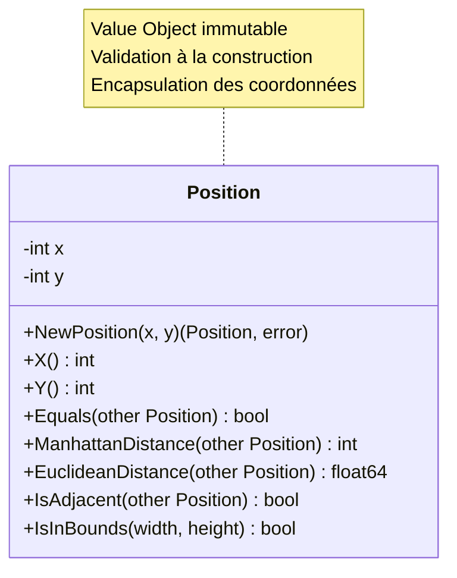

```mermaid
classDiagram
    class Position {
        -int x
        -int y
        +NewPosition(x, y) (Position, error)
        +X() int
        +Y() int
        +Equals(other Position) bool
        +ManhattanDistance(other Position) int
        +EuclideanDistance(other Position) float64
        +IsAdjacent(other Position) bool
        +IsInBounds(width, height) bool
    }
    
    note for Position "Value Object immutable
    Validation à la construction
    Encapsulation des coordonnées"
```