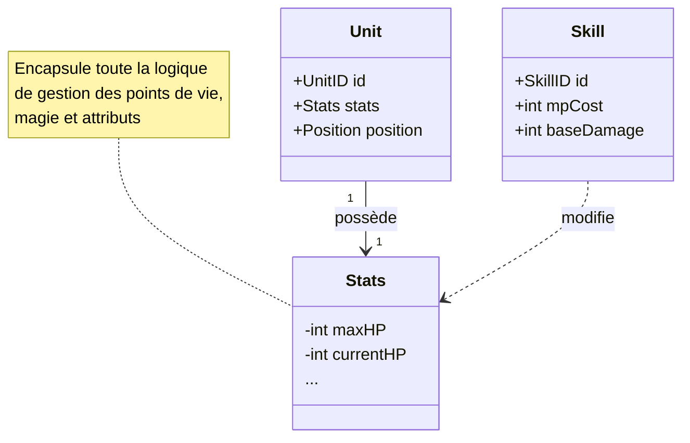

Relation avec d'autres entités

```mermaid
classDiagram
    class Unit {
        +UnitID id
        +Stats stats
        +Position position
    }
    
    class Stats {
        -int maxHP
        -int currentHP
        ...
    }
    
    class Skill {
        +SkillID id
        +int mpCost
        +int baseDamage
    }
    
    Unit "1" --> "1" Stats : possède
    Skill ..> Stats : modifie
    
    note for Stats "Encapsule toute la logique
    de gestion des points de vie,
    magie et attributs"
```