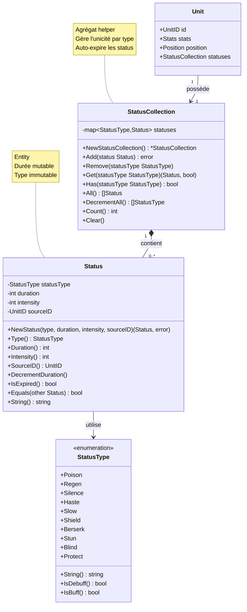

```mermaid
classDiagram
    class StatusType {
        <<enumeration>>
        +Poison
        +Regen
        +Silence
        +Haste
        +Slow
        +Shield
        +Berserk
        +Stun
        +Blind
        +Protect
        +String() string
        +IsDebuff() bool
        +IsBuff() bool
    }
    
    class Status {
        -StatusType statusType
        -int duration
        -int intensity
        -UnitID sourceID
        +NewStatus(type, duration, intensity, sourceID) (Status, error)
        +Type() StatusType
        +Duration() int
        +Intensity() int
        +SourceID() UnitID
        +DecrementDuration()
        +IsExpired() bool
        +Equals(other Status) bool
        +String() string
    }
    
    class StatusCollection {
        -map~StatusType,Status~ statuses
        +NewStatusCollection() *StatusCollection
        +Add(status Status) error
        +Remove(statusType StatusType)
        +Get(statusType StatusType) (Status, bool)
        +Has(statusType StatusType) bool
        +All() []Status
        +DecrementAll() []StatusType
        +Count() int
        +Clear()
    }
    
    class Unit {
        +UnitID id
        +Stats stats
        +Position position
        +StatusCollection statuses
    }
    
    Status --> StatusType : utilise
    StatusCollection "1" *-- "0..*" Status : contient
    Unit "1" --> "1" StatusCollection : possède
    
    note for Status "Entity
    Durée mutable
    Type immutable"
    
    note for StatusCollection "Agrégat helper
    Gère l'unicité par type
    Auto-expire les status"
```

