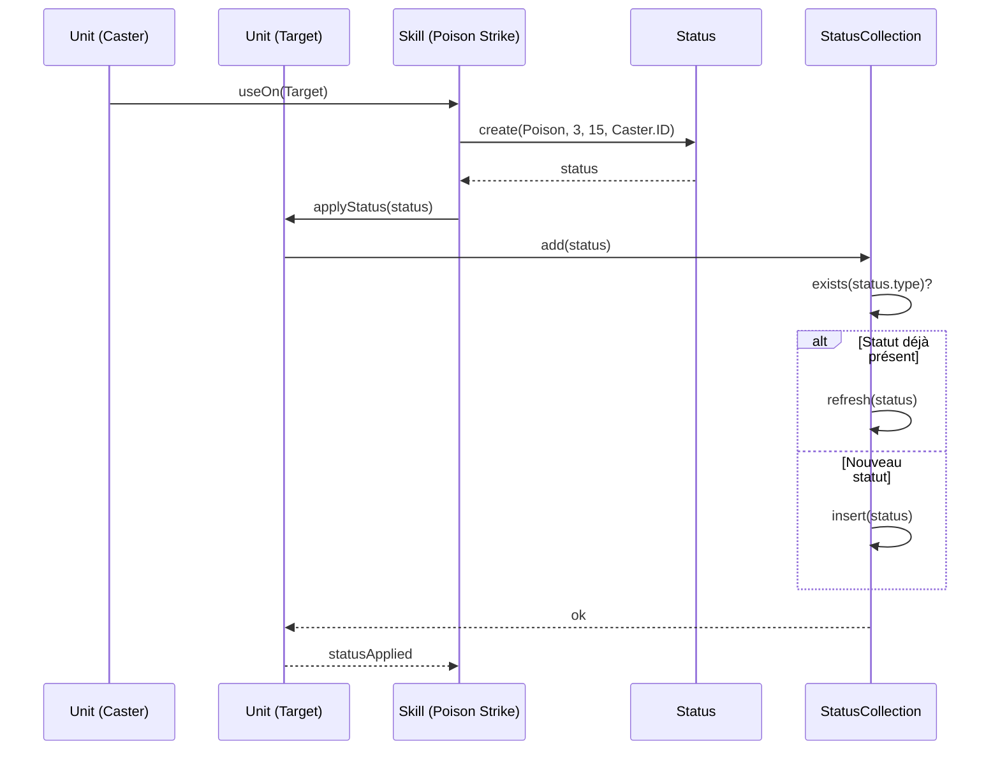
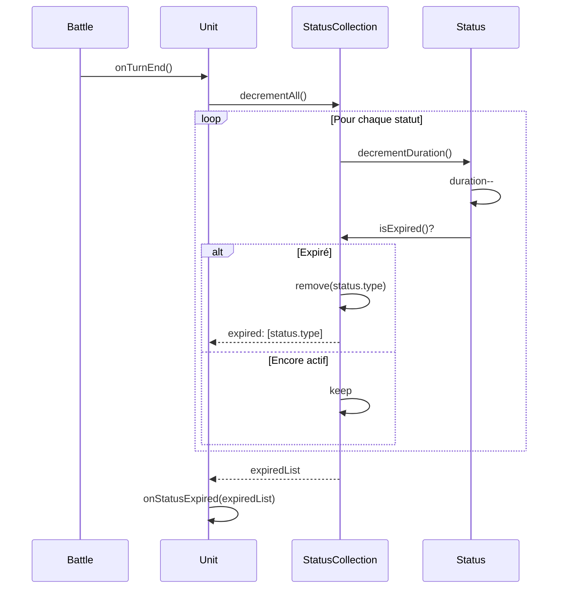

### 1. Diagramme de séquence – Application d’un Statut

```mermaid
sequenceDiagram
    participant Caster as Unit (Caster)
    participant Target as Unit (Target)
    participant Skill as Skill (Poison Strike)
    participant Status as Status
    participant StatusCol as StatusCollection

    Caster->>Skill: useOn(Target)
    Skill->>Status: create(Poison, 3, 15, Caster.ID)
    Status-->>Skill: status
    Skill->>Target: applyStatus(status)
    Target->>StatusCol: add(status)
    StatusCol->>StatusCol: exists(status.type)?
    alt Statut déjà présent
        StatusCol->>StatusCol: refresh(status)
    else Nouveau statut
        StatusCol->>StatusCol: insert(status)
    end
    StatusCol-->>Target: ok
    Target-->>Skill: statusApplied
```

### 2. Diagramme de séquence – Expiration des Statuts

```mermaid
sequenceDiagram
    participant Battle as Battle
    participant Unit as Unit
    participant StatusCol as StatusCollection
    participant Status as Status

    Battle->>Unit: onTurnEnd()
    Unit->>StatusCol: decrementAll()

    loop Pour chaque statut
        StatusCol->>Status: decrementDuration()
        Status->>Status: duration--
        Status->>StatusCol: isExpired()?
        alt Expiré
            StatusCol->>StatusCol: remove(status.type)
            StatusCol-->>Unit: expired: [status.type]
        else Encore actif
            StatusCol->>StatusCol: keep
        end
    end

    StatusCol-->>Unit: expiredList
    Unit->>Unit: onStatusExpired(expiredList)
```
