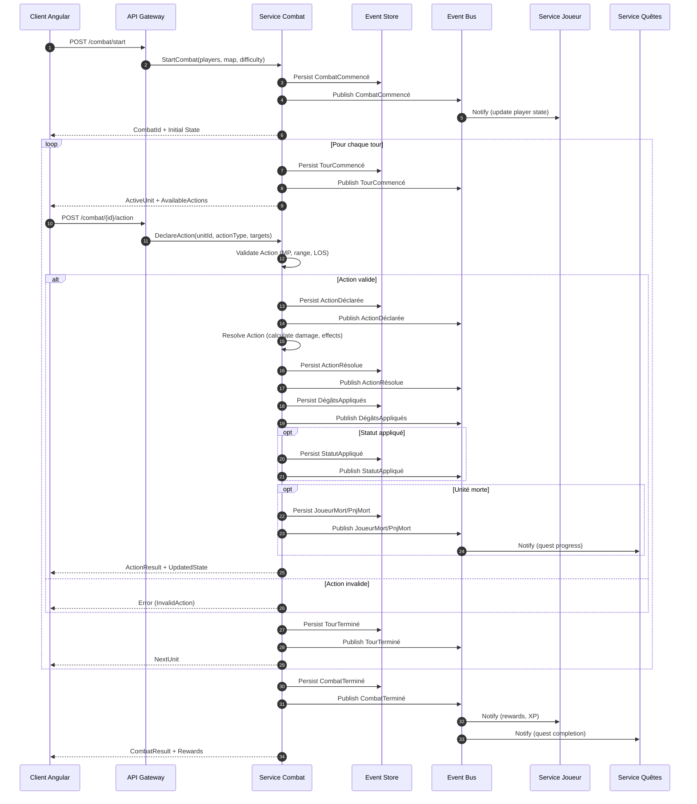
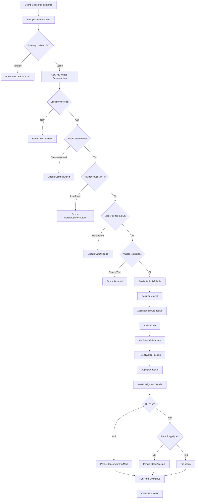
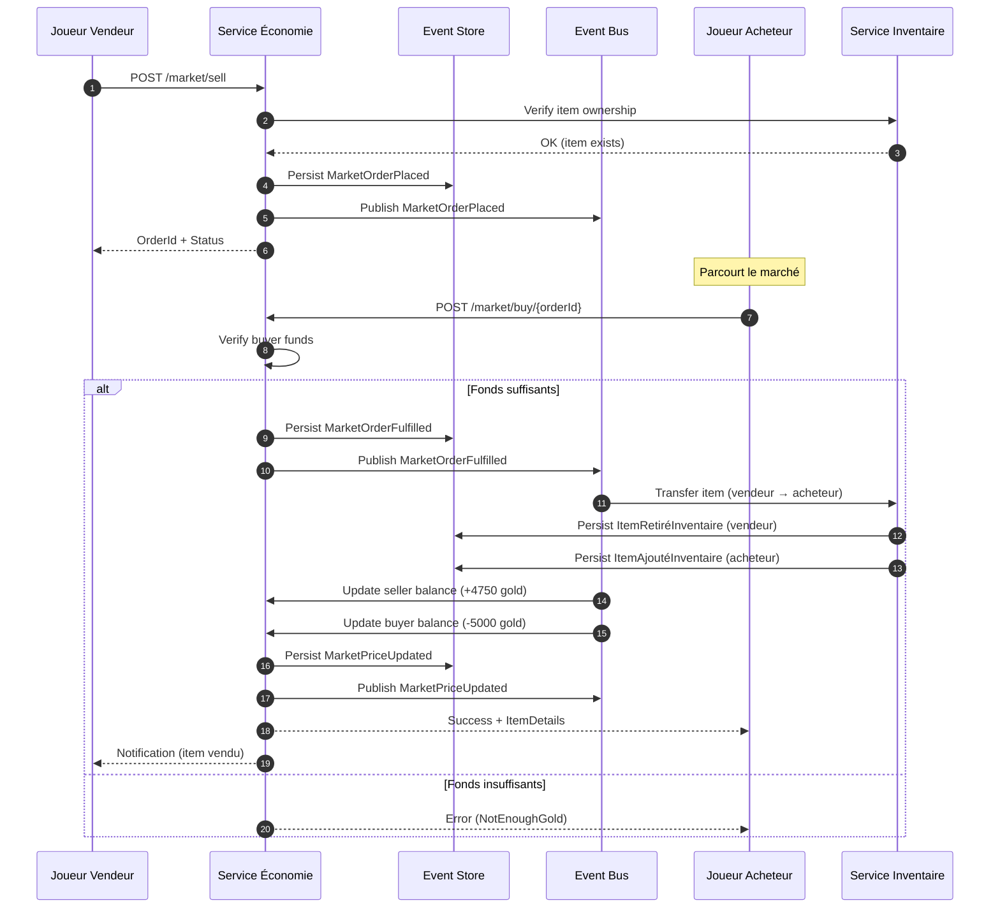

# Timeline des Événements – Aether-Engine

> **Note de synchronisation** :
> Ce document illustre les flux temporels des événements majeurs dans le système.
> Les structures détaillées de chaque événement sont dans `/doc/matrice_evenements.md`.

---

## 1. Flux de Combat Complet

### Diagramme de séquence : Cycle de vie d'un combat



---

## 2. Flux d'Action Joueur (Détail)

### Diagramme : De la saisie utilisateur à l'application des effets



---

## 3. Timeline Événementielle d'un Combat Typique

### Exemple : Combat PvE (3 joueurs vs 1 boss)

```
T=0s    CombatCommencé
        └─ Participants: [player-123, player-456, player-789, boss-666]
        └─ Ordre initiative: [player-456, player-789, player-123, boss-666]

T=5s    TourCommencé (player-456)
        └─ ATB: 100

T=8s    ActionDéclarée (player-456 → skill-fireball → boss-666)
        └─ Coût: 30 MP
        └─ Validation: OK

T=10s   ActionRésolue
        └─ Dégâts calculés: 250
        └─ Critique: false

T=11s   DégâtsAppliqués (boss-666)
        └─ HP: 10000 → 9750

T=11.5s StatutAppliqué (boss-666)
        └─ Brulure (3 tours, 20 dégâts/tour)

T=12s   TourTerminé (player-456)

---

T=13s   TourCommencé (player-789)
        └─ ATB: 100

T=16s   ActionDéclarée (player-789 → skill-heal → player-123)
        └─ Coût: 40 MP
        └─ Validation: OK

T=18s   ActionRésolue
        └─ Soin calculé: 200
        └─ Critique: true (+50%)

T=19s   SoinAppliqué (player-123)
        └─ HP: 500 → 800

T=20s   TourTerminé (player-789)

---

T=21s   TourCommencé (player-123)
        └─ ATB: 100

T=24s   ActionDéclarée (player-123 → attack-normal → boss-666)
        └─ Coût: 0 MP
        └─ Validation: OK

T=26s   ActionRésolue
        └─ Dégâts calculés: 150
        └─ Critique: false

T=27s   DégâtsAppliqués (boss-666)
        └─ HP: 9750 → 9600

T=28s   TourTerminé (player-123)

---

T=29s   TourCommencé (boss-666)
        └─ ATB: 100
        └─ Statut Brulure: -20 HP (9600 → 9580)

T=32s   ActionPnjEffectuée (boss-666 → skill-earthquake → all-players)
        └─ IA: aggressive

T=34s   ActionRésolue
        └─ Zone AoE: tous les joueurs

T=35s   DégâtsAppliqués (player-456)
        └─ HP: 800 → 650

T=35.5s DégâtsAppliqués (player-789)
        └─ HP: 900 → 750

T=36s   DégâtsAppliqués (player-123)
        └─ HP: 800 → 550

T=36.5s StatutAppliqué (player-123)
        └─ Stunned (2 tours)

T=37s   TourTerminé (boss-666)

---

[... 12 tours supplémentaires ...]

---

T=285s  ActionRésolue (player-456 → skill-ultimate → boss-666)
        └─ Dégâts: 1500 (critical)

T=286s  DégâtsAppliqués (boss-666)
        └─ HP: 200 → -1300

T=287s  PnjMort (boss-666)
        └─ Tué par: player-456
        └─ Loot: [item-dragon-scale, item-legendary-sword, 10000 XP, 5000 gold]

T=288s  CombatTerminé
        └─ Résultat: Victoire
        └─ Durée: 288s (15 tours)
        └─ Récompenses distribuées
```

---

## 4. Flux Économique : Transaction Marché



---

## 5. Flux de Progression de Quête

```mermaid
graph LR
    A[PNJ donne quête] --> B[QueteCommencée]
    B --> C[ObjectifQueteProgressé: 0/10 gobelins tués]
    
    C --> D[Combat #1]
    D --> E[PnjMort: gobelin-001]
    E --> F[ObjectifQueteProgressé: 1/10]
    
    F --> G[Combat #2]
    G --> H[PnjMort: gobelin-002]
    H --> I[ObjectifQueteProgressé: 2/10]
    
    I --> J[...]
    J --> K[Combat #10]
    K --> L[PnjMort: gobelin-010]
    L --> M[ObjectifQueteProgressé: 10/10]
    
    M --> N{Objectif atteint?}
    N -->|Oui| O[QueteTerminée]
    O --> P[Récompenses distribuées]
    P --> Q[JoueurMonteNiveau]
    P --> R[ItemAjoutéInventaire]
```



---

## 6. Flux de Niveau Joueur & Montée en puissance

```
ExperienceGained (combat-789)
└─ +5000 XP

ExperienceGained (quest-dragon-slayer)
└─ +10000 XP

JoueurMonteNiveau
└─ Niveau: 10 → 11
└─ +5 points de compétence
└─ Stats augmentées: HP+50, MP+30, Force+2, Int+1

StatsJoueurModifiées
└─ Bonus équipement appliqué

JoueurEquipeItem (item-legendary-sword)
└─ Force +20, Critique +10

StatsJoueurModifiées
└─ Stats finales recalculées
```

---

## 7. Flux de Gestion de Statuts (Buffs/Debuffs)

```
StatutAppliqué (Brulure)
├─ Durée: 3 tours
├─ Dégâts/tour: 20
└─ Stackable: oui

Tour 1:
├─ TourCommencé (boss-666)
├─ Statut Brulure: -20 HP
└─ Durée restante: 2 tours

Tour 2:
├─ TourCommencé (boss-666)
├─ Statut Brulure: -20 HP
└─ Durée restante: 1 tour

Tour 3:
├─ TourCommencé (boss-666)
├─ Statut Brulure: -20 HP
└─ Durée restante: 0 tours

StatutExpiré (Brulure)
└─ Dégâts totaux infligés: 60
```

---

## 8. Flux de Cooldown de Compétence

```
CompétenceUtilisée (skill-fireball)
└─ Coût: 30 MP

CooldownCompétenceCommencé
├─ Durée: 3 tours
└─ Tours restants: 3

TourTerminé (player-456)
└─ Cooldown: 3 → 2 tours

TourTerminé (player-456)
└─ Cooldown: 2 → 1 tour

TourTerminé (player-456)
└─ Cooldown: 1 → 0 tours

CooldownCompétenceTerminé
└─ Compétence disponible
```

---

## 9. Flux d'Événement Monde (World Event)

```
WorldEventTriggered (invasion-dragons)
├─ Zone: Capitale
├─ Durée: 60 minutes
└─ Objectif: Vaincre 50 dragons

[Tous les joueurs peuvent participer]

PnjApparu (dragon-001) ... PnjApparu (dragon-050)

[Combats multiples]

PnjMort (dragon-001)
└─ Progression: 1/50

PnjMort (dragon-002)
└─ Progression: 2/50

...

PnjMort (dragon-050)
└─ Progression: 50/50

WorldEventCompleted
└─ Récompenses globales distribuées
```

---

## 10. Flux de Cycle Jour/Nuit

```
DayNightCycleChanged
├─ Ancien état: Jour
├─ Nouvel état: Nuit
├─ Heure jeu: 20:00
└─ Effets actifs:
    ├─ BonusMonstres +20%
    ├─ SpawnAugmente +50%
    └─ VisibilitéRéduite

[6 heures temps réel plus tard]

DayNightCycleChanged
├─ Ancien état: Nuit
├─ Nouvel état: Jour
├─ Heure jeu: 08:00
└─ Effets désactivés
```

---

## Résumé des Flux

| Flux | Événements clés | Durée typique | Complexité |
|------|----------------|---------------|------------|
| Combat complet | CombatCommencé → Tours → CombatTerminé | 5-15 min | Haute |
| Action joueur | ActionDéclarée → ActionRésolue → Effets | 2-5s | Moyenne |
| Transaction marché | MarketOrderPlaced → MarketOrderFulfilled | Instantané | Faible |
| Progression quête | QueteCommencée → Objectifs → QueteTerminée | Variable | Moyenne |
| Montée niveau | ExperienceGained → JoueurMonteNiveau | Instantané | Faible |
| Gestion statuts | StatutAppliqué → Ticks → StatutExpiré | 3-10 tours | Faible |
| Cooldown | CooldownCommencé → Ticks → CooldownTerminé | 2-5 tours | Faible |
| World Event | WorldEventTriggered → Progression → Completed | 30-60 min | Haute |
| Cycle Jour/Nuit | DayNightCycleChanged (récurrent) | 6h temps réel | Faible |

---

## Causalité & Corrélation

### Metadata pour traçabilité

Chaque événement inclut des metadata pour établir la causalité :

```json
{
  "metadata": {
    "causedBy": "skill-fireball",
    "combatId": "combat-789",
    "turnId": "turn-1",
    "correlationId": "uuid-correlation",
    "sessionId": "session-123",
    "userId": "user-456"
  }
}
```

### Exemples de chaînes causales

**Chaîne 1 : Skill → Damage → Death → Quest Progress**
```
CompétenceUtilisée (causedBy: player-action)
  └─> ActionRésolue (causedBy: skill-fireball)
      └─> DégâtsAppliqués (causedBy: skill-fireball)
          └─> PnjMort (causedBy: skill-fireball)
              └─> ObjectifQueteProgressé (causedBy: monster-killed)
```

**Chaîne 2 : Level Up → Stats Boost → Equipment Bonus**
```
JoueurMonteNiveau (causedBy: experience-gained)
  └─> StatsJoueurModifiées (causedBy: level-up)
      └─> JoueurEquipeItem (causedBy: inventory-action)
          └─> StatsJoueurModifiées (causedBy: item-equipped)
```

**Chaîne 3 : Combat End → Rewards → Inventory → Market**
```
CombatTerminé (causedBy: all-enemies-defeated)
  └─> ItemAjoutéInventaire (causedBy: loot-combat)
      └─> MarketOrderPlaced (causedBy: player-action)
          └─> MarketOrderFulfilled (causedBy: player-purchase)
```
