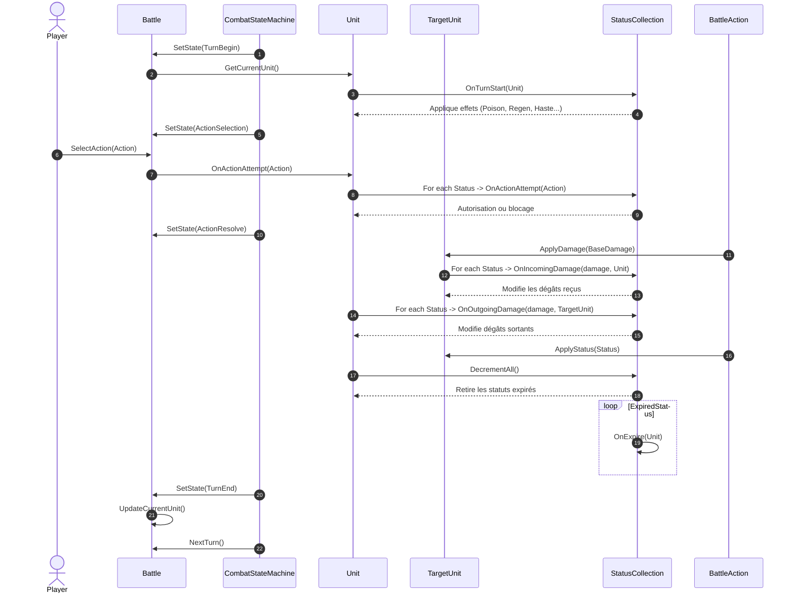

```mermaid
sequenceDiagram
    autonumber
    actor Player
    participant Battle
    participant CombatStateMachine
    participant Unit
    participant TargetUnit
    participant StatusCollection
    participant Action as BattleAction

    %% =========================
    %% DÉBUT DU TOUR
    %% =========================
    CombatStateMachine ->> Battle: SetState(TurnBegin)
    Battle ->> Unit: GetCurrentUnit()
    Unit ->> StatusCollection: OnTurnStart(Unit)
    StatusCollection -->> Unit: Applique effets (Poison, Regen, Haste...)

    %% =========================
    %% SÉLECTION DE L'ACTION
    %% =========================
    CombatStateMachine ->> Battle: SetState(ActionSelection)
    Player ->> Battle: SelectAction(Action)
    Battle ->> Unit: OnActionAttempt(Action)
    Unit ->> StatusCollection: For each Status -> OnActionAttempt(Action)
    StatusCollection -->> Unit: Autorisation ou blocage

    %% =========================
    %% RÉSOLUTION DE L'ACTION
    %% =========================
    CombatStateMachine ->> Battle: SetState(ActionResolve)
    Action ->> TargetUnit: ApplyDamage(BaseDamage)
    TargetUnit ->> StatusCollection: For each Status -> OnIncomingDamage(damage, Unit)
    StatusCollection -->> TargetUnit: Modifie les dégâts reçus
    Unit ->> StatusCollection: For each Status -> OnOutgoingDamage(damage, TargetUnit)
    StatusCollection -->> Unit: Modifie dégâts sortants
    Action ->> TargetUnit: ApplyStatus(Status)

    %% =========================
    %% FIN DU TOUR
    %% =========================
    Unit ->> StatusCollection: DecrementAll()
    StatusCollection -->> Unit: Retire les statuts expirés
    loop ExpiredStatus
        StatusCollection ->> StatusCollection: OnExpire(Unit)
    end

    CombatStateMachine ->> Battle: SetState(TurnEnd)
    Battle ->> Battle: UpdateCurrentUnit()
    CombatStateMachine ->> Battle: NextTurn()

```